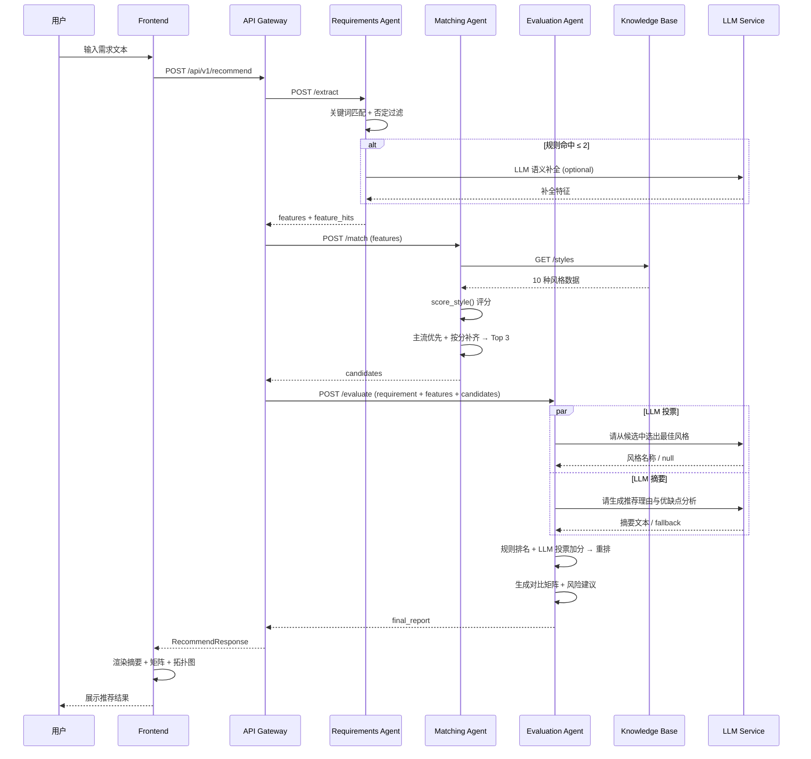
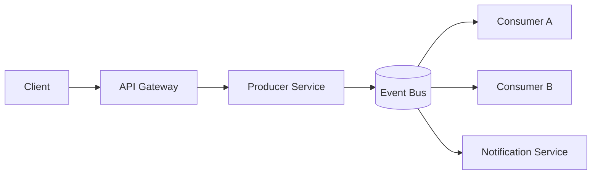

# 架构设计文档

## 1. 设计目标

本系统面向"自然语言需求输入 → 架构风格推荐 → 可解释决策报告"的完整闭环，设计目标如下：

1. 支持自然语言需求的结构化特征提取，处理模糊性和否定语义。
2. 基于知识库与规则引擎输出至少 3 种候选架构风格。
3. 通过规则引擎 + LLM 协同实现可解释的混合推理决策。
4. 具备知识库可扩展能力与工程化可维护性。
5. LLM 不可用时自动降级，保证核心推荐链路高可用。

---

## 2. 总体架构

### 2.1 架构风格选择

系统自身采用**微服务架构**（Microservices），核心划分为 6 个独立容器。选择的合理性分析：

| 维度 | 分析 |
|------|------|
| **领域职责解耦** | 需求提取、规则匹配、LLM 评估各属不同领域，拆分后各自独立演进 |
| **异构能力集成** | 需求提取依赖词典规则（纯计算），评估依赖外部 LLM（网络调用），拆分后可独立优化和扩容 |
| **故障隔离** | LLM 调用存在外部依赖风险，独立部署 evaluation-agent 后，即便 LLM 波动，知识库查询和特征提取仍稳定 |
| **技术栈灵活** | 各 Agent 可独立选择技术方案（如 matching-agent 可升级为 Neo4j 驱动），互不影响 |
| **部署独立性** | 每个服务独立构建、独立运行，通过 Docker Compose 按依赖顺序启动 |

### 2.2 系统组成

```
┌─────────────────────────────────────────────────────────────┐
│                        前端 (Frontend)                        │
│                  Nginx :3000  |  index.html                  │
└──────────────────────────┬──────────────────────────────────┘
                           │ HTTP POST
                           ▼
┌─────────────────────────────────────────────────────────────┐
│                     API 网关 (api-gateway)                    │
│                  FastAPI :8000  |  /api/v1/recommend          │
└──────┬──────────────┬───────────────┬───────────────────────┘
       │ POST /extract│ POST /match   │ POST /evaluate
       ▼              ▼               ▼
┌──────────────┐ ┌──────────────┐ ┌──────────────────┐
│ requirements │ │  matching    │ │  evaluation      │
│    -agent    │ │    -agent    │ │     -agent       │
│   :8001      │ │   :8002      │ │    :8003         │
│ 特征提取     │ │ 规则匹配     │ │  评估与报告      │
└──────────────┘ └──────┬───────┘ └──────────────────┘
                        │ GET /styles, /feedback/weights
                        ▼
               ┌────────────────┐
               │ knowledge-base │
               │    :8004       │
               │ 双后端存储      │
               └───────┬────────┘
                       │
          ┌────────────┼────────────┐
          ▼            ▼            ▼
   ┌──────────┐ ┌──────────┐ ┌──────────┐
   │ Neo4j    │ │ JSON     │ │ 学习权重  │
   │ 图数据库  │ │ 文件存储  │ │ JSON 文件 │
   │ :7687    │ │ (fallback)│ │          │
   └──────────┘ └──────────┘ └──────────┘

    ┌──────────────────────────────────────┐
    │       外部 LLM 服务 (可选)             │
    │   DeepSeek / 通义千问 / OpenAI        │
    │   通过环境变量配置接入                  │
    └──────────────────────────────────────┘
```

### 2.3 C4 模型表达

#### C4-Context（系统上下文）

```
┌──────────┐          ┌─────────────────────────┐          ┌──────────────┐
│          │  需求文本 │                         │  API调用  │              │
│   用户    │─────────▶│  架构风格智能助手系统     │─────────▶│  LLM 服务    │
│          │          │                         │          │ (DeepSeek/   │
│          │◀─────────│                         │          │  通义/OpenAI)│
│          │  推荐报告 │                         │          │              │
└──────────┘          └─────────────────────────┘          └──────────────┘
```

#### C4-Container（容器级）

| 容器名 | 技术栈 | 端口 | 职责 |
|--------|--------|------|------|
| frontend | Nginx + HTML/JS | 3000 | Web 交互界面 |
| api-gateway | FastAPI + LangGraph + httpx | 8000 | 请求编排与响应汇总 |
| requirements-agent | FastAPI | 8001 | 需求特征提取 |
| matching-agent | FastAPI + httpx | 8002 | 规则匹配与候选生成 |
| evaluation-agent | FastAPI + httpx | 8003 | 评估决策与报告生成 |
| knowledge-base | FastAPI + neo4j-driver | 8004 | 架构风格数据服务 (Neo4j + JSON) |
| neo4j | Neo4j 5.26 Community | 7474/7687 | 知识图谱存储 (可选) |
| refactoring-agent | FastAPI + httpx | 8005 | 架构重构建议生成 |

---

## 3. 微服务详细设计

### 3.1 API Gateway（api-gateway）

**文件**：
- [services/api_gateway/app/main.py](services/api_gateway/app/main.py)（v0.2.0, ~120 行）
- [services/api_gateway/app/langchain_workflow.py](services/api_gateway/app/langchain_workflow.py)（~100 行）
- [services/api_gateway/app/workflow_state.py](services/api_gateway/app/workflow_state.py)

**职责**：
- 统一对外入口，接收 `POST /api/v1/recommend` 请求。
- 使用 **LangGraph StateGraph** 编排三个 Agent 的调用流程。
- LangGraph 不可用时自动 fallback 到手写 httpx 编排。
- 汇总各 Agent 响应 + 编排追踪信息。
- 统一异常处理与日志记录。

**编排机制**（双引擎）：

```
启动时
  │
  ├─ 尝试 import langgraph + build_workflow()
  │
  ├─ 成功 → WORKFLOW_ENGINE = "langgraph"
  │         LangGraph StateGraph: START → extract → match → evaluate → trace → END
  │         每个节点内部仍通过 httpx 调用对应 Agent 服务
  │
  └─ 失败 → WORKFLOW_ENGINE = "manual"
            回退到手写三部串行 (extract → match → evaluate)
            逻辑与 Phase 1-3 完全一致
```

**LangGraph 节点定义**：

| 节点 | 调用的服务 | 输入 | 输出 |
|------|----------|------|------|
| `extract_node` | requirements-agent:8001/extract | requirement | extracted_features, feature_hits |
| `match_node` | matching-agent:8002/match | extracted_features | candidates |
| `evaluate_node` | evaluation-agent:8003/evaluate | requirement + features + candidates | final_report |
| `trace_node` | (本地) | state | workflow_engine 标记 |

**fallback 策略**：
- langgraph 包未安装 → 启动时 `build_workflow()` 返回 None
- LangGraph 运行时异常 → 捕获后调用 `_manual_orchestrate()`
- 手动编排代码完整保留在主模块中

**输入**：
```json
{"requirement": "自然语言需求文本 (min_length=10)"}
```

**输出**（新增 `workflow_engine` 和 `workflow_trace`）：
```json
{
  "extracted_features": {...},
  "feature_hits": {...},
  "candidates": [
    {
      "style": "...",
      "score": 9,
      "reasons": ["规则理由..."],
      "graph_score": 6,
      "graph_reasons": ["图谱理由..."],
      "matched_attributes": [...], "matched_scenarios": [...],
      "related_risks": [...], "combinable_styles": [...],
      "pros": [...], "cons": [...],
      "topology_mermaid": "graph LR\n..."
    }
  ],
  "final_report": {
    "recommended_style": "...",
    "alternative_styles": [...],
    "decision_basis": {...},
    "comparison_matrix": [...],
    "risk_and_suggestions": {...}
  },
  "workflow_engine": "langgraph",
  "workflow_trace": [
    {"node": "extract", "elapsed_ms": 12, "status": "ok"},
    {"node": "match", "elapsed_ms": 8, "status": "ok"},
    {"node": "evaluate", "elapsed_ms": 150, "status": "ok"}
  ]
}
```

**异常处理**：
- `httpx.HTTPError` → HTTP 502（附带上游错误详情）
- LangGraph 运行时异常 → 自动回退 `_manual_orchestrate()`
- 未预期异常 → HTTP 500
- 每次节点调用记录耗时日志（ms 级）
- workflow_trace 记录每节点耗时、状态和错误信息

**请求级缓存**：

API Gateway 在请求到达时首先检查缓存，命中则直接返回，跳过整个编排链路。

- **缓存键**：`SHA256(requirement + LLM_MODEL + knowledge_version)[:16]`
- **TTL**：可配置，默认 3600 秒
- **后端**：内存 (memory) 或 SQLite (sqlite) 持久化
- **失效条件**：知识库 styles 文件内容变更 → knowledge_version 改变 → 旧缓存自动失效
- **禁用**：`CACHE_ENABLED=false`

响应新增 `cache_hit: true/false` 字段，前端展示缓存命中/实时计算标记。

缓存管理端点：
| 方法 | 路径 | 说明 |
|------|------|------|
| GET | `/cache/stats` | 缓存统计（命中率、条目数、TTL） |
| POST | `/cache/clear` | 清空全部缓存 |

环境变量：
| 变量 | 默认值 | 说明 |
|------|--------|------|
| `CACHE_ENABLED` | true | 启用/禁用缓存 |
| `CACHE_TTL_SECONDS` | 3600 | 缓存过期时间 |
| `CACHE_BACKEND` | memory | 缓存后端 (memory/sqlite) |
| `KNOWLEDGE_VERSION` | (自动计算) | 手动设置知识库版本强制失效 |

**配置**：通过环境变量 `REQUIREMENTS_AGENT_URL`、`MATCHING_AGENT_URL`、`EVALUATION_AGENT_URL` 指定上游地址。

---

### 3.2 Requirements Agent（requirements-agent）

**文件**：[services/requirements_agent/app/main.py](services/requirements_agent/app/main.py)（255 行）

**职责**：从自然语言需求中提取 10 个维度的特征布尔值及关键词命中证据。

**输入**：
```json
{"requirement": "需求文本 (min_length=10)"}
```

**处理流程**：

```
需求文本
  │
  ├─ 1. 文本小写化
  │
  ├─ 2. 关键词匹配 (keyword_hits)
  │    遍历 10 个维度的 lexicon 词典
  │    文本包含即命中
  │
  ├─ 3. 否定语义过滤 (filter_negation)
  │    检查关键词前 6 字符内是否含否定词
  │    否定词列表: ["不需要", "不要求", "无需", "没有", "无高", "非"]
  │    命中则排除该关键词
  │
  ├─ 4. LLM 语义补全 (llm_semantic_supplement) [可选]
  │    触发条件: 规则命中维度 ≤ 2 且 LLM 已配置
  │    Prompt: "分析以下软件需求描述, 判断是否涉及这些特征维度..."
  │    Temperature: 0.1
  │    Timeout: 15s
  │    失败时静默降级, 维持规则结果
  │
  └─ 5. 返回 features + feature_hits
```

**关键词词典设计**（10 个维度）：

| 维度 | 关键词数量 | 示例关键词 |
|------|-----------|-----------|
| high_concurrency | 10 | 高并发、并发、万人、海量用户、秒杀、高吞吐、QPS |
| real_time | 10 | 实时、即时、低延迟、毫秒、消息、通知、IM |
| reliability | 9 | 可靠、高可用、容灾、容错、稳定、不丢 |
| scalability | 9 | 扩展、弹性、扩容、横向、scale、可伸缩 |
| complex_business | 7 | 复杂业务、交易、审批、规则、工作流 |
| strict_consistency | 5 | 强一致、事务、金融、账务、一致提交 |
| deployment_constraint | 6 | 本地部署、私有化、边缘、多地域、离线、内网 |
| data_intensive | 7 | 数据流、ETL、流处理、日志、监控、数据中台 |
| team_size_large | 6 | 多团队、跨团队、多人协作、并行开发 |
| security | 15 | 安全、加密、认证、鉴权、审计、隔离、防护、合规 |

**输出**：
```json
{
  "features": {"high_concurrency": true, "security": false, ...},
  "feature_hits": {"high_concurrency": ["高并发", "万人"], ...}
}
```

**LLM 语义补全设计**：

当规则命中 ≤ 2 个维度时（说明需求文本未使用领域术语），调用 LLM 进行二次语义分析：
- System Prompt: `"You are a requirements analyst. Output only JSON."`
- User Prompt: 包含 10 个中文特征标签列表 + 需求原文
- 解析结果：仅写入 LLM 推断为 True 且规则尚为 False 的特征
- 标记来源：`feature_hits[key].append("llm_supplement")`

**异常处理**：
- LLM 未配置 → 跳过补全，直接返回规则结果
- LLM 超时/网络异常 → 静默降级
- LLM 返回非 JSON → 尝试剥离 markdown 代码块解析；失败则丢弃

---

### 3.3 Matching Agent（matching-agent）

**文件**：
- [services/matching_agent/app/main.py](services/matching_agent/app/main.py)（v0.2.0）
- [services/matching_agent/app/graph_matcher.py](services/matching_agent/app/graph_matcher.py)（新增）

**职责**：采用**规则引擎 + Neo4j 图谱关系推理**双通道评分，对知识库中全部架构风格进行打分，输出 Top 3 候选。

**输入**：
```json
{"features": {"high_concurrency": true, "real_time": true, ...}}
```

**处理流程**（双通道评分 → 融合 → 候选筛选）：

```
特征布尔映射
  │
  ├─ 1. 从 knowledge-base 获取全部风格 (GET /styles)
  │
  ├─ 2a. 规则引擎评分 (score_style) — 始终运行
  │    ├─ 基础评分: 风格 tags 与特征交集, 每命中 1 项 +2 分
  │    ├─ 额外规则 (6 条硬编码领域规则)
  │    └─ 学习权重加分 (learned boost, 反馈积累 ≥ 2 次确认)
  │
  ├─ 2b. 图谱关系推理 (graph_matcher) — Neo4j 可用时运行
  │    ├─ 调用 knowledge-base POST /graph/match
  │    ├─ 遍历 Neo4j 中 HAS_QUALITY / SUITABLE_FOR / HAS_RISK / COMPLEMENTS 关系
  │    └─ 每个匹配质量属性 +2 分 (上限不超过规则得分 50%)
  │
  ├─ 3. 分数融合 (blend_scores)
  │    score_final = score_rule + min(score_graph, score_rule // 2)
  │    图谱证据字段追加到候选: graph_reasons, matched_attributes,
  │    matched_scenarios, related_risks, combinable_styles
  │
  ├─ 4. 按总分降序排列
  │
  ├─ 5. 候选集生成 (主流优先 + 按分补齐)
  │    ├─ 优先纳入 3 种主流风格 (Layered/Microservices/Event-Driven)
  │    ├─ 剩余空位按分数从高到低补齐
  │    └─ 全部得分为 0 时, 返回 3 种主流作为基线
  │
  └─ 6. 返回 candidates (Top 3)
```

**评分规则表**（规则引擎层）：

| 规则类型 | 触发条件 | 分值 |
|---------|---------|------|
| tags 匹配 | 风格 tag ∈ 特征命中维度 | +2 / 项 |
| 图谱质量属性匹配 | Neo4j HAS_QUALITY 关系命中 | +2 / 项 (capped) |
| 高并发奖励 | Event-Driven + high_concurrency | +1 |
| 多团队奖励 | Microservices + team_size_large | +1 |
| 强一致奖励 | Layered + strict_consistency | +1 |
| 流处理奖励 | Pipeline-Filter + data_intensive + real_time | +1 |
| CQRS 奖励 | CQRS + data_intensive + high_concurrency | +1 |
| 微服务+并发+一致 | Microservices + high_concurrency + strict_consistency | +1 |
| 学习权重 | 特征-风格关联 ≥ 2 次确认 | +1 / 项 |

**输出**（新增图谱证据字段，向后兼容）：

```json
{
  "candidates": [
    {
      "style": "Event-Driven Architecture",
      "score": 9,
      "reasons": ["matches feature: high_concurrency", "extra rule: ..."],
      "graph_score": 6,
      "graph_reasons": ["graph match: quality attribute 'high_concurrency'"],
      "matched_attributes": ["high_concurrency", "real_time", "scalability"],
      "matched_scenarios": ["real-time messaging"],
      "related_risks": ["事件一致性设计难度大"],
      "combinable_styles": ["CQRS"],
      "pros": ["high throughput", "loose coupling"],
      "cons": ["hard tracing", "eventual consistency complexity"],
      "best_for": ["real-time messaging", "stream processing"],
      "topology_mermaid": "graph LR\n..."
    }
  ]
}
```

**三层驱动架构**：

```
Layer 1: 规则引擎 (Rule Engine)     — 确定性匹配, 保证下限
Layer 2: 知识图谱 (Knowledge Graph) — 关系推理, 发现隐含关联
Layer 3: LLM 投票/摘要 (evaluation) — 语义判断, 提升上限
```

**异常处理**：
- knowledge-base 不可用 → HTTP 502
- Neo4j 不可用 → graph_matcher 静默降级, 返回纯规则评分
- 图谱返回空数据 → blend_scores 原样返回规则结果, 填充空字段

---

### 3.4 Evaluation Agent（evaluation-agent）

**文件**：[services/evaluation_agent/app/main.py](services/evaluation_agent/app/main.py)（301 行）

**职责**：基于候选列表执行混合推理（规则排名 + LLM 投票 + LLM 摘要），生成最终推荐报告。

**输入**：
```json
{
  "requirement": "原始需求文本",
  "features": {...},
  "candidates": [...]
}
```

**混合推理流程**：

```
候选列表 + 原始需求 + 特征
  │
  ├─ 1. 规则排名
  │    按 score 降序, 确定 rule_best
  │
  ├─ 2. 并行 LLM 调用 (asyncio.gather) [可选]
  │    ├─ llm_vote_style(): 从候选中选最佳风格 (+1 tie-break)
  │    │   System: "strict architecture judge"
  │    │   Temperature: 0.0, Timeout: 20s
  │    │   输出校验: 必须精确匹配候选列表中的名称
  │    │
  │    └─ llm_summary(): 生成推荐理由 + 优缺点分析
  │        System: "senior architecture reviewer"
  │        Temperature: 0.3, Timeout: 25s
  │        失败时降级为 _fallback_summary()
  │
  ├─ 3. 混合评分
  │    LLM 投票命中的风格 +1 分 → 重新排序
  │
  ├─ 4. 确定最终推荐
  │    best = 排序后第 1 位
  │
  ├─ 5. 生成对比矩阵
  │    每项含: style, score, recommendation_type, pros, cons,
  │            key_reasons (中文), key_reasons_raw, topology_mermaid
  │
  ├─ 6. 生成风险与建议
  │    3 种核心风格 → 针对性的 main_risks + suggestions
  │    其余风格 → 通用回退模板
  │
  └─ 7. 返回 final_report
```

**降级设计**：

| 场景 | 检测 | 降级行为 |
|------|------|---------|
| LLM 未配置 | `LLM_API_BASE/KEY/MODEL` 为空 | 跳过所有 LLM 调用, llm_summary 使用 `_fallback_summary()`, llm_vote 返回 null |
| LLM 超时 | httpx 超时异常 | 捕获后使用 fallback 摘要 |
| LLM 返回异常 | HTTP 错误 / JSON 解析失败 | 捕获后使用 fallback 摘要 |
| LLM 投票无效 | 返回名不在候选列表 | 丢弃投票, 不加分 |

**Fallback 摘要格式**（`_fallback_summary()`）：

```
1. 推荐架构：Event-Driven Architecture（核心推荐）
   备选架构：Microservices、Layered Architecture

2. 推荐理由：
   - 高并发场景处理能力强
   - 实时性需求匹配度高

3. 优缺点分析：
   √ 优点：high throughput、loose coupling
   × 缺点：hard tracing、eventual consistency complexity
```

**风险与建议映射**（`_dynamic_risks()`）：

3 种核心风格在 `STYLE_RISK_MAP` 中有针对性内容：

| 风格 | 典型风险举例 | 缓解建议举例 |
|------|------------|------------|
| Event-Driven | 事件溯源实现复杂度高、一致性设计难度大 | 引入消息队列（Kafka/RabbitMQ）+ 死信队列 |
| Microservices | 分布式事务一致性难保障、运维成本高 | 采用 Saga 模式 + 服务网格（Istio） |
| Layered | 跨层性能开销、横向扩展能力有限 | 严格单向依赖 + CQRS 读写分离 |

其余 7 种风格使用通用回退模板（架构腐化风险、团队熟悉度、持续评审等）。

**输出结构**：
```json
{
  "recommended_style": "Event-Driven Architecture",
  "alternative_styles": ["Microservices", "Layered Architecture"],
  "decision_basis": {
    "rule_engine": ["高并发场景处理能力强", "实时性需求匹配度高"],
    "rule_engine_raw": ["matches feature: high_concurrency", ...],
    "llm_summary": "1. 推荐架构...",
    "llm_vote": "Event-Driven Architecture"
  },
  "comparison_matrix": [
    {
      "style": "Event-Driven Architecture",
      "score": 8,
      "recommendation_type": "核心推荐",
      "pros": [...], "cons": [...],
      "key_reasons": [...],
      "topology_mermaid": "graph LR\n..."
    }
  ],
  "risk_and_suggestions": {
    "main_risks": [...],
    "suggestions": [...]
  }
}
```

---

### 3.5 Knowledge Base（knowledge-base）

**文件**：[services/knowledge_base/app/main.py](services/knowledge_base/app/main.py)（v0.2.0，约 130 行）

**职责**：提供架构风格元数据的查询与扩展接口，以及用户反馈的收集与统计。支持双后端存储（Neo4j + JSON fallback）。

**数据存储架构**：

```
                    ┌─────────────────────┐
                    │  KNOWLEDGE_BACKEND   │
                    │  json / neo4j / auto │
                    └─────────┬───────────┘
                              │
              ┌───────────────┼───────────────┐
              ▼                               ▼
   ┌──────────────────┐            ┌──────────────────┐
   │  GraphRepository │            │  JsonRepository  │
   │  (Neo4j Driver)  │            │  (JSON 文件读写)  │
   └────────┬─────────┘            └────────┬─────────┘
            │                               │
            ▼                               ▼
   ┌──────────────────┐            ┌──────────────────┐
   │   Neo4j 图数据库  │            │  architecture_   │
   │   :7687 (bolt)   │            │  styles.json     │
   │   :7474 (http)   │            │  feedback_log.   │
   └──────────────────┘            │  json            │
                                   │  learned_weights.│
                                   │  json            │
                                   └──────────────────┘
```

**后端选择**（环境变量 `KNOWLEDGE_BACKEND`）：

| 值 | 行为 | 适用场景 |
|----|------|---------|
| `json` (默认) | 始终使用 JSON 文件 | 本地开发、无 Neo4j 环境 |
| `neo4j` | 始终使用 Neo4j, 不可用时返回 503 | 生产环境、图查询 |
| `auto` | 优先 Neo4j, 不可用时自动 fallback JSON | Docker Compose 部署 |

**存储层文件**：
- `json_repository.py` — JSON 文件读写, 所有方法无外部依赖
- `graph_repository.py` — Neo4j 图数据库操作, 导入失败时返回 None
- `main.py` — 统一调度 `_repo()` 函数, 根据 BACKEND 分发

**API 端点**：

| 方法 | 路径 | 说明 |
|------|------|------|
| GET | `/health` | 健康检查 + 后端状态 |
| GET | `/styles` | 返回全部架构风格 |
| POST | `/styles` | 新增架构风格 |
| GET | `/feedback` | 获取反馈列表 |
| POST | `/feedback` | 记录用户反馈 |
| GET | `/feedback/stats` | 获取反馈统计 |
| GET | `/feedback/weights` | 获取学习权重 |
| GET | `/graph/status` | **新增** 图数据库状态 |

**`GET /graph/status` 响应示例**：
```json
{
  "backend": "json",
  "configured_backend": "auto",
  "neo4j_available": false,
  "node_count": 10,
  "relationship_count": 0
}
```

当 Neo4j 可用时：
```json
{
  "backend": "neo4j",
  "configured_backend": "neo4j",
  "neo4j_available": true,
  "node_count": 58,
  "relationship_count": 72,
  "uri": "bolt://neo4j:7687"
}
```

**Neo4j 图模型**：

| 节点类型 | 属性 | 示例 |
|---------|------|------|
| `ArchitectureStyle` | name, name_zh, pros, cons, topology_mermaid | "Microservices" |
| `QualityAttribute` | name | "high_concurrency" |
| `Scenario` | name | "real-time messaging" |
| `Risk` | name | "分布式事务一致性难保障" |
| `Feedback` | timestamp, requirement, recommended_style, user_choice | 用户反馈记录 |

| 关系类型 | 方向 | 含义 |
|---------|------|------|
| `HAS_QUALITY` | Style → QualityAttribute | 风格具备某质量属性 |
| `SUITABLE_FOR` | Style → Scenario | 风格适用于某场景 |
| `HAS_RISK` | Style → Risk | 风格存在某风险 |
| `COMPLEMENTS` | Style → Style | 两种风格互补可组合 |

**图初始化**：
```bash
# 从 JSON 数据初始化 Neo4j 图
python services/knowledge_base/init/init_neo4j.py
```

**架构风格数据结构**（每条风格包含 6 个字段，与 JSON 完全兼容）：

```json
{
  "name": "Event-Driven Architecture",
  "tags": ["high_concurrency", "real_time", "scalability", "data_intensive"],
  "best_for": ["real-time messaging", "stream processing"],
  "pros": ["high throughput", "loose coupling"],
  "cons": ["hard tracing", "eventual consistency complexity"],
  "topology_mermaid": "graph LR\nA[Client] --> B[API Gateway]\n..."
}
```

**10 种已包含的架构风格**：

| 序号 | 风格名称 | 特征标签数 | 适用场景 |
|------|---------|-----------|---------|
| 1 | Layered Architecture | 2 | 企业应用、清晰领域分层 |
| 2 | Microservices | 3 | 大团队、独立部署 |
| 3 | Event-Driven Architecture | 4 | 实时消息、流处理 |
| 4 | SOA | 2 | 遗留系统集成、跨系统编排 |
| 5 | Hexagonal Architecture | 2 | 领域驱动设计、高可测试性 |
| 6 | Pipeline-Filter | 2 | 数据处理、ETL 工作流 |
| 7 | CQRS | 3 | 读写分离、审计密集领域 |
| 8 | Serverless | 2 | 突发负载、快速迭代 |
| 9 | Space-Based | 2 | 极端流量、内存数据网格 |
| 10 | Client-Server | 1 | 经典企业局域网应用 |

**知识扩展机制**：
- POST /styles 接收新风格数据（name/tags/best_for/pros/cons），同时写入 JSON 文件和 Neo4j（如已启用）。
- matching-agent 每次请求实时拉取 `/styles`，新增风格立即参与匹配。
- 无需重启服务即可生效。

**反馈收集机制**：
- POST /feedback 记录用户对推荐结果的确认或修正。
- 每条反馈包含：时间戳、需求文本、推荐风格、用户选择、备注、是否确认。
- GET /feedback/stats 返回准确率和各风格确认/修正分布。
- 知识进化权重通过特征-风格关联计数实现。

---

## 4. Agent 协作机制

### 4.1 LangGraph + 微服务混合编排

本系统采用 **LangGraph StateGraph + FastAPI 微服务** 的混合编排模式。API Gateway 使用 LangGraph 定义状态图节点, 每个节点内部通过 httpx 异步调用对应的独立 Agent 服务。LangGraph 不可用时自动回退到手写编排。

```
User Input
  │
  ▼
┌─────────────────────────────────────────────────┐
│              API Gateway (LangGraph)             │
│                                                 │
│  StateGraph:                                    │
│    START → extract_node → match_node            │
│          → evaluate_node → trace_node → END     │
│                                                 │
│  每个 node 内部: httpx → Agent 服务              │
└───┬──────────────┬───────────────┬──────────────┘
    │ httpx POST   │ httpx POST    │ httpx POST
    ▼              ▼               ▼
┌──────────┐ ┌──────────┐ ┌──────────────┐
│ Req-Agent│ │Match-Agent│ │ Eval-Agent   │
│  :8001   │ │  :8002    │ │   :8003      │
└──────────┘ └──────────┘ └──────────────┘
```

### 4.2 为什么保留手动 fallback

1. **零外部依赖可运行**：langgraph/langchain-core 未安装时系统仍可正常工作。
2. **故障隔离**：LangGraph 运行时异常（如状态图编译失败）不影响核心推荐链路。
3. **渐进式升级**：手动编排代码与 LangGraph 编排共存，方便对比调试和性能分析。
4. **课程要求**：手动编排体现代理协作的底层原理，LangGraph 体现工程化框架应用。

### 4.3 协作特点

1. **分层职责清晰**：感知 → 决策 → 解释，每层独立可替换。
2. **微服务边界明确**：LangGraph 仅做编排，Agent 仍然是独立进程。
3. **LLM 仅参与末段**：LLM 仅在评估阶段参与投票和摘要，降低不确定性扩散。
4. **并行优化**：evaluation-agent 内部的 LLM 投票和 LLM 摘要通过 `asyncio.gather` 并行执行。
5. **可观测性**：workflow_trace 记录每个节点的耗时和状态。

### 4.3 UML 时序图



---

## 5. LLM 集成方案

### 5.1 集成架构

通过环境变量注入 LLM 配置，支持任何兼容 OpenAI `/chat/completions` 协议的模型服务：

```
.env / docker-compose environment
  ├─ LLM_API_BASE  (e.g. https://api.deepseek.com/v1)
  ├─ LLM_API_KEY   (e.g. sk-xxxx)
  └─ LLM_MODEL     (e.g. deepseek-chat)
```

系统在两个位置调用 LLM：

| 调用位置 | 用途 | Temperature | Timeout | 失败策略 |
|---------|------|-------------|---------|---------|
| requirements-agent | 语义特征补全 | 0.1 | 15s | 静默降级 |
| evaluation-agent (vote) | 最佳风格投票 | 0.0 | 20s | 返回 null |
| evaluation-agent (summary) | 推荐理由生成 | 0.3 | 25s | fallback 摘要 |

### 5.2 Prompt Engineering

系统在两个 Agent 中采用 **Few-shot Prompt Engineering** 策略，提升 LLM 输出的质量和格式稳定性。

**Few-shot 模块位置**：
- `services/common/prompts/requirements_few_shot.py` — 6 个需求特征提取示例
- `services/common/prompts/evaluation_few_shot.py` — 3 个架构评审报告示例

**需求特征补全 Few-shot**（requirements-agent）：

6 个示例覆盖的场景：
| 序号 | 场景 | 关键教学点 |
|------|------|-----------|
| 1 | 模糊高并发 ("日活百万，双十一暴增") | "峰值"不等于"高并发"关键词, 需语义推断 |
| 2 | 否定语义 ("不需要实时，批量即可") | 明确写 false, 不猜测隐含需求 |
| 3 | 安全合规 ("医疗数据，患者隐私") | "隐私"→security, 非显式"安全"也触发 |
| 4 | 数据密集 ("TB级日志，ETL管道") | 数据量+处理方式→data_intensive |
| 5 | 强一致 ("ACID一致提交") | 事务关键词→strict_consistency+reliability |
| 6 | 架构重构 ("单体拆服务，多团队") | "拆分"→team_size_large+scalability |

Prompt 结构：
```
[Few-shot 示例 1-6]
---
请分析以下软件需求描述, 判断是否涉及这些特征维度: ...
返回严格的 JSON 格式, 不要输出其他内容。
需求: {user_text}
```

**评估摘要 Few-shot**（evaluation-agent）：

3 个参考报告覆盖 3 种核心推荐风格：
- Event-Driven Architecture — 即时通讯场景
- Microservices — 电商平台场景
- Layered Architecture — 企业内部审批场景

每个示例展示完整的 4 段式结构：
```
1. 推荐架构 (核心+备选)
2. 推荐理由 (2-3 条)
3. 优缺点分析 (√/×)
4. 风险与建议
```

**语义补全 Prompt**（requirements-agent, fallback 零样本）：
- System: `"You are a requirements analyst. Output only JSON."`
- Few-shot: 含 6 个示例的中文需求分析前置
- 输出约束：`{"特征名": true/false}`，仅 JSON

**投票 Prompt**（evaluation-agent）：
- System: `"You are a strict architecture judge."`
- User: 需求 + 候选列表
- 输出约束：仅风格名称，无额外文字
- 输出校验：必须在候选列表中

**摘要 Prompt**（evaluation-agent, fallback 零样本）：
- System: `"You are a senior software architecture reviewer. Output in Chinese with clear structure."`
- Few-shot: 含 3 个中文评审报告示例的前置
- 输出约束：1. 推荐架构 2. 推荐理由 3. 优缺点分析 4. 风险与建议

**降级兼容**：
- Few-shot 模块未安装 (ImportError) → 自动回退零样本 Prompt
- 零样本 Prompt 内联在 Agent 代码中, 保证永远可用

### 5.3 幻觉控制策略

1. **候选范围限定**：LLM 投票必须在给定候选集内选择，输出需精确匹配。
2. **规则主导**：候选集生成完全由规则评分决定，LLM 不参与候选筛选。
3. **低温度参数**：投票 temperature=0.0 最小化随机性。
4. **输出校验**：投票结果在候选列表中才采纳。

### 5.4 降级与容错

详见第 9 节"异常处理与降级机制"。

---

## 6. 知识库设计

### 6.1 数据结构

采用 JSON 文件存储，结构简洁，便于人工编辑与程序扩展：

```json
{
  "styles": [
    {
      "name": "风格名称",
      "tags": ["特征标签1", "特征标签2"],
      "best_for": ["适用场景1", "适用场景2"],
      "pros": ["优点1", "优点2"],
      "cons": ["缺点1", "缺点2"],
      "topology_mermaid": "graph LR\n..."
    }
  ]
}
```

- `tags` 字段与 requirements-agent 的 10 个特征维度标识（英文 key）对应，是规则匹配的关键桥梁。
- `topology_mermaid` 提供该风格的 Mermaid 拓扑图语法，前端动态渲染。

### 6.2 设计决策

| 决策点 | 当前选择 | 理由 |
|--------|---------|------|
| 主存储 | Neo4j 图数据库 | 关系查询更自然, 支持路径推理和模式组合 |
| Fallback 存储 | JSON 文件 | Neo4j 不可用时自动降级, 保证零外部依赖可运行 |
| 后端选择 | KNOWLEDGE_BACKEND 环境变量 | json/neo4j/auto 三种模式, 覆盖开发到生产 |
| 读写策略 | 全量加载 (JSON) / Cypher 查询 (Neo4j) | 数据量小, 全量加载简单可靠；图查询按需优化 |
| 扩展接口 | REST API | 与微服务架构一致，便于前端或管理工具集成 |
| 图初始化 | init_neo4j.py 脚本 | 从 JSON 数据一键导入, 幂等可重入 |

### 6.3 知识进化路径

```
当前阶段            下一阶段            远期阶段
─────────         ─────────          ─────────
Neo4j + JSON     → 图推理评分       → 自动权重学习
双后端存储         规则+图谱融合       ADR 决策溯源
反馈数据积累       组合关系查询       架构重构建议
```

---

## 7. 规则引擎设计

### 7.1 评分模型

`score_style()` 函数实现确定性的规则评分：

```
总分 = Σ(标签匹配分) + Σ(额外规则分)

标签匹配: 风格 tag ∈ 激活特征集 → +2 分/项
额外规则:
  Event-Driven Architecture + high_concurrency    → +1 分
  Microservices + team_size_large                 → +1 分
  Layered Architecture + strict_consistency       → +1 分
```

### 7.2 候选筛选策略

采用"主流优先 + 按分补齐"策略：

```
1. 从所有已评分风格中分别取出 3 种主流风格
2. 如所有主流得分均为 0 → 直接返回 3 种主流（基线对比）
3. 否则：
   a. 优先纳入得分 > 0 的主流风格（最多 3 个）
   b. 按分数从高到低补齐至 3 个候选
   c. 如仍不足 3 个，从非主流中按分补齐
```

此策略确保：既保证主流架构的可见性（课程要求），又反映特征对非主流风格的匹配程度。

### 7.3 规则引擎的特点

| 特点 | 说明 |
|------|------|
| 确定性 | 相同输入必定产生相同输出，可复现可测试 |
| 可追溯 | 每个分数增量对应一条英文理由（reasons） |
| 可扩展 | 新增额外规则仅需在 `score_style()` 中添加条件 |
| 低耦合 | 规则逻辑集中在一个函数中，不依赖 LLM |

---

## 8. 混合推理流程

### 8.1 推理层次（三层驱动架构）

```
Layer 1: 规则引擎评分（Rule Engine）     [始终运行]
  ├─ 确定性特征匹配 (score_style)
  ├─ 知识库标签计分 (tags → +2/项)
  ├─ 额外规则加分 (6 条硬编码规则)
  └─ 学习权重加分 (反馈积累 ≥ 2 次确认)
       │
       ▼ rule_scored candidates

Layer 2: 知识图谱推理（Knowledge Graph）  [Neo4j 可用时运行]
  ├─ POST /graph/match → Cypher 遍历关系
  ├─ HAS_QUALITY 匹配质量属性 (+2/项, capped)
  ├─ SUITABLE_FOR 匹配场景
  ├─ HAS_RISK 获取相关风险
  ├─ COMPLEMENTS 发现可组合风格
  └─ blend_scores() 融合规则+图谱得分
       │
       ▼ blended candidates (scored & sorted)

Layer 3: LLM 投票/摘要（evaluation-agent） [可选]
  ├─ llm_vote_style(): 语义级最佳判断 (+1 tie-break)
  └─ llm_summary(): 推荐理由生成 + 优缺点分析
       │
       ▼ final_report
```

### 8.2 设计原则（核心创新）

**"规则保证下限，图谱增强关系，LLM 提升上限"**

- 规则引擎确保在任何情况下都能给出基于知识库的、有依据的推荐。
- Neo4j 知识图谱通过关系遍历发现隐含的架构关联（如互补组合、风险传导），弥补规则引擎"只知道标签匹配"的不足。
- LLM 在规则和图谱基础上提供语义级辅助判断和自然语言解释。
- 三层独立运行、松耦合：图谱不可用时自动退化为规则+LLM，LLM 不可用时退化为规则+图谱。

### 8.3 可追溯性设计

三层可追溯证据链：

| 层级 | 字段路径 | 内容 | 受众 |
|------|---------|------|------|
| 特征证据 | `extracted_features` + `feature_hits` | 哪些关键词触发了哪些特征 | 开发者 / 评审者 |
| 规则推理 | `decision_basis.rule_engine` | 每条推荐理由的中文表述 | 所有用户 |
| 语义解释 | `decision_basis.llm_summary` | LLM 生成的推荐理由与优缺点分析 | 所有用户 |

---

## 9. 可视化模块

### 9.1 前端布局

[frontend/index.html](frontend/index.html)（约 148 行）实现以下四区域展示：

```
┌───────────────────────────────────────┐
│         架构风格智能助手               │
│  [文本输入框: 7 行]                    │
│  [开始推荐] 按钮                       │
├───────────────────────────────────────┤
│ 区域1: 推荐摘要                        │
│   核心推荐: Event-Driven Architecture  │
│   备选: Microservices                  │
│   推荐理由与优缺点分析...               │
│                                        │
│ 区域2: 识别特征标签                     │
│   [高并发(高并发/万人)] [实时性(实时)]  │
│                                        │
│ 区域3: 架构对比矩阵                     │
│   | 推荐 | 风格 | 得分 | 理由 | 优缺点 | │
│                                        │
│ 区域4: 推荐拓扑图 (Mermaid)            │
│   graph LR ...                         │
│                                        │
│ 区域5: 原始响应 JSON                    │
└───────────────────────────────────────┘
```

### 9.2 Mermaid 拓扑图

10 种架构风格均在 knowledge base 中包含 `topology_mermaid` 字段，存储该风格的 Mermaid 图语法。前端使用 Mermaid.js v10 从后端数据动态读取并渲染。

**示例** — Event-Driven Architecture：


前端 `buildTopology()` 函数优先从对比矩阵中读取推荐风格的 `topology_mermaid` 字段，无则该使用通用回退拓扑图。

### 9.3 对比矩阵

对比矩阵表格含 6 列：
| 推荐类型 | 架构风格 | 得分 | 关键理由 | 优点 | 缺点 |

按得分降序排列，第 1 行标记为"核心推荐"，其余标记为"备选架构"。每行的理由已本地化为中文可读表述。

---

## 10. 部署架构

### 10.1 Docker Compose 编排

[docker-compose.yml](docker-compose.yml) 定义 6 个服务：

```yaml
services:
  api-gateway:        # FastAPI :8000, 依赖 3 个 Agent
  requirements-agent: # FastAPI :8001, 可选 LLM 配置
  matching-agent:     # FastAPI :8002, 依赖 knowledge-base
  evaluation-agent:   # FastAPI :8003, 可选 LLM 配置
  knowledge-base:     # FastAPI :8004, 依赖 neo4j
  neo4j:              # Neo4j 5.26 :7474/:7687, 知识图谱
  frontend:           # Nginx :3000, 依赖 api-gateway
```

### 10.2 启动流程

```bash
docker compose up --build
```

启动顺序（由 `depends_on` 控制）：
1. neo4j（知识图谱数据库，健康检查通过后可用）
2. knowledge-base（依赖 neo4j，不可用时自动 JSON fallback）
3. requirements-agent、matching-agent、evaluation-agent
4. api-gateway（依赖三个 Agent）
5. frontend（依赖 api-gateway）

初始化 Neo4j 图数据（首次启动后执行一次）：
```bash
docker compose exec knowledge-base python init/init_neo4j.py
```

### 10.3 网络架构

- 对外暴露：端口 3000（前端）、8000（网关）、8001-8004（各 Agent，调试用）
- 对内通信：Docker 内部网络，通过容器名访问（如 `http://knowledge-base:8004`）
- 前端通过 `GATEWAY_URL` 环境变量（默认 `http://localhost:8000`）访问网关

### 10.4 配置管理

```
LLM_API_BASE    → 模型服务地址（空 = 纯规则模式）
LLM_API_KEY     → API 密钥
LLM_MODEL       → 模型名称
```
通过 `.env` 文件或 docker-compose 环境变量注入，`.env` 已加入 `.gitignore`。

---

## 11. 异常处理与降级机制

### 11.1 异常处理矩阵

| 故障点 | 影响范围 | 检测方式 | 处理策略 |
|--------|---------|---------|---------|
| LangGraph 未安装 | 无影响 | build_workflow() 返回 None | 自动回退手动编排 |
| LangGraph 运行时异常 | 当次请求 | try/except 捕获 | 回退 _manual_orchestrate() |
| requirements-agent 不可达 | 全链路中断 | httpx.HTTPError | 网关返回 502 |
| matching-agent 不可达 | 全链路中断 | httpx.HTTPError | 网关返回 502 |
| knowledge-base 不可达 | matching-agent 失败 | httpx.HTTPError | 网关返回 502 |
| evaluation-agent 不可达 | 全链路中断 | httpx.HTTPError | 网关返回 502 |
| Neo4j 不可达 (auto 模式) | 无影响 | graph_repository 返回 None | 自动 fallback 到 JSON |
| Neo4j 不可达 (neo4j 模式) | knowledge-base 部分接口失败 | graph_repository 抛异常 | 返回 HTTP 503 |
| LLM 未配置 | 无 LLM 功能 | 环境变量为空 | 静默切换纯规则模式 |
| LLM 超时 | 单次调用失败 | httpx.TimeoutException | 降级为 fallback |
| LLM 返回异常 | 单次调用失败 | HTTPError / JSONDecodeError | 降级为 fallback |
| LLM 投票无效 | 投票弃用 | 返回名不在候选列表 | 丢弃投票，不加分 |
| 前端网络异常 | 用户无结果 | fetch 异常 | 显示错误文本 |

### 11.2 降级层次

```
正常运行:  规则引擎 + LLM 补全 + LLM 投票 + LLM 摘要 → 完整推荐
LLM 波动:  规则引擎 + LLM 投票失败 + LLM 摘要失败 → 规则 + 模板摘要
LLM 未配置: 规则引擎 → 纯规则模式推荐（仍可通过回归 100%）
单服务宕机: 网关捕获 → HTTP 502 → 前端显示错误
```

---

## 12. 技术栈与依赖

| 层级 | 技术 | 用途 |
|------|------|------|
| 后端框架 | FastAPI | 全部 5 个微服务 |
| Agent 编排 | LangGraph (StateGraph) | 状态图工作流编排, 手动 fallback |
| HTTP 客户端 | httpx (AsyncClient) | 服务间通信、LLM API 调用 |
| 数据校验 | Pydantic | 请求/响应模型 |
| 图数据库 | Neo4j 5.26 Community | 架构知识图谱存储 |
| 图驱动 | neo4j Python Driver 5.28 | Neo4j 连接与查询 |
| 缓存 | 内存 dict / SQLite | 请求级缓存 + LLM 结果缓存 |
| 文件存储 | JSON | 知识库 fallback 存储 |
| 容器化 | Docker + Docker Compose | 多服务编排部署 |
| 前端 | 原生 HTML/CSS/JS | 交互界面 |
| 图表渲染 | Mermaid.js v10 (CDN) | 架构拓扑图渲染 |
| 测试框架 | pytest | 单元测试 |
| 测试数据 | JSON 文件 | 20 条需求场景用例 |
| LLM 协议 | OpenAI 兼容 `/chat/completions` | DeepSeek/通义千问/OpenAI |

---

## 13. 目录结构

```
architecture-assistant/
├── docker-compose.yml              # 服务编排
├── README.md                       # 项目说明
├── .env.example                    # LLM 配置模板
├── start.sh                        # 启动脚本
├── services/
│   ├── common/
│   │   ├── prompts/
│   │   │   ├── requirements_few_shot.py   # 6 个需求示例
│   │   │   └── evaluation_few_shot.py     # 3 个评估示例
│   │   └── cache/
│   │       ├── hash_utils.py              # 缓存键 hash 生成
│   │       ├── simple_cache.py            # 内存 TTL 缓存
│   │       └── sqlite_cache.py            # SQLite 持久化缓存
│   ├── api-gateway/
│   │   ├── Dockerfile
│   │   ├── requirements.txt
│   │   └── app/
│   │       ├── main.py               # API 网关 (v0.2.0)
│   │       ├── langchain_workflow.py # LangGraph 编排
│   │       └── workflow_state.py     # 状态定义
│   ├── requirements-agent/
│   │   ├── Dockerfile
│   │   └── app/main.py             # 需求提取 Agent (255 行)
│   ├── matching-agent/
│   │   ├── Dockerfile
│   │   ├── app/
│   │   │   ├── main.py             # 匹配 Agent (v0.2.0)
│   │   │   └── graph_matcher.py    # 图谱关系推理模块
│   ├── evaluation-agent/
│   │   ├── Dockerfile
│   │   └── app/main.py             # 评估决策 Agent (301 行)
│   └── knowledge-base/
│       ├── Dockerfile
│       ├── requirements.txt
│       ├── app/
│       │   ├── main.py               # 知识库服务 (v0.2.0, ~130 行)
│       │   ├── json_repository.py    # JSON 存储层
│       │   └── graph_repository.py   # Neo4j 图存储层
│       ├── data/
│       │   ├── architecture_styles.json  # 10 种风格
│       │   ├── feedback_log.json         # 用户反馈
│       │   └── learned_weights.json      # 学习权重
│       └── init/
│           └── init_neo4j.py         # 图数据库初始化脚本
├── frontend/
│   ├── Dockerfile
│   ├── index.html                  # 前端页面 (148 行)
│   └── styles.css
├── tests/
│   ├── datasets/
│   │   └── requirements_cases.json # 20 条测试用例
│   ├── unit/
│   │   ├── test_requirements.py    # 4 条
│   │   ├── test_matching.py        # 2 条
│   │   ├── test_knowledge.py       # 7 条
│   │   └── test_evaluation.py      # 10 条
│   ├── run_regression.py           # 回归测试
│   ├── run_smoke.py                # 冒烟测试
│   └── generate_test_report.py     # 测试报告生成
├── scripts/
│   └── check_assignment.py         # 自动验收检查
└── docs/                           # 文档
    ├── 01-需求规格说明书.md
    ├── 02-架构设计文档.md
    └── 03-系统测试报告.md
```

---

## 14. 与课程要求的对应

| 课程要求 | 实现情况 | 证据 |
|---------|---------|------|
| 微服务架构 | ✅ 7 个独立容器 | docker-compose.yml |
| ≥ 3 类 Agent | ✅ Requirements / Matching / Evaluation | 3 个 Agent 服务 |
| Agent 协作 | ✅ Pipeline-Agent 模式 | API Gateway 编排 |
| LLM 集成 | ✅ 语义补全 + 投票 + 摘要 | evaluation-agent / requirements-agent |
| LLM 降级 | ✅ 三级降级策略 | _fallback_summary() |
| 规则 + LLM 混合推理 | ✅ 规则 + 图谱 + LLM 三层驱动 | matching-agent + graph_matcher + evaluation-agent |
| Neo4j 知识图谱 | ✅ 4 类节点 + 4 种关系 | init_neo4j.py + graph_repository.py |
| JSON fallback | ✅ Neo4j 不可用时自动降级 | KNOWLEDGE_BACKEND 环境变量 |
| 知识库 ≥ 10 种风格 | ✅ 10 种完整风格 | architecture_styles.json |
| 知识可扩展 | ✅ POST /styles 接口 | knowledge-base |
| 对比矩阵 | ✅ 6 列矩阵表格 | frontend/index.html |
| 拓扑图 | ✅ 10/10 Mermaid 图 | architecture_styles.json topology_mermaid |
| 20 条测试数据 | ✅ 覆盖 10+ 领域 | requirements_cases.json |
| 自动化测试 | ✅ 冒烟 + 回归 + 单元 (33 条) | tests/ |
| Docker 部署 | ✅ docker compose up | docker-compose.yml |