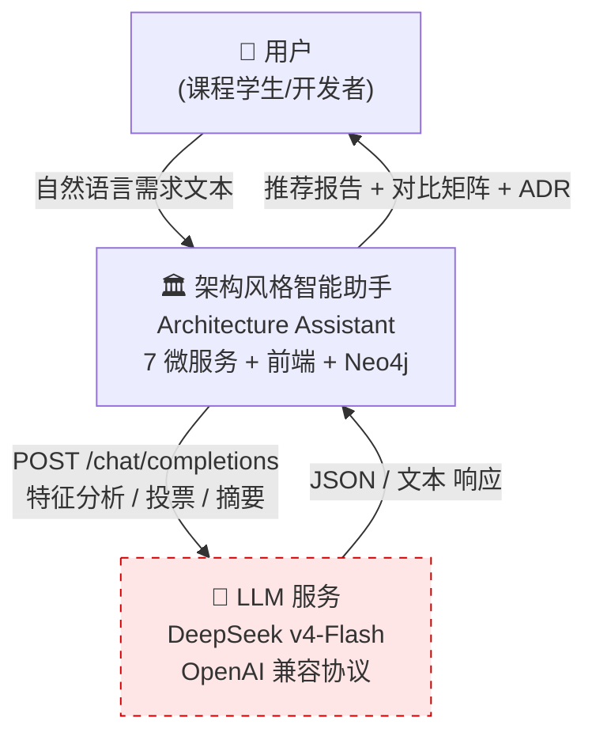
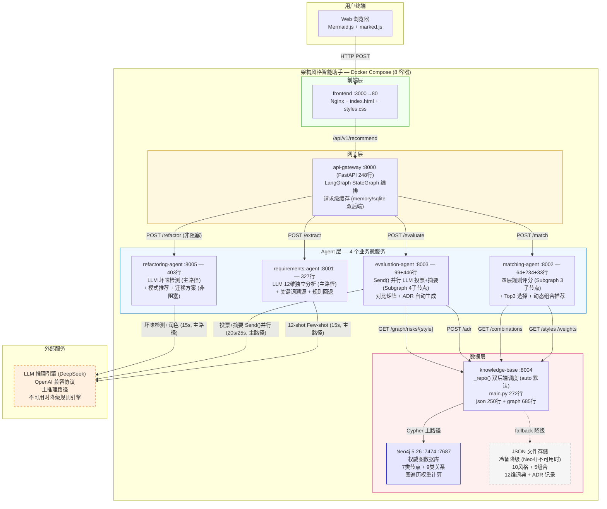
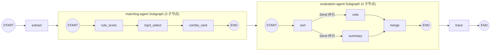
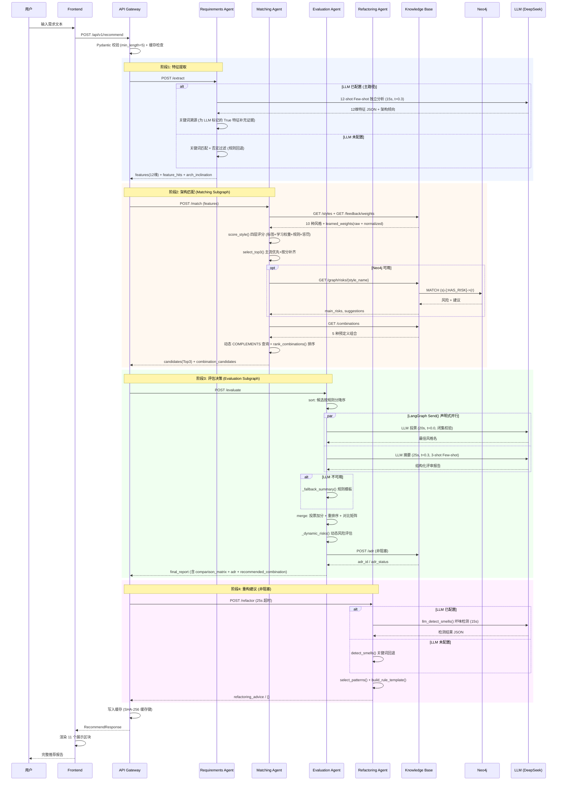
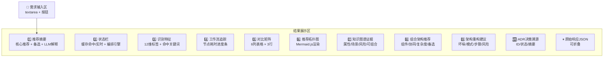

# 架构设计文档

> 版本: 3.0
> 日期: 2026-05-13
> 项目: 基于大模型的软件架构风格智能助手 (Architecture Assistant)

---

## 1. 设计目标

本系统面向"自然语言需求输入 → 架构风格推荐 → 可解释决策报告"的完整闭环，核心设计目标如下：

| # | 目标 | 说明 |
|---|------|------|
| G1 | 自然语言理解 | 从非结构化中文需求文本中结构化提取 12 维架构特征 |
| G2 | 多源推理融合 | 规则引擎 + 知识图谱 + LLM 三层协同，保证推荐质量 |
| G3 | 可解释决策 | 提供从特征证据到最终推荐的完整追溯链，支撑评审 |
| G4 | 高可用降级 | LLM / Neo4j / LangGraph 不可用时自动降级，核心链路不中断 |
| G5 | 工程可维护 | 6 个后端微服务独立部署，代码量可控，通过环境变量驱动配置 |
| G6 | 知识可进化 | 支持运行时新增架构风格，反馈驱动的学习权重自动累积 |

---

## 2. 架构驱动因素

### 2.1 需求不确定性

**问题**: 用户输入的需求描述可能模糊、不完整或含否定语义。

**设计决策**:
- LLM 独立理解需求语义，词典仅提供关键词溯源证据
- 否定语义过滤消除误命中（否定词 + 6 字符窗口）
- LLM 始终运行做全维度独立分析，不可用时回退纯规则
- LLM 不可用时规则结果即为最终特征集

### 2.2 LLM 不稳定性

**问题**: 外部 LLM 服务可能因网络、配额或模型幻觉导致输出不可靠。

**设计决策**:
- LLM 不参与候选集生成（候选由规则引擎确定）
- LLM 投票结果必须精确匹配候选列表中的风格名才被采纳
- LLM 摘要降级为规则模板（`_fallback_summary()`）
- 所有 LLM 调用设独立超时（15s/20s/25s）和 temperature 约束（0.0-0.3）
- Few-shot Prompt 约束输出格式

### 2.3 架构推荐可解释性

**问题**: 推荐结论需附带可追溯的证据链，满足课程评审要求。

**设计决策**:
- 四层证据链：L1 特征证据 → L2 匹配证据（规则+图谱） → L3 语义解释（LLM） → L4 决策记录（ADR）
- 每层在前后端均有独立的展示区块
- 对比矩阵包含 score/pros/cons/key_reasons/topology_mermaid 完整字段

### 2.4 微服务可维护性

**问题**: 单文件代码量过大将影响课程答辩的代码走查和设计讲解。

**设计决策**:
- 6 个后端微服务（含 API 网关）+ 1 个前端，各司其职，单文件最大 393 行，平均约 200 行
- 服务间通过 HTTP + JSON 通信，接口契约由 Pydantic 模型约束
- 配置通过环境变量注入，支持 .env 文件和 docker-compose.yml

---

## 3. 总体架构概览

系统自身采用**微服务架构**，核心理由：

| 维度 | 分析 |
|------|------|
| 领域解耦 | 需求提取(规则)、架构匹配(规则+图谱)、评估决策(LLM)分属不同领域 |
| 故障隔离 | LLM 调用存在外部依赖风险，独立部署后波动不影响知识库和匹配 |
| 异构集成 | 规则计算(CPU密集)、LLM调用(网络IO)、图查询(数据库)各自独立优化 |
| 技术灵活 | matching-agent 可独立接入 Neo4j，其他 Agent 不受影响 |
| 独立部署 | 每个服务独立 Dockerfile，docker-compose 按依赖顺序启动 |

### 系统组成（7 个服务 + Neo4j）

```
┌──────────────────────────────────────────────────────────────┐
│                    前端 (Frontend)                             │
│              Nginx :3000  |  index.html + styles.css          │
└──────────────────────────┬───────────────────────────────────┘
                           │ POST /api/v1/recommend
                           ▼
┌──────────────────────────────────────────────────────────────┐
│                 API 网关 (api-gateway :8000)                   │
│          FastAPI + LangGraph + httpx + 请求级缓存              │
│  端点: /api/v1/recommend  /health  /cache/stats  /cache/clear │
└──┬────────────┬────────────┬───────────────┬─────────────────┘
   │            │            │               │
   │POST/extract│POST/match  │POST/evaluate  │POST/refactor
   ▼            ▼            ▼               ▼
┌──────┐ ┌──────┐ ┌──────────┐ ┌──────────────┐
│ req- │ │match-│ │ eval-    │ │ refactoring- │
│ agent│ │agent │ │ agent    │ │   agent      │
│:8001 │ │:8002 │ │ :8003    │ │   :8005      │
└──────┘ └──┬───┘ └────┬─────┘ └──────────────┘
            │           │
            ▼           │ POST /adr
     ┌────────────┐     │
     │knowledge-  │◄────┘
     │   base     │
     │  :8004     │
     └──┬────┬────┘
        │    │
   ┌────▼──┐ ▼─────────┐
   │ Neo4j │ JSON 文件  │
   │ :7687 │ (fallback)│
   └───────┘ └──────────┘

          ┌─────────────────────────────┐
          │    外部 LLM 服务 (可选)       │
          │  DeepSeek v4-Flash           │
          │  /chat/completions           │
          └─────────────────────────────┘
```

---

## 4. C4 架构图

### 4.1 C4-Context（系统上下文）



### 4.2 C4-Container（容器级）



---

## 5. 微服务划分表

| 容器名 | 端口 | 技术栈 | 代码量 | 职责 | 对外暴露 |
|--------|------|--------|--------|------|----------|
| frontend | 3000→80 | Nginx 1.27 + HTML/CSS/JS | 前端: ~600行 | 用户交互与结果可视化 | ✅ |
| api-gateway | 8000 | FastAPI + LangGraph + httpx | 248+249+77行 | 请求校验、编排路由、缓存管理 | ✅ |
| requirements-agent | 8001 | FastAPI | 327行 | LLM 特征提取 + 关键词溯源 + 规则回退 | ❌ |
| matching-agent | 8002 | FastAPI + httpx | 64+234+33行 | 规则评分 + Top3 选择 + 组合推荐 | ❌ |
| evaluation-agent | 8003 | FastAPI + httpx + LangGraph | 99+446行 | LLM投票评估 (Send并行) + 矩阵 + ADR | ❌ |
| knowledge-base | 8004 | FastAPI + neo4j-driver | 272+685+250行 | 双后端知识存取 + 反馈 + ADR存储 | ❌ |
| refactoring-agent | 8005 | FastAPI + httpx | 403行 | LLM坏味检测 + 模式推荐 + 迁移方案 | ❌ |
| neo4j | 7474/7687 | Neo4j 5.26 Community | — | 权威图数据库 (auto 默认主后端) | ❌ |

**对外仅暴露前端 (3000) 和网关 (8000)**，其余服务通过 Docker 内部网络通信。

### 文件索引

| 服务 | 关键文件 | 行数 |
|------|---------|------|
| api-gateway | `services/api_gateway/app/main.py` | 248 |
| api-gateway | `services/api_gateway/app/langchain_workflow.py` | 249 |
| api-gateway | `services/api_gateway/app/workflow_state.py` | 77 |
| requirements-agent | `services/requirements_agent/app/main.py` | 327 |
| matching-agent | `services/matching_agent/app/main.py` | 64 |
| matching-agent | `services/matching_agent/app/matching_subgraph.py` | 234 |
| matching-agent | `services/matching_agent/app/combo_matcher.py` | 33 |
| evaluation-agent | `services/evaluation_agent/app/main.py` (99行) + `evaluation_subgraph.py` (446行) |
| knowledge-base | `services/knowledge_base/app/main.py` | 272 |
| knowledge-base | `services/knowledge_base/app/json_repository.py` | ~250 |
| knowledge-base | `services/knowledge_base/app/graph_repository.py` | 685 |
| knowledge-base | `services/knowledge_base/init/init_neo4j.py` | 376 |
| refactoring-agent | `services/refactoring_agent/app/main.py` | 403 |
| common | `services/common/cache/simple_cache.py` | 96 |
| common | `services/common/cache/sqlite_cache.py` | 155 |
| common | `services/common/cache/hash_utils.py` | 51 |
| common | `services/common/matching/rules.py` | 176 |
| common | `services/common/matching/combo.py` | 97 |
| common | `services/common/prompts/requirements_few_shot.py` | 135 |
| common | `services/common/prompts/evaluation_few_shot.py` | 149 |

---

## 6. API Gateway 设计

### 6.1 职责

API Gateway (`services/api_gateway/app/main.py`, 226 行) 是系统的唯一对外入口，负责：

1. **请求校验**: 通过 Pydantic `RecommendRequest` 模型验证 `requirement` 字段（min_length=10）
2. **缓存检查**: 请求级缓存命中时直接返回，跳过编排链路
3. **LangGraph 编排**: StateGraph 4 节点串行执行 (extract → match → evaluate → trace)
4. **重构调用**: 推荐完成后异步调用 refactoring-agent（非阻塞，失败不影响主链路）
5. **结果缓存**: 未命中缓存的请求完成后写入缓存
6. **健康检查**: `GET /health` 返回服务名、编排引擎类型、缓存后端
7. **缓存管理**: `GET /cache/stats` + `POST /cache/clear`

### 6.2 端点一览

| 方法 | 路径 | 说明 |
|------|------|------|
| POST | `/api/v1/recommend` | 主推荐入口（extract → match → evaluate → refactor） |
| GET | `/health` | 健康检查，含 workflow_engine 和 cache_backend |
| GET | `/cache/stats` | 缓存统计（命中率、条目数、TTL、知识库版本） |
| POST | `/cache/clear` | 清空全部缓存 |

### 6.3 推荐主流程

```
POST /api/v1/recommend
      │
      ├─ 1. Pydantic 校验 (min_length=10) → 422
      │
      ├─ 2. 请求级缓存检查 (cache_key)
      │     ├─ 命中 → 直接返回 (cache_hit=true)
      │     └─ 未命中 → 继续
      │
      ├─ 3. LangGraph 编排
      │     START → extract_node → match_node
      │          → evaluate_node → trace_node → END
      │
      ├─ 4. 重构建议 (非阻塞)
      │     POST refactoring-agent/refactor
      │     失败 → 记录警告，refactoring_advice = {}
      │
      ├─ 5. 写入缓存 → 返回
      │
      └─ 返回字段: extracted_features, feature_hits,
                    candidates, combination_candidates,
                    final_report (含 refactoring_advice, adr, recommended_combination),
                    workflow_engine, workflow_trace, cache_hit
```

---

## 7. LangGraph 编排机制

### 7.1 Workflow State

定义在 `services/api_gateway/app/workflow_state.py` (36 行)：

```python
class ArchitectureWorkflowState(TypedDict):
    requirement: str              # 用户输入
    extracted_features: dict      # extract_node 输出
    feature_hits: dict            # 关键词命中证据
    candidates: list              # match_node 输出
    combination_candidates: list  # 组合候选
    final_report: dict            # evaluate_node 输出
    errors: list                  # 错误收集
    trace: list                   # 每节点耗时追踪
```

### 7.2 节点定义

| 节点 | 调用的服务 | 内部实现 | 输入 | 输出 |
|------|-----------|---------|------|------|
| `extract_node` | requirements-agent:8001/extract | HTTP 调用 | requirement | extracted_features, feature_hits |
| `match_node` | matching-agent:8002/match | **LangGraph Subgraph** (3 子节点: rule_score → top3_select → combo_rank) | extracted_features | candidates, combination_candidates |
| `evaluate_node` | evaluation-agent:8003/evaluate | **LangGraph Subgraph** (4 子节点: sort → Send(vote ∥ summary) → merge) | requirement + features + candidates | final_report |
| `trace_node` | (本地) | 纯函数, 汇总 state | state | workflow_engine, 总耗时 |

### 7.3 状态图结构（父图 + 两个 Subgraph）



### 7.4 子图设计说明

**matching-agent Subgraph** (`services/matching_agent/app/matching_subgraph.py`):

| 子节点 | 职责 | 调用的纯函数 |
|--------|------|------------|
| `rule_score` | HTTP 拉取 styles + weights, 逐风格调用 score_style() 评分 | `common.matching.score_style` |
| `top3_select` | select_top3() Top3 选择 + 图谱风险查询 (GET /graph/risks) | `common.matching.select_top3` |
| `combo_rank` | 动态 COMPLEMENTS 查询 + JSON 组合定义, rank_combinations() 排序 | `common.matching.rank_combinations` |

**evaluation-agent Subgraph** (`services/evaluation_agent/app/evaluation_subgraph.py`):

| 子节点 | 职责 | 并行? |
|--------|------|:--:|
| `sort` | 候选按规则分排序 | 串行 |
| `vote` | LLM 投票 (t=0.0, 闭集校验) | ← Send() 并行 |
| `summary` | LLM 摘要 (t=0.3, Few-shot) | ← Send() 并行 |
| `merge` | 投票加分 + 重新排序 + 对比矩阵 + 风险分析 + ADR 生成 | 汇聚 |

Send() 是 LangGraph 的声明式并行 API——图结构直接声明 vote 和 summary 两个节点可同时执行, LangGraph 引擎自动管理两者的并发调度和结果合并。替代原来的 `asyncio.gather` 手动并行。

---

## 8. 智能体协作机制

### 8.1 完整协作流程



### 8.2 Requirements Agent

**文件**: `services/requirements_agent/app/main.py` (约 330 行)

**设计思路**: LLM 优先 + 词典溯源。LLM 独立理解需求语义做判断，关键词词典仅用于补充可解释性证据，不影响判断结果。

**核心处理流程**:

```
需求文本
  │
  ├─ 1. llm_analyze(): LLM 独立分析 (主路径)
  │    Prompt: 12-shot Few-shot → 零样本 fallback
  │    Temperature: 0.3, Timeout: 15s
  │    输出: 全 12 维 True/False JSON + 架构倾向 (---ARCH---)
  │    能力: 语义理解 (双十一流量→高并发)、否定识别、隐含特征推断
  │
  ├─ 2. 词典溯源: 为 LLM 标记的 True 特征匹配关键词证据
  │    命中 → feature_hits[dim] = ["高并发", "万人", ...]
  │    未命中 → feature_hits[dim] = ["llm_identified"]
  │    词典不影响判断, 只提供可解释性
  │
  └─ 3. rule_extract(): 纯规则回退 (LLM 不可用时)
       关键词匹配 + 双向否定过滤
       保证 LLM 不可用时的核心功能
```

**12 维特征词典** (外置于 `feature_lexicon.json`):

| 维度 key | 中文名 | 关键词数 | 说明 |
|----------|--------|----------|------|
| high_concurrency | 高并发 | 12 | 高并发/万人/峰值/秒杀/高吞吐 |
| real_time | 实时性 | 12 | 实时/毫秒/消息推送/IM/低延迟 |
| reliability | 可靠性 | 9 | 高可用/容灾/容错/熔断/SLA |
| scalability | 可扩展性 | 12 | 弹性/水平扩展/集群/分片/可伸缩 |
| complex_business | 复杂业务 | 11 | 工作流/审批/CMS/ERP/多模块 |
| strict_consistency | 强一致性 | 10 | 事务/ACID/原子性/分布式事务/回滚 |
| deployment_constraint | 部署约束 | 10 | 本地部署/内网/信创/国产化/局域网 |
| data_intensive | 数据密集型 | 14 | 数据流/ETL/大数据/数据仓库/BI/TB级 |
| team_size_large | 多团队 | 8 | 多团队/跨团队/多部门/并行开发 |
| security | 安全性 | 15 | 加密/审计/等保/零信任/GDPR/脱敏 |
| simple_crud | 极简业务 | 10 | 增删改查/CRUD/内部工具/管理后台 |
| resource_constrained | 资源受限 | 10 | 预算有限/成本控制/小团队/MVP/快速交付 |

> **设计决策**: 自然语言千变万化——"双十一流量"/"日活百万"/"并发极高"——手工编写正则规则无法穷尽。LLM 作为主路径能理解各种表述，词典降级为"证据库"——只回答"为什么"，不决定"是什么"。

### 8.3 Matching Agent（含 LangGraph Subgraph）

**文件**: `services/matching_agent/app/main.py` (64 行) + `matching_subgraph.py` (234 行) + `combo_matcher.py` (33 行)

**共享模块**: `services/common/matching/` — `rules.py` (score_style, select_top3), `combo.py` (score_combination, rank_combinations)

**设计思路**: 四层评分体系——标签基础分 + 学习权重分 + 特定规则加成 + 非对称惩罚。匹配流程由 3 子节点 LangGraph Subgraph 驱动: rule_score → top3_select → combo_rank。

**子图拓扑**:

```
START → rule_score → top3_select → combo_rank → END
```

| 子节点 | 职责 | 输出 |
|--------|------|------|
| `rule_score` | HTTP 拉取 10 种风格 + 学习权重, 逐风格 score_style() 评分 | `rule_scored` |
| `top3_select` | 排序 + select_top3() Top3 选择 + 图谱风险查询 | `candidates` |
| `combo_rank` | 动态 COMPLEMENTS 查询 + JSON 组合定义, rank_combinations() | `combination_candidates` |

**评分算法** (`score_style()`, `services/common/matching/rules.py`):

```
总分 = 标签基础分 + 学习权重分 + 特定规则加成 + 非对称惩罚

标签基础分:  for tag in style.tags:
               if features[tag] and not disputed: score += 2
               elif features[tag] and disputed:    score += 1   # LLM 争议特征

学习权重分:  (基于 raw 计数阈值, 避免归一化放大单次反馈)
               raw ≥ 1.5  → +2 (金牌: ~3次确认 或 1次5★+1次确认)
               raw ≥ 0.5  → +1 (银牌: ~1次确认)
               raw ≤ -1.0 → -2 (强负反馈)
               raw ≤ -0.5 → -1 (中负反馈)

特定规则分 (7 条):
  Event-Driven + high_concurrency                            → +1
  Microservices + team_size_large                            → +1
  Layered + strict_consistency                               → +1
  Pipeline-Filter + data_intensive + real_time               → +1
  CQRS + data_intensive + high_concurrency                   → +1
  Microservices + high_concurrency + strict_consistency      → +1

非对称惩罚:  penalty_tags 反向扣分
  Microservices × simple_crud = -3, × resource_constrained = -4
  Client-Server × high_concurrency = -4, × scalability = -3, × team_size_large = -4
  Event-Driven × simple_crud = -3, × resource_constrained = -3
  CQRS × simple_crud = -2, × resource_constrained = -3
  Space-Based × resource_constrained = -4
  Layered × high_concurrency = -2, × real_time = -2, × data_intensive = -2
```

**候选筛选策略**: 主流优先 + 按分补齐。Layered / Microservices / Event-Driven 始终出现在 Top 3 中。

**组合推荐** (`combo_matcher.py`):

```
score_combination(combo, scored_styles, features, graph_evidence):
  score = sum(组件风格分数) + 特征覆盖互补加分 + 图谱 COMPLEMENTS 加分 - complexity_penalty
  返回 Top 3 组合候选
```

### 8.4 Evaluation Agent（含 LangGraph Subgraph + Send() 并行）

**文件**: `services/evaluation_agent/app/main.py` (99 行) + `evaluation_subgraph.py` (446 行)

**设计思路**: 混合推理——规则排名确定候选顺序，LLM 投票做 tie-break（+1 分），LLM 摘要提供自然语言解释。LLM 完全不可用时使用模板化摘要。评估流程由 4 子节点 LangGraph Subgraph 驱动, vote 和 summary 通过 `Send()` API 声明式并行执行。

**子图拓扑**:

```
START → sort → Send(vote) + Send(summary) → merge → END
                   └──── 并行扇出 ────┘
```

| 子节点 | 职责 | 并行? |
|--------|------|:--:|
| `sort` | 候选按规则分降序排列 | 串行 |
| `vote` | LLM 投票 (t=0.0, 闭集校验, 20s 超时) | ← Send() 并行 |
| `summary` | LLM 摘要 (t=0.3, Few-shot, 25s 超时) | ← Send() 并行 |
| `merge` | 投票加分 + 重新排序 + 对比矩阵 + 风险 + 组合推荐 + ADR | 汇聚 |

Send() 替代原来的 `asyncio.gather`——并行关系从 Python 协程级提升为图结构声明, LangGraph 引擎自动调度并发和结果合并。

**核心流程**:

```
候选列表 + 需求文本 + 特征
  │
  ├─ 1. 按规则分数降序排列
  │
  ├─ 2. 并行 LLM 调用 (LangGraph Send() 声明式并行)
  │    ├─ vote 子节点 (llm_vote_style):
  │    │    System: "strict architecture judge"
  │    │    User: 需求 + 候选列表
  │    │    Temperature: 0.0, Timeout: 20s
  │    │    输出: 仅风格名称 (如 "Event-Driven Architecture")
  │    │    校验: 必须在候选列表中
  │    │
  │    └─ summary 子节点 (llm_summary):
  │         System: "senior architecture reviewer"
  │         Few-shot: 3 个示例 (Event-Driven/Microservices/Layered+CQRS)
  │         Temperature: 0.3, Timeout: 25s
  │         失败 → _fallback_summary()
  │
  ├─ 3. 混合评分: LLM 投票匹配的风格 +1 → 重新排序
  │
  ├─ 4. 构建对比矩阵 (3 行，6 列表格 + topology_mermaid 图)
  │    表格列: recommendation_type, style, score, key_reasons, pros, cons
  │    配套: 每行含 topology_mermaid 字段供前端独立渲染
  │
  ├─ 5. 动态风险评估 (_dynamic_risks)
  │    Event-Driven → 事件一致性/溯源复杂度
  │    Microservices → 分布式事务/运维成本
  │    Layered → 跨层性能/扩展限制
  │    其余 7 种 → 通用回退模板
  │
  ├─ 6. 推荐组合 (若 combination_candidates 非空)
  │    最高分组合 → recommended_combination
  │
  └─ 7. ADR 自动生成 → POST /adr (非阻塞)
```

**降级摘要格式** (`_fallback_summary()`):

```
1. 推荐架构：{best_style}（核心推荐）
   备选架构：{alt_style_1}、{alt_style_2}

2. 推荐理由：
   - {rule_reason_1}
   - {rule_reason_2}

3. 优缺点分析：
   √ 优点：{pros}
   × 缺点：{cons}
```

### 8.5 Refactoring Agent

**文件**: `services/refactoring_agent/app/main.py` (340 行)

**设计思路**: 规则引擎主导的架构坏味检测与重构建议。LLM 仅用于可选润色，不可用时使用纯规则模板。

**核心流程**:

```
需求文本 + 推荐风格 + 特征
  │
  ├─ 1. 坏味检测 (detect_smells)
  │    基于关键词匹配 + 特征推断
  │    5 种坏味:
  │    ├─ monolith_coupling (单体耦合)
  │    ├─ scaling_bottleneck (扩展瓶颈)
  │    ├─ slow_release (发布缓慢)
  │    ├─ legacy_lockin (遗留系统锁定)
  │    └─ data_coupling (数据层耦合)
  │
  ├─ 2. 模式选择 (select_patterns)
  │    基于需求特征 + 推荐风格 + 检测坏味
  │    5 种模式:
  │    ├─ Strangler Fig (绞杀者模式)
  │    ├─ Anti-Corruption Layer (防腐层)
  │    ├─ Modular Monolith First (模块化单体优先)
  │    ├─ CQRS Migration (CQRS 迁移)
  │    └─ Event-Driven Migration (事件驱动迁移)
  │
  ├─ 3. 规则模板生成 (build_rule_template)
  │    ├─ refactoring_needed (boolean)
  │    ├─ detected_smells (坏味列表 + 描述)
  │    ├─ recommended_patterns (模式列表 + 描述)
  │    ├─ migration_steps (≥ 3 个阶段步骤)
  │    ├─ risks (迁移风险)
  │    └─ mitigations (缓解措施)
  │
  └─ 4. LLM 润色 (llm_polish, 可选)
       改进步骤描述和风险说明，保持结构不变
```

**调用方式**: API Gateway 在推荐完成后异步调用（`main.py:193-212`），超时 8s，失败不阻塞主流程，`refactoring_advice` 默认为空对象。

---

## 9. LLM 集成方案

### 9.1 集成架构

所有 LLM 调用通过 OpenAI 兼容协议 (`POST /chat/completions`)：

```
环境变量:
  LLM_API_BASE  → https://api.deepseek.com
  LLM_API_KEY   → sk-xxxx
  LLM_MODEL     → deepseek-v4-flash
```

### 9.2 调用点一览

| # | 调用位置 | 用途 | Temperature | Timeout | 失败策略 |
|---|---------|------|-------------|---------|---------|
| 1 | requirements-agent | 语义特征补全 | 0.1 | 15s | 静默降级，维持规则结果 |
| 2 | evaluation-agent | 风格投票 | 0.0 | 20s | 返回 null，不加分 |
| 3 | evaluation-agent | 摘要生成 | 0.3 | 25s | `_fallback_summary()` |
| 4 | refactoring-agent | 步骤润色 | 0.3 | 15s | 使用规则模板原文 |

### 9.3 Few-shot Prompt 设计

**Requirements Few-shot** (`services/common/prompts/requirements_few_shot.py`, 135 行):

12 个标注示例，覆盖全部 12 个特征维度：

| # | 场景 | 教学点 |
|---|------|--------|
| 1 | "日活百万，双十一暴增" | 高并发 + 可扩展（语义推断） |
| 2 | "不需要实时，批量处理即可" | 否定语义（显式 false） |
| 3 | "医疗数据，患者隐私合规" | 隐含安全（非显式关键词） |
| 4 | "TB 级日志，ETL 管道处理" | 数据密集型（量级推断） |
| 5 | "金融交易，ACID 一致提交" | 强一致 + 可靠 |
| 6 | "单体拆服务，多团队并行开发" | 多团队 + 扩展 |
| 7 | "运营数据分析，百万条记录" | 数据密集型（降低阈值） |
| 8 | "股票行情，毫秒级推送" | 实时性（毫秒级表述） |
| 9 | "企业 ERP，采购库存财务人事" | 复杂业务 + 强一致 |
| 10 | "军工指挥，内网部署，等保三级" | 部署约束 + 安全 |
| 11 | "内部后台，增删改查" | 极简业务 |
| 12 | "创业 MVP，预算有限 5 人团队" | 资源受限 |

**Evaluation Few-shot** (`services/common/prompts/evaluation_few_shot.py`, 119 行):

3 个完整评审报告示例，覆盖 3 种核心推荐风格：

| # | 推荐风格 | 场景 |
|---|---------|------|
| 1 | Event-Driven Architecture | 即时通讯系统 |
| 2 | Microservices | 电商平台 |
| 3 | Layered Architecture + CQRS | 企业内部审批系统 |

每个示例展示完整的四部分输出结构：
```
1. 推荐架构 (核心 + 备选)
2. 推荐理由 (2-3 条，基于特征-风格匹配)
3. 优缺点分析 (√ 优点 / × 缺点)
4. 风险与建议 (2-3 条风险 + 缓解措施)
```

**Fallback 链**: Few-shot 模块导入失败 → 自动降级为零样本 Prompt（内联在 Agent 代码中）。

### 9.4 输出校验

| 校验点 | 方法 | 失败处理 |
|--------|------|---------|
| LLM 投票风格名 | `returned_name in [c["style"] for c in candidates]` | 丢弃投票 |
| LLM 补全 JSON | `json.loads()` 尝试；失败则尝试 markdown 代码块提取 | 丢弃 LLM 结果 |
| LLM 摘要文本 | 非空字符串检查 | `_fallback_summary()` |

### 9.5 降级策略

```
LLM 全可用:  规则 + LLM补全 + LLM投票 + Few-shot摘要 → 完整智能推荐
LLM 部分故障: 规则 + LLM补全 + 投票失败 + 模板摘要 → 降级推荐
LLM 完全不可用: 规则 + 模板摘要 → 纯规则推荐 (回归测试仍 100% 通过)
```

---

## 10. Neo4j 知识图谱设计

### 10.1 图模型

Neo4j 作为权威图数据库（`auto` 模式默认主后端），JSON 文件作为冷备降级。

**节点类型** (7 类):

| 节点标签 | 属性 | 数量 | 示例 |
|---------|------|------|------|
| `ArchitectureStyle` | name, name_zh, pros, cons, topology_mermaid, is_mainstream | 10 | "Event-Driven Architecture" |
| `QualityAttribute` | name | ≥ 12 | "high_concurrency", "real_time" |
| `Feature` | name | 12 | 评分特征维度 (用于 HAS_PENALTY 关系) |
| `Scenario` | name | ≥ 10 | "real-time messaging", "e-commerce" |
| `Risk` | name, suggestion | 30 (10×3) | "事件一致性设计难度大" |
| `ScoringRule` | name, bonus, required_features | 6 | "EDA高并发加成" |
| `Feedback` | timestamp, requirement, recommended_style, is_confirmed, rating | 动态增长 | 用户反馈记录 |

**关系类型** (9 类):

| 关系 | 方向 | 含义 | 示例 |
|------|------|------|------|
| `HAS_QUALITY` | Style → QualityAttribute | 风格具备某质量属性 | Event-Driven → high_concurrency |
| `SUITABLE_FOR` | Style → Scenario | 风格适用于某场景 | Microservices → large_team |
| `HAS_RISK` | Style → Risk | 风格存在某风险 | Microservices → 分布式事务 |
| `COMPLEMENTS` | Style → Style | 两种风格互补可组合 | CQRS → Event-Driven |
| `HAS_PENALTY` | Feature → Style | 特征对风格的反向惩罚评分 | simple_crud → Microservices (-3) |
| `LEARNED_FOR` | Style → QualityAttribute | 学习权重边 (带 weight 属性) | Event-Driven → high_concurrency |
| `HAS_FEATURE` | Feedback → QualityAttribute | 反馈关联的活跃特征 | 替代 JSON 数组属性 |
| `REQUIRES` | ScoringRule → Feature | 评分规则的前置特征 | "EDA高并发加成" → high_concurrency |
| `APPLIES_TO` | ScoringRule → Style | 评分规则应用的目标风格 | "EDA高并发加成" → Event-Driven |

**ADR 扩展节点与关系**:
- 节点: `ADR` (adr_id, timestamp, requirement, recommended_style)
- 关系: `RECOMMENDS` (ADR → ArchitectureStyle), `BASED_ON` (ADR → QualityAttribute)

### 10.2 初始化

`services/knowledge_base/init/init_neo4j.py` (376 行):

```bash
python services/knowledge_base/init/init_neo4j.py
```

初始化流程：
1. `DETACH DELETE` 清空现有数据（幂等可重复执行）
2. 从 `architecture_styles.json` 读取 10 种风格
3. 创建 12 个 Feature 节点 + ArchitectureStyle、QualityAttribute、Scenario、Risk、ScoringRule 节点
4. 创建 HAS_QUALITY、SUITABLE_FOR、HAS_RISK、HAS_PENALTY (16条)、COMPLEMENTS (16条) 关系
5. 创建 6 个 ScoringRule 节点及 REQUIRES/APPLIES_TO 关系
6. 创建 11 条种子反馈及 LEARNED_FOR 关系

### 10.3 图匹配查询

`graph_repository.py:graph_match()`:

```cypher
MATCH (s:ArchitectureStyle)-[:HAS_QUALITY]->(a:QualityAttribute)
WHERE a.name IN $active_features
RETURN s.name, collect(a.name), ...
```

每个匹配属性 +2 分。同时查询 Scenario、Risk、COMPLEMENTS 关系。

### 10.4 双后端调度

`knowledge_base/app/main.py` 中的 `_repo()` 函数实现统一调度：

| `KNOWLEDGE_BACKEND` | 行为 | 适用场景 |
|---------------------|------|----------|
| `auto` (默认) | 优先 Neo4j，连接失败自动回退 JSON | Docker Compose 部署 |
| `json` | 始终使用 JSON 文件，不连接 Neo4j | 本地开发、无 Docker |
| `neo4j` | 始终使用 Neo4j，不可用时抛 RuntimeError | 生产环境图查询 |

### 10.5 图谱状态端点

`GET /graph/status` 返回：

```json
{
  "backend": "auto",
  "neo4j_available": true,
  "node_count": 58,
  "relationship_count": 72,
  "uri": "bolt://neo4j:7687"
}
```

Neo4j 不可用时：
```json
{
  "backend": "json",
  "neo4j_available": false
}
```

---

## 11. 规则引擎设计

### 11.1 评分层次

```
Layer 1: 规则引擎评分 (score_style)          [始终运行，确定性]
  ├─ 标签匹配: tag ∈ features → +2/项
  ├─ 特定规则: 6 条硬编码领域规则 → +1/条
  └─ 学习权重: >= 2 次确认的关联 → +1/项

Layer 2: 知识图谱证据 (top3_select)           [Neo4j 可用时运行]
  ├─ HAS_QUALITY/SUITABLE_FOR/HAS_RISK/COMPLEMENTS → 附加信息
  ├─ GET /graph/risks/{style_name} → 风险与建议
  └─ graph_evidence 作为前端展示信息，不参与评分

Layer 3: LLM 投票/摘要 (evaluation-agent)    [LLM 可用时运行]
  ├─ llm_vote_style() → +1 tie-break
  └─ llm_summary() → 自然语言解释
```

### 11.2 设计原则

**"规则保证下限，图谱增强关系，LLM 提升上限"**

- 规则引擎确保在任何情况下都有基于知识库的、有依据的推荐
- Neo4j 知识图谱通过关系遍历发现隐含的架构关联
- LLM 在规则和图谱基础上提供语义级辅助判断
- 三层独立运行、松耦合：任一层不可用则自动退化为下层

### 11.3 主流架构保底

```python
MAINSTREAM_STYLES = [
    "Layered Architecture",
    "Microservices",
    "Event-Driven Architecture",
]
```

候选集生成策略：主流风格始终出现在 Top 3 中，剩余空位按分数从高到低补齐。全部得分为 0 时返回三种主流作为基线对比。

---

## 12. LLM 缓存机制

### 12.1 设计目标

避免相同需求的重复 LLM 调用和计算，同时保证知识库更新后缓存自动失效。

### 12.2 缓存键生成

`services/common/cache/hash_utils.py` (51 行):

```python
cache_key = SHA256(requirement + LLM_MODEL + knowledge_version)[:16]
knowledge_version = MD5(architecture_styles.json 内容)[:8]
```

知识库文件内容变更 → knowledge_version 改变 → 旧缓存全部自动失效。

### 12.3 双后端实现

| 后端 | 文件 | 特点 |
|------|------|------|
| memory (默认) | `simple_cache.py` (96行) | 内存字典 + TTL + 线程安全，进程重启丢失 |
| sqlite | `sqlite_cache.py` (155行) | SQLite 持久化 + 定期过期清理，跨重启持久化 |

配置: `CACHE_BACKEND=memory|sqlite`, `CACHE_TTL_SECONDS=3600`, `CACHE_ENABLED=true|false`

### 12.4 缓存管理 API

| 端点 | 说明 | 响应字段 |
|------|------|---------|
| GET `/cache/stats` | 缓存统计 | backend, enabled, ttl_seconds, entries, hits, misses, hit_rate, knowledge_version |
| POST `/cache/clear` | 清空缓存 | status, cleared_count |

### 12.5 前端展示

响应中 `cache_hit: true/false` 字段驱动前端展示：
- `true` → 绿色徽章"缓存命中"
- `false` → 蓝色徽章"实时计算"

---

## 13. ADR 决策溯源机制

### 13.1 生成时机与触发

每次 `POST /evaluate` 完成后，Evaluation Agent 自动生成 ADR 并写入 knowledge-base：

```
evaluation-agent/main.py:evaluate()
  │
  └─ POST {KNOWLEDGE_BASE_URL}/adr
        │
        ├─ 成功 → adr_status = "created"
        └─ 失败 → adr_status = "failed" (不阻塞推荐主流程)
```

### 13.2 ADR 存储字段

| 字段 | 说明 |
|------|------|
| adr_id | ADR-YYYYMMDD-NNN（如 ADR-20260513-001） |
| timestamp | ISO 格式时间戳 |
| requirement | 原始需求文本 |
| extracted_features | 12 维特征布尔映射 |
| candidates | 候选架构列表（含分数、理由） |
| recommended_style | 最终推荐 |
| decision_basis | 规则理由 + LLM 投票 + LLM 摘要 |
| risk_and_suggestions | 风险与缓解建议 |
| graph_evidence | 图谱匹配证据（如有） |

### 13.3 双端存储

| 存储方式 | 文件/位置 | 说明 |
|---------|----------|------|
| JSON 持久化 | `adr_records.json` | 始终可用，追加写入 |
| Neo4j 同步 | ADR 节点 + RECOMMENDS/BASED_ON 关系 | 可选，失败不影响 JSON 存储 |

### 13.4 ADR API

| 方法 | 路径 | 说明 |
|------|------|------|
| POST | `/adr` | 创建 ADR（内部调用） |
| GET | `/adr?limit=20` | 列表查询 |
| GET | `/adr/{adr_id}` | 单条查询，404 如不存在 |

### 13.5 响应嵌入

推荐响应中嵌入 ADR 信息：
```json
{
  "final_report": {
    "adr": {
      "adr_id": "ADR-20260513-001",
      "adr_status": "created",
      "adr_summary": "Event-Driven Architecture 推荐决策",
      "api_path": "/adr/ADR-20260513-001"
    }
  }
}
```

---

## 14. 架构组合推荐

### 14.1 组合数据

`services/knowledge_base/data/architecture_combinations.json` 定义 5 种预定义组合：

| 组合 | 组件风格 | 特征标签 | 复杂度 |
|------|---------|---------|--------|
| 微服务 + 事件驱动 | Microservices, Event-Driven | high_concurrency, scalability, real_time, team_size_large, reliability | 1 |
| 分层架构 + CQRS | Layered, CQRS | complex_business, strict_consistency, scalability, data_intensive | 1 |
| 管道-过滤器 + 事件驱动 | Pipeline-Filter, Event-Driven | data_intensive, real_time, high_concurrency, scalability | 2 |
| 六边形架构 + 微服务 | Hexagonal, Microservices | complex_business, team_size_large, scalability, reliability | 2 |
| CQRS + 事件溯源 | CQRS, Event-Driven | strict_consistency, data_intensive, high_concurrency, security | 3 |

### 14.2 评分算法

`services/matching_agent/app/combo_matcher.py` (114 行):

```python
score_combination(combo, scored_styles, features, graph_evidence):
    score = sum(各组件风格在 scored_styles 中的分数)
          + feature_coverage_bonus    # 组合覆盖了特征但组件未覆盖 → +1/项
          + graph_complements_bonus   # 图谱中 CAN_COMBINE_WITH 关系 → +2/项
          - complexity_penalty        # 每个复杂度级别 -1 分
```

### 14.3 输出字段

```json
{
  "recommended_combination": {
    "name": "Microservices + Event-Driven Architecture",
    "name_zh": "微服务 + 事件驱动",
    "score": 15,
    "components": ["Microservices", "Event-Driven Architecture"],
    "synergy_zh": "微服务负责服务边界和独立部署；事件驱动解耦服务间通信...",
    "complexity_penalty": 1,
    "topology_mermaid": "graph LR\n..."
  },
  "combination_candidates": [...]
}
```

---

## 15. 前端可视化设计

### 15.1 技术栈

| 组件 | 技术 | 说明 |
|------|------|------|
| 页面结构 | 原生 HTML5 | 289 行，单页应用 |
| 样式 | 原生 CSS3 | 151 行，暖色调卡片式设计 |
| 流程图渲染 | Mermaid.js v10 (CDN) | 架构拓扑图动态渲染 |
| Markdown 渲染 | marked.js (CDN) | LLM 摘要文本渲染 |
| HTTP 请求 | fetch API | POST /api/v1/recommend |
| 部署 | Nginx 1.27-alpine | :3000→80 |

### 15.2 11 个展示区块



### 15.3 关键渲染函数

| 函数 | 渲染目标 | 数据来源 |
|------|---------|---------|
| `renderMatrix()` | 对比矩阵表格 | `final_report.comparison_matrix` |
| `buildTopology()` | Mermaid 拓扑图 | `comparison_matrix[0].topology_mermaid` |
| `renderFeatures()` | 特征标签 + 命中词 | `extracted_features` + `feature_hits` |
| `renderWorkflowTrace()` | 工作流追踪条 | `workflow_trace` |
| `renderGraphEvidence()` | 图谱证据卡片 | `candidates[*].graph_evidence` |
| `renderCombo()` | 组合推荐卡片 | `final_report.recommended_combination` |
| `renderRefactoring()` | 重构建议卡片 | `final_report.refactoring_advice` |
| (内联) | ADR 信息 + 状态栏 | `final_report.adr` + `cache_hit` + `workflow_engine` |

---

## 16. 异常处理与降级机制

### 16.1 异常处理矩阵

| 故障点 | 影响范围 | 检测方式 | 处理策略 | 用户体验 |
|--------|---------|---------|---------|---------|
| LangGraph 未安装 | 编排引擎 | `build_workflow()` 返回 None | 抛出明确错误提示安装 | 需安装 langgraph |
| LangGraph 运行时异常 | 当次请求 | try/except 捕获并记录 trace | 返回 502 错误 | 错误信息可观测 |
| requirements-agent 不可达 | 全链路 | `httpx.HTTPError` | 网关返回 502 | 显示错误 |
| matching-agent 不可达 | 全链路 | `httpx.HTTPError` | 网关返回 502 | 显示错误 |
| knowledge-base 不可达 | 匹配失败 | `httpx.HTTPError` | 网关返回 502 | 显示错误 |
| evaluation-agent 不可达 | 全链路 | `httpx.HTTPError` | 网关返回 502 | 显示错误 |
| refactoring-agent 不可达 | 无影响 | try/except (非阻塞) | refactoring_advice = {} | 重构区空白 |
| Neo4j 不可达 (auto/json) | 无影响 | graph_repository 返回 None | 自动回退 JSON | 透明，功能完整 |
| Neo4j 不可达 (neo4j 强制) | 知识库部分功能 | graph_repository 抛异常 | HTTP 503 | 显示错误 |
| LLM 未配置 | 无 LLM 功能 | 环境变量为空 | 静默纯规则模式 | 模板化摘要 |
| LLM 超时 (15s/20s/25s) | 单次调用 | `httpx.TimeoutException` | fallback 摘要 | 降级推荐 |
| LLM 返回异常/非 JSON | 单次调用 | HTTPError / JSONDecodeError | fallback 摘要 | 降级推荐 |
| LLM 投票名不在候选列表 | 投票弃用 | 字符串匹配校验 | 丢弃投票不加分 | 透明 |
| LLM 分析失败 | 特征提取 | try/except | 回退 rule_extract() | 核心特征可提取 |
| ADR 写入失败 | 无影响 | try/except (非阻塞) | adr_status = "failed" | ADR 区显示失败 |
| 前端网络异常 | 用户无结果 | fetch 异常 | 显示错误文本 + 恢复按钮 | 错误提示 |

### 16.2 降级层次

```
Level 0: 全功能
  规则引擎 + Neo4j图谱 + LLM补全 + LLM投票 + Few-shot摘要 + ADR + 重构
  → 完整智能推荐报告

Level 1: LLM 波动
  规则引擎 + Neo4j图谱 + LLM补全 + 投票失败 + 模板摘要 + ADR + 重构
  → 降级但不影响核心推荐

Level 2: Neo4j 不可用
  规则引擎 + LLM补全 + LLM投票 + Few-shot摘要 + ADR + 重构 (JSON后端)
  → 缺少图谱证据，其他功能完整

Level 3: LLM 完全不可用
  规则引擎 (JSON后端) + 模板摘要 + ADR + 重构(模板)
  → 纯规则推荐，回归测试仍 100% 通过

Level 4: 单服务宕机
  网关捕获异常 → HTTP 502 → 前端显示错误
```

---

## 17. 知识进化机制

### 17.1 反馈收集

`POST /feedback` 接收用户对推荐结果的确认或修正。前端提供三种反馈入口：**[确认]** (rating=4)、**[选「备选」]** (选备选架构)、**五星评分** (1-5 星)。

```python
class FeedbackPayload(BaseModel):
    requirement: str              # 用户原始需求文本
    recommended_style: str        # 系统推荐的首选架构风格
    user_choice: Optional[str]    # 用户实际选择的风格（None=接受推荐）
    comment: Optional[str]        # 用户补充反馈文本
    features: Dict[str, bool]     # LLM 已提取的 12 维特征 (用于 HAS_FEATURE 关系)
    rating: Optional[int]         # 1-5 星评分 (None=未使用)
```

存储策略：在 `BACKEND=auto` 模式下——

```
POST /feedback
  → _repo("add_feedback")
      ├─ GraphRepository._neo4j_save_feedback()  ← Neo4j 权威存储
      ├─ JsonRepository.add_feedback()            ← JSON 冷备
      └─ GraphRepository._compute_weights_from_neo4j()  ← 即时重算权重
```

`GraphRepository._neo4j_save_feedback()` 创建 `(f:Feedback)` 节点：
```cypher
CREATE (f:Feedback {
  timestamp: $ts, requirement: $req,
  recommended_style: $rec, user_choice: $choice,
  comment: $comment, is_confirmed: $confirmed
})
```

### 17.2 自动权重学习

权重计算以 **Neo4j 为唯一权威数据源**，使用图遍历代替关键词重提取。每次反馈提交后即时触发全量重算：

```
POST /feedback 完成
  │
  ▼
GraphRepository._compute_weights_from_neo4j()
  │
  ├─ MATCH (f:Feedback)-[:HAS_FEATURE]->(q:QualityAttribute)
  │    RETURN q.name AS feature, f.recommended_style AS style,
  │           f.timestamp AS timestamp, f.is_confirmed AS is_confirmed, f.rating AS rating
  │    从 Neo4j HAS_FEATURE 关系直接获取特征 (无需重新解析需求文本)
  │
  ├─ 对每条反馈加权衰减:
  │    decay = e^(-0.05 × days)  (半衰期 ~14 天)
  │    multiplier = RATING_MAP[rating] = {5:1.0, 4:0.5, 3:0, 2:-1.0, 1:-2.0}
  │    raw_weights[feature][style] += decay × multiplier
  │
  ├─ max-normalization: normalized[feature] = raw / max(raw)
  │
  └─ _save_weights() → learned_weights.json  缓存覆写
      _sync_learned_for_edges() → Neo4j LEARNED_FOR 边同步
```

### 17.3 权重时效性数据流

```
┌─────────────┐    POST /feedback     ┌──────────────┐
│   前端       │ ────────────────────→ │ knowledge-base│
│ [确认]/星评/ │  (features+rating)    │               │
│ [选备选]     │                       │ ① Neo4j Feedback节点+HAS_FEATURE关系 │
└─────────────┘                       │ ② JSON 冷备   │
                                       │ ③ 即时图遍历重算权重 │
                                       │ ④ 同步 LEARNED_FOR 边 │
                                       └──────┬───────┘
                                              │
                          GET /feedback/weights│
┌─────────────┐             ┌──────────────┐  │
│ matching-    │ ←────────── │ knowledge-base│ ←┘
│ agent        │             │               │
│ score_style()│             │ MATCH Feedback│
│ raw阈值评分  │             │ HAS_FEATURE   │
└─────────────┘             └──────────────┘
```

### 17.4 权重应用

`score_style()` 使用 raw 计数阈值（非归一化百分比），避免单次反馈被放大至满分：

```python
if learned_weights:
    for feat, is_active in features.items():
        if is_active and feat in learned_weights:
            raw = raw_weights.get(feat, {}).get(style_name, 0)
            if raw >= 1.5:          # 金牌: ~3次确认 或 1次5★+1次确认
                score += 2
            elif raw >= 0.5:        # 银牌: ~1次确认
                score += 1
            elif raw <= -1.0:       # 强负反馈
                score -= 2
            elif raw <= -0.5:       # 中负反馈
                score -= 1
```

非对称惩罚设计：5★ → +1.0，1★ → -2.0，一次差评需要两次好评才能抵消。

### 17.5 反馈统计

`GET /feedback/stats` 返回：
```json
{
  "total": 6,
  "accuracy": 0.67,
  "style_stats": {
    "Event-Driven Architecture": {"total": 4, "confirmed": 3},
    "Layered Architecture": {"total": 2, "confirmed": 1}
  }
}
```

---

## 18. 部署架构

### 18.1 Docker Compose 编排

`docker-compose.yml` 定义 8 个容器（7 服务 + 1 Neo4j）：

```yaml
services:
  api-gateway:          # :8000, depends_on: [req, match, eval, refactor]
  requirements-agent:   # :8001, LLM 配置注入
  matching-agent:       # :8002, depends_on: [knowledge-base]
  evaluation-agent:     # :8003, LLM 配置注入
  knowledge-base:       # :8004, depends_on: [neo4j]
  refactoring-agent:    # :8005, LLM 配置注入
  neo4j:                # :7474, :7687, healthcheck: cypher-shell
  frontend:             # :3000→80, depends_on: [api-gateway]
```

### 18.2 启动流程

```bash
# 1. 启动所有服务
docker compose up --build

# 2. (首次) 初始化 Neo4j 图数据
docker compose exec knowledge-base python init/init_neo4j.py

# 3. 访问
# 前端: http://localhost:3000
# Swagger: http://localhost:8000/docs
```

启动顺序由 `depends_on` 控制：neo4j → knowledge-base → agent 层 → gateway → frontend。

### 18.3 网络架构

- **对外暴露**: 3000 (前端), 8000 (网关)
- **内部通信**: Docker 内部网络，通过容器名访问 (如 `http://knowledge-base:8004`)
- **LLM 通信**: 通过宿主机网络访问外部 API (DeepSeek)

---

## 19. 安全与配置管理

| 编号 | 措施 | 实现 |
|------|------|------|
| S1 | LLM API Key 环境变量注入 | `.env` → docker-compose environment |
| S2 | `.env` 不入版本控制 | `.gitignore` 包含 `.env` |
| S3 | 用户输入与 System Prompt 分离 | user message 独立传递，不拼接 |
| S4 | 内部端口不对外暴露 | 仅 3000/8000 映射宿主机端口 |
| S5 | CORS 中间件 | FastAPI CORSMiddleware (当前 allow_all) |
| S6 | 输入长度校验 | Pydantic min_length=10 |
| S7 | LLM 超时保护 | 每处 LLM 调用独立 timeout |

---

## 20. 目录结构

```
architecture-assistant/
├── docker-compose.yml
├── .env                              # LLM 配置 (不入库)
├── .env.example                      # 配置模板
├── services/
│   ├── common/                       # 共享模块
│   │   ├── cache/
│   │   │   ├── hash_utils.py         # 缓存键生成 (SHA256)
│   │   │   ├── simple_cache.py       # 内存 TTL 缓存
│   │   │   └── sqlite_cache.py       # SQLite 持久化缓存
│   │   ├── matching/
│   │   │   ├── rules.py              # 评分引擎 (score_style + select_top3)
│   │   │   └── combo.py              # 组合评分 (score_combination + rank_combinations)
│   │   └── prompts/
│   │       ├── requirements_few_shot.py  # 12 个需求示例
│   │       └── evaluation_few_shot.py    # 3 个评估示例
│   ├── api_gateway/
│   │   └── app/
│   │       ├── main.py               # 网关主程序 (248行)
│   │       ├── langchain_workflow.py # LangGraph 编排 (249行)
│   │       └── workflow_state.py     # 状态定义 (77行)
│   ├── requirements_agent/
│   │   └── app/main.py               # 需求提取 (327行)
│   ├── matching_agent/
│   │   └── app/
│   │       ├── main.py               # 匹配入口 (64行)
│   │       ├── matching_subgraph.py  # 匹配子图 (234行)
│   │       └── combo_matcher.py      # 组合数据获取 (33行)
│   ├── evaluation_agent/
│   │   └── app/
│   │       ├── main.py               # 评估入口 (99行)
│   │       └── evaluation_subgraph.py # 评估子图 (446行)
│   ├── knowledge_base/
│   │   ├── app/
│   │   │   ├── main.py               # 知识库服务 (272行)
│   │   │   ├── json_repository.py    # JSON 存储 (250行)
│   │   │   └── graph_repository.py   # Neo4j 存储 (685行)
│   │   ├── data/
│   │   │   ├── architecture_styles.json       # 10 种风格
│   │   │   ├── architecture_combinations.json # 5 种组合
│   │   │   ├── feature_lexicon.json           # 12维特征关键词词典
│   │   │   ├── feedback_log.json              # 反馈冷备
│   │   │   ├── learned_weights.json           # 学习权重缓存
│   │   │   └── adr_records.json               # ADR 记录
│   │   └── init/
│   │       └── init_neo4j.py          # 图数据库初始化 (376行)
│   └── refactoring_agent/
│       └── app/main.py               # 重构建议 (403行)
├── frontend/
│   ├── index.html                    # 前端页面
│   ├── styles.css                    # 样式表
│   └── Dockerfile                    # Nginx 镜像
├── tests/
│   ├── datasets/
│   │   └── requirements_cases.json   # 20 条测试用例
│   ├── unit/                         # 127 个单元测试
│   │   ├── test_requirements.py      # 8 tests
│   │   ├── test_matching.py          # 13 tests
│   │   ├── test_evaluation.py        # 21 tests
│   │   ├── test_knowledge.py         # 39 tests
│   │   ├── test_knowledge_endpoints.py # 12 tests
│   │   ├── test_gateway.py           # 20 tests
│   │   ├── test_refactoring.py       # 10 tests
│   │   └── test_refactoring_endpoints.py # 4 tests
│   ├── run_smoke.py                  # 冒烟测试
│   ├── run_regression.py             # 回归测试
│   └── generate_test_report.py       # 测试报告生成
├── scripts/
│   ├── check_assignment.py           # 自动验收检查 (15大类)
│   └── generate_ppt.py               # 答辩 PPT 生成
└── docs/
    ├── 01-需求规格说明书.md
    ├── 02-架构设计文档.md
    ├── 03-系统测试报告.md
    └── 项目事实清单.md
```

---

## 21. 与课程要求对应表

| 课程要求 | 实现情况 | 证据 |
|---------|---------|------|
| 微服务架构 | ✅ 7 个独立容器 (8 含 Neo4j) | `docker-compose.yml` 8 services |
| ≥ 3 类 Agent | ✅ Requirements / Matching / Evaluation / Refactoring | 4 个业务 Agent 服务 |
| Agent 协作 | ✅ Pipeline-Agent 模式 + LangGraph 编排 | `langchain_workflow.py` (4 节点 StateGraph) |
| LLM 集成 | ✅ 特征分析 + 投票 + 摘要 + 润色 | 4 处 LLM 调用点 |
| LLM 降级 | ✅ 三级降级（调用/模型/全不可用） | `_fallback_summary()` 等 |
| 规则 + LLM 混合推理 | ✅ 三层驱动架构（规则+图谱+LLM） | matching-agent + evaluation-agent |
| Neo4j 知识图谱 | ✅ 4 类节点 + 4 类关系 | `graph_repository.py` (388行) |
| JSON fallback | ✅ Neo4j 不可用自动降级 | `KNOWLEDGE_BACKEND=auto` |
| 知识库 ≥ 10 种风格 | ✅ 10 种完整风格 | `architecture_styles.json` |
| 知识可扩展 | ✅ POST /styles 运行时新增 | `knowledge-base/main.py` |
| 对比矩阵 | ✅ 6 列表格 × 3 行 + Mermaid 拓扑图 | `evaluation-agent/main.py` |
| 拓扑图 | ✅ 10/10 Mermaid 图 | `topology_mermaid` 字段 |
| 20 条测试数据 | ✅ 20 条覆盖 10+ 领域 | `requirements_cases.json` |
| 自动化测试 | ✅ 79 单元 + 20 冒烟 + 20 回归 | `tests/` |
| Docker 部署 | ✅ `docker compose up --build` | `docker-compose.yml` |
| Few-shot Prompt | ✅ 9 个标注示例 (6+3) | `common/prompts/` |
| LLM 缓存 | ✅ memory/sqlite 双后端 | `common/cache/` |
| ADR 决策溯源 | ✅ 自动生成 + API 查询 | `POST /adr` + `GET /adr/{id}` |
| 前端可视化 | ✅ 11 个展示区块 | `frontend/index.html` |

---

## 22. 与技术建议对应表

| # | 技术建议项 | 实现情况 | 实现方式 |
|---|-----------|---------|---------|
| 1 | 微服务架构 + Agent 协作 | ✅ | 6 后端微服务 + 前端 + LangGraph 编排 |
| 2 | Neo4j 知识图谱 | ✅ | 可选后端 + JSON fallback |
| 3 | LangGraph/LangChain | ✅ | StateGraph 4 节点 + 手动 fallback |
| 4 | Few-shot Prompt | ✅ | 9 个示例 + 零样本 fallback |
| 5 | LLM 缓存 | ✅ | memory/sqlite 双后端 + 知识库版本感知 |
| 6 | ADR 架构决策记录 | ✅ | 自动生成 + 双端存储 + API 查询 |
| 7 | 架构组合推荐 | ✅ | 5 种预定义组合 + 评分公式 |
| 8 | 重构建议 | ✅ | 5 坏味 + 5 模式 + 迁移方案 |
| 9 | 规则引擎 + LLM 混合推理 | ✅ | 三层驱动架构 |

---

## 23. 架构取舍与不足

### 23.1 已做的架构取舍

| 取舍 | 选择 | 理由 | 代价 |
|------|------|------|------|
| 服务间通信 | HTTP + JSON | 简单、可调试、与 FastAPI 原生集成 | 性能不如 gRPC，无流式支持 |
| Neo4j 策略 | 权威图数据库 + JSON 冷备 | Neo4j 为 auto 默认主后端，不可用时自动降级 JSON | 图遍历权重计算在 JSON 模式下不可用 |
| LangGraph 策略 | 可选引擎 + 手动 fallback | 零额外依赖可运行 | 维护两套编排代码 |
| LLM 参与范围 | 仅末段评估 | 降低不确定性扩散 | 特征提取和匹配环节缺少语义深度 |
| 规则权重 | 硬编码值 (+2/+1) | 简单明确，可解释 | 缺少数据驱动的自动调优 |
| 风险建议覆盖 | 3 种核心风格有针对性条目 | 重点覆盖主流架构 | 其余 7 种使用通用模板 |
| 缓存粒度 | 请求级 | 实现简单 | 不区分 LLM 调用级别，粗粒度 |
| 前端框架 | 原生 HTML/JS | 零构建步骤，部署简单 | 无组件化、无状态管理 |
| 学习权重阈值 | ≥ 2 次确认生效 | 防止单次反馈过度影响 | 需要多次相同反馈才产生效果 |

### 23.2 当前不足

1. **规则引擎权重硬编码**: +2/+1 分值为经验值，未通过数据驱动优化。
2. **风险建议覆盖不全**: 7 种非主流架构使用通用回退模板，缺乏针对性建议。
3. **缓存粒度粗**: 整个推荐结果作为缓存单元，不区分 LLM 调用级别的细粒度缓存。
4. **无用户认证**: 反馈接口无需登录，无法区分反馈来源。
5. **无消息队列**: 服务间同步 HTTP 调用，无异步解耦能力。
6. **单机部署**: Docker Compose 单机模式，无 Kubernetes 水平扩展能力。
7. **测试覆盖不完整**: Neo4j 集成测试需 Neo4j 运行环境，CI 中自动跳过。

---

*文档结束。所有设计描述均基于 2026-05-13 代码库实际状态。*
