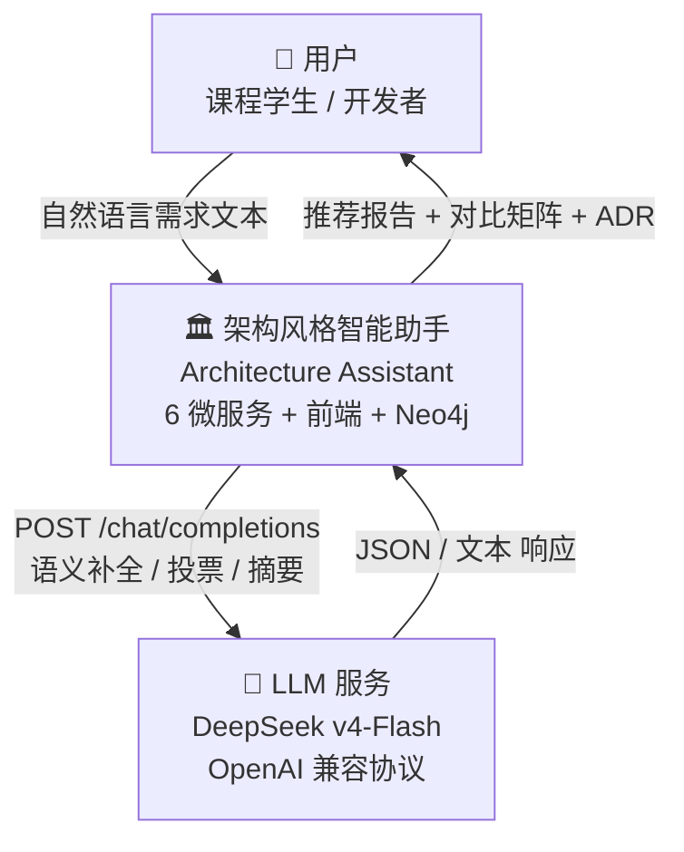
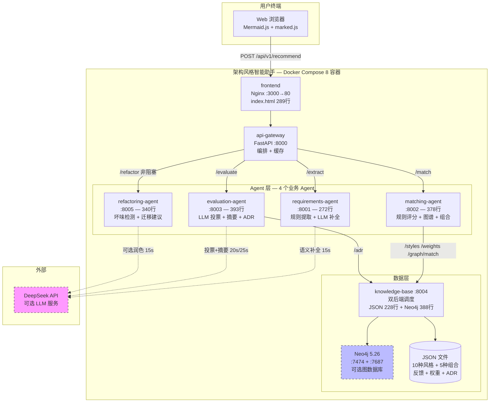
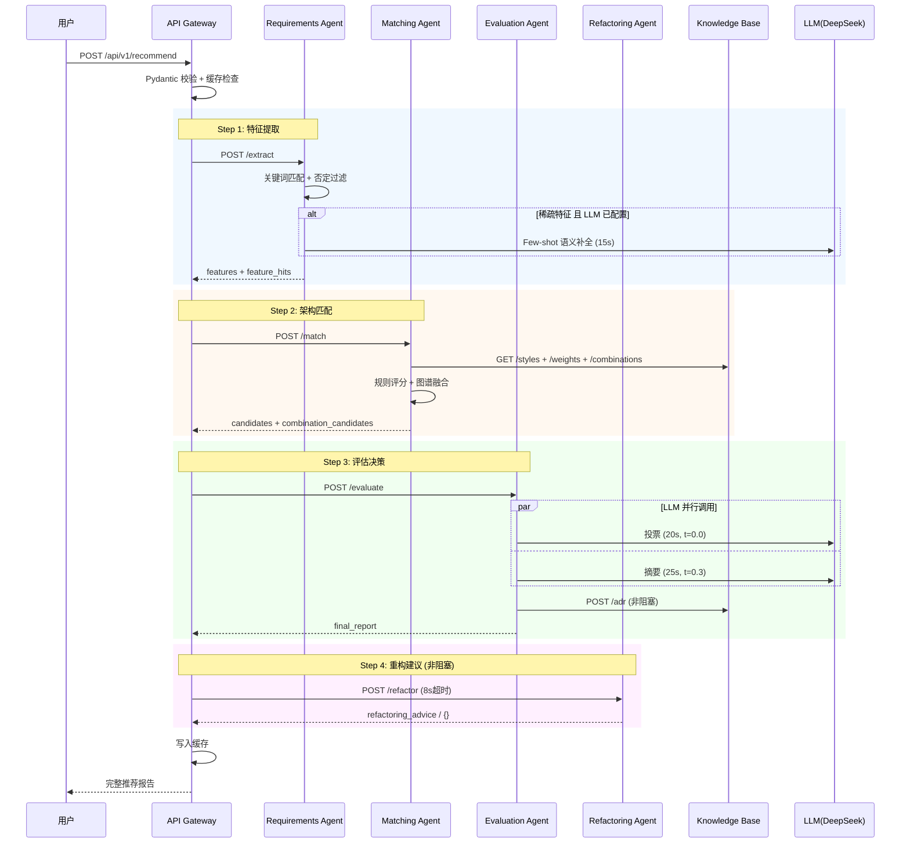
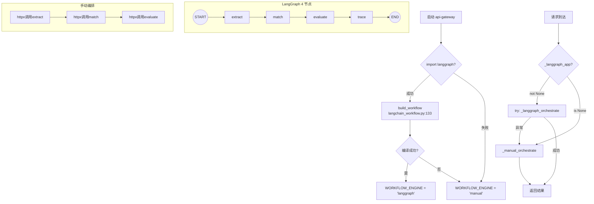
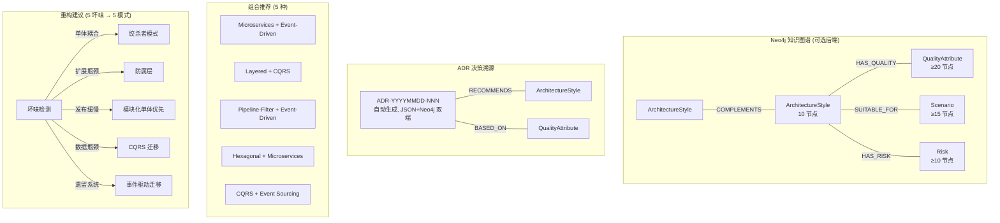
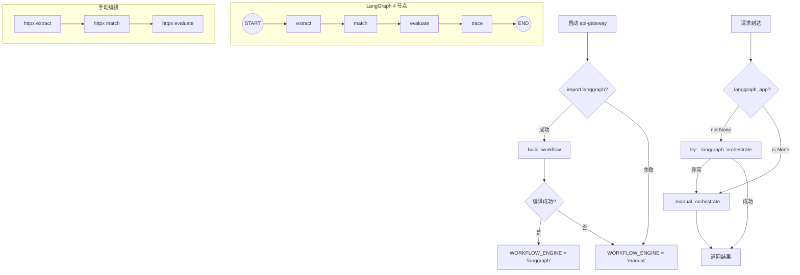
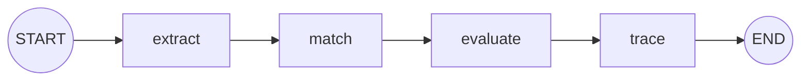

# 15 分钟架构设计专题讲稿

> 版本: 1.0
> 日期: 2026-05-13
> 用途: 课程答辩 15 分钟架构设计专题讲解
> 原则: 所有架构图、代码引用、设计决策均基于实际实现

---

## 整体时间分配

| 时间段 | 时长 | 主题 | PPT 页码 |
|--------|------|------|---------|
| 0:00-1:30 | 90s | 项目背景与问题定义 | 1-2 |
| 1:30-3:30 | 120s | 总体架构与 C4 Context | 3 |
| 3:30-5:30 | 120s | C4 Container 与微服务划分 | 4-5 |
| 5:30-7:30 | 120s | Multi-Agent / LangGraph 协作机制 | 6-7 |
| 7:30-9:30 | 120s | LLM + 知识图谱 + 规则引擎混合推理 | 8-9 |
| 9:30-11:00 | 90s | LLM 集成方案 | 10-11 |
| 11:00-12:30 | 90s | 知识图谱、ADR、组合推荐、重构建议 | 12 |
| 12:30-14:00 | 90s | 测试验证与工程可靠性 | 13-14 |
| 14:00-15:00 | 60s | 总结与创新点 | 15 |

---

## 0:00-1:30 | 项目背景与问题定义（PPT 第 1-2 页）

### PPT 第 1 页：问题定义

```
┌────────────────────────────────────────────────┐
│  软件架构风格智能助手 — 问题定义                  │
│                                                │
│  传统架构选型三大痛点:                           │
│  ┌──────────┬────────────────────────────┐     │
│  │ 效率低    │ 依赖个人经验，缺少系统化方法  │     │
│  ├──────────┼────────────────────────────┤     │
│  │ 不稳定    │ 不同评审者结论不同，不可复现  │     │
│  ├──────────┼────────────────────────────┤     │
│  │ 不完整    │ 缺少量化评分与决策追溯        │     │
│  └──────────┴────────────────────────────┘     │
│                                                │
│  解决方案: 规则引擎 + LLM + 知识图谱 三层协同     │
└────────────────────────────────────────────────┘
```

### PPT 第 2 页：为什么是 Compound AI System

```
┌────────────────────────────────────────────────┐
│  为什么不是普通 LLM 聊天机器人?                   │
│                                                │
│  普通 ChatBot          Compound AI System      │
│  ┌──────────┐         ┌──────────────────┐    │
│  │ LLM 全包  │         │ 规则引擎 → 确定性  │    │
│  │ 黑盒输出  │   vs    │ Neo4j   → 关系推理 │    │
│  │ 无校验    │         │ LLM     → 语义理解 │    │
│  │ 不可降级  │         │ 每层独立可降级     │    │
│  └──────────┘         └──────────────────┘    │
│                                                │
│  Compound AI = 多个专用组件协同，而非单一模型     │
└────────────────────────────────────────────────┘
```

### 逐字稿

> 各位老师好，接下来 15 分钟我重点讲解本系统的架构设计。
>
> 首先看问题定义。软件体系结构课程中，学生需要根据需求描述选择架构风格。但这面临三个核心问题：
>
> 第一，**效率低**——依赖个人经验，缺少系统化方法。
> 第二，**不稳定**——同一个需求，不同人可能给出不同结论。
> 第三，**不完整**——缺少量化的评分依据和可追溯的决策过程。
>
> 我们的方案不是做一个"问 LLM 推荐什么架构"的聊天机器人——那种方案有两个致命缺陷：LLM 可能推荐不存在的架构风格（幻觉），而且 LLM 不可用时整个系统就瘫痪了。
>
> 我们选择的是 **Compound AI System** 路线——把系统拆成多个专用组件：规则引擎负责确定性匹配、Neo4j 知识图谱负责关系推理、LLM 只负责语义理解和解释生成。每个组件有明确的职责边界和独立的降级能力。
>
> 这页的关键词是"**规则保证下限，LLM 提升上限**"——后面所有设计决策都围绕这个理念展开。

---

## 1:30-3:30 | 总体架构与 C4 Context（PPT 第 3 页）

### PPT 第 3 页：C4 Context 图



### 逐字稿

> 我们使用 **C4 模型**进行架构表达，这是业界公认的软件架构可视化方法。
>
> 首先看 **C4-Context**，即系统上下文图，展示系统与外部世界的交互边界。
>
> 系统核心是中间的"架构风格智能助手"，由 6 个后端微服务、1 个前端和 1 个 Neo4j 图数据库组成。
>
> 它有三个外部交互——
>
> 左边是**用户**：通过浏览器输入自然语言需求，接收推荐报告。
>
> 右边是**外部 LLM 服务**：我们目前接入的是 DeepSeek v4-Flash，但它兼容 OpenAI 协议。这意味着只需改环境变量，就可以切换到通义千问、GPT-4、或者任何兼容 `/chat/completions` 的模型。
>
> 注意一个重要的边界设计：**LLM 在系统边界之外**——它不是一个必须存在的内部组件。如果 LLM 未配置或不可达，系统自动降级为纯规则模式，核心推荐链路不受影响。这是我们整个架构设计的核心约束之一。

### 答辩老师可能追问

**Q: LLM 放在系统边界外有什么工程意义？**
> A: 三个意义。一是降低耦合——LLM 的可用性波动不影响核心链路。二是可替换——改一个环境变量就能换模型。三是成本控制——不调用 LLM 时系统零费用运行。我们回归测试 20 条用例在纯规则模式下 100% 通过，证明了核心链路的独立性。

---

## 3:30-5:30 | C4 Container 与微服务划分（PPT 第 4-5 页）

### PPT 第 4 页：C4 Container 图



> 图例: 虚线框 = 可选组件（Neo4j 和 LLM 均可降级）

### PPT 第 5 页：微服务划分决策表

```
┌────────────┬────────┬──────────────────┬──────────────┐
│ 服务        │ 端口    │ 职责              │ 为什么独立     │
├────────────┼────────┼──────────────────┼──────────────┤
│ frontend   │ 3000   │ 用户交互与可视化    │ 前后端分离     │
│ api-gateway│ 8000   │ 请求校验 + 编排+缓存│ 单一对外入口   │
│ req-agent  │ 8001   │ 特征提取(规则+LLM) │ CPU+网络IO混合│
│ match-agent│ 8002   │ 评分+图谱+组合     │ 独立接入Neo4j │
│ eval-agent │ 8003   │ LLM评估+ADR       │ LLM故障隔离   │
│ kb         │ 8004   │ 双后端知识存取      │ 数据层独立    │
│ ref-agent  │ 8005   │ 坏味检测+迁移方案   │ 重构逻辑独立   │
│ neo4j      │ 7687   │ 图数据库(可选)     │ 独立数据服务   │
└────────────┴────────┴──────────────────┴──────────────┘
```

### 逐字稿

> 接下来看 **C4-Container**，也就是容器级架构。这里"容器"指的是可独立部署的运行单元，不是 Docker 容器的狭义概念。
>
> 整个系统由 8 个 Docker 容器组成，分为四层——
>
> **前端层**，也就是 nginx 托管的单页 HTML。289 行代码，零框架依赖，仅通过 CDN 引入 Mermaid.js 渲染拓扑图和 marked.js 渲染 Markdown。选择原生 HTML 的理由很简单——对课程项目而言，零构建步骤意味着任何评委的浏览器打开就能看。
>
> **网关层**，api-gateway，这是系统唯一的对外入口。负责请求校验、缓存检查、编排路由。双引擎设计——LangGraph 优先，不可用时自动回退手动编排。
>
> **Agent 层**，4 个业务 Agent。这是系统核心。每个 Agent 有明确的职责边界：
> - requirements-agent 负责特征提取，规则引擎主导、LLM 仅在特征稀疏时补全
> - matching-agent 负责架构匹配，规则评分 + 图谱融合 + 组合推荐
> - evaluation-agent 负责最终评估，LLM 投票 + 摘要 + ADR 生成
> - refactoring-agent 负责重构建议，规则引擎主导、LLM 可选润色
>
> **数据层**，knowledge-base 提供双后端知识存取——JSON 文件始终可用，Neo4j 图数据库作为可选增强。
>
> 现在回答一个关键的架构决策问题：**为什么不写成单体？**
>
> 五个理由：
>
> 第一，**领域解耦**。特征提取是字符串匹配（CPU 密集），架构评估是 LLM 调用（网络 I/O 密集），知识库是数据存取——它们属于不同技术领域，混在一起代码边界模糊。
>
> 第二，**故障隔离**。LLM 调用有外部依赖风险，如果所有逻辑在一个进程里，一次 LLM 超时可能拖垮整个服务。微服务模式下，evaluation-agent 的 LLM 超时只影响摘要质量，不影响特征提取和架构匹配。
>
> 第三，**异构集成**。matching-agent 需要独立接入 Neo4j driver，其他 Agent 不需要。微服务让依赖按需加载。
>
> 第四，**独立部署**。每个服务有独立 Dockerfile，docker-compose 按依赖顺序启动，单服务代码量最大 393 行，平均约 200 行——便于课程答辩时的代码走查。
>
> 第五，**技术灵活**。环境变量驱动配置，LLM 模型切换、缓存后端切换、知识库后端切换都不需要改代码。

### 答辩老师可能追问

**Q: 8 个容器对课程项目来说是否过度设计？**
> A: 这是一个有意识的架构选择，而非无脑拆分。关键判据是：每个服务是否有独立的故障域和独立的扩容需求。比如 evaluation-agent 的 LLM 调用可能超时，但它的故障不应影响 requirements-agent 的关键词匹配。如果写成单体，一个线程池就能隔离——但微服务把这个隔离边界显式化了，并且每个服务的代码量非常小（平均 200 行），不会增加理解负担。Neo4j 标注为可选后端——如果评委觉得依赖过重，JSON 模式零外部依赖即可运行全功能。

**Q: 服务间 HTTP 通信有什么代价？**
> A: 延迟增加（每次调用约 1-5ms 额外网络开销），无流式支持，且缺少消息队列的异步解耦。这是工程权衡——对于课程演示场景，HTTP 的可调试性（浏览器可直接查看、curl 可测试）比 gRPC 的性能优势更有价值。

---

## 5:30-7:30 | Multi-Agent / LangGraph 协作机制（PPT 第 6-7 页）

### PPT 第 6 页：Agent 协作时序图



### PPT 第 7 页：LangGraph 状态图 + 手动 Fallback



### 逐字稿

> 接下来讲 Agent 的协作机制。这是系统的"神经系统"。
>
> 首先看左边这张 **UML 时序图**（PPT 第 6 页）。一次完整的推荐请求经过四个阶段——
>
> **Step 1 特征提取**：Gateway 调用 requirements-agent。Agent 先跑关键词匹配和否定过滤，如果规则命中维度太少（≤2 维）且 LLM 已配置，触发 LLM 语义补全。LLM 不可用就静默跳过，维持规则结果。
>
> **Step 2 架构匹配**：Gateway 调用 matching-agent。Agent 从 knowledge-base 拉取全部 10 种风格、学习权重和组合定义，跑规则评分，再通过 POST /graph/match 获取 Neo4j 图谱证据进行融合。Neo4j 不可用时图谱得分为 0，不阻断。
>
> **Step 3 评估决策**：Gateway 调用 evaluation-agent。Agent **并行**调用 LLM 做两件事——投票（从给定候选列表选出最佳风格）和摘要（生成中文推荐报告）。并行调用通过 `asyncio.gather` 实现，减少了串行等待时间。
>
> 注意这里的设计：**LLM 投票是"闭集选择"，不是"开集生成"**。LLM 只能从规则引擎产出的候选列表中选择，不能推荐列表之外的风格。投票结果还要经过字符串精确匹配校验，不在候选列表内就直接丢弃。
>
> **Step 4 重构建议**：Gateway **异步非阻塞**调用 refactoring-agent。这个调用有 8 秒超时，失败了也不会影响主推荐流程——`refactoring_advice` 字段为空而已。
>
> 现在看编排引擎（PPT 第 7 页）。系统启动时先尝试导入 langgraph。如果 langgraph 安装了，就编译一个 4 节点的状态图：extract → match → evaluate → trace。如果没安装或者编译失败，`WORKFLOW_ENGINE` 设置为 `manual`。
>
> 运行时，如果 `_langgraph_app` 不为 None 就执行 LangGraph 编排，如果执行过程中抛异常就回退到 `_manual_orchestrate`。手动编排用 httpx 顺序调用三个 Agent，功能完全等价。
>
> 为什么是 **Workflow-based Multi-Agent** 而不是完全自主 Agent？
>
> 完全自主 Agent 意味着每个 Agent 自己决定下一步调谁、传什么参数——这在课程项目中引入了不必要的复杂性。我们的场景是一个确定性的 Pipeline：一定是先提取特征，再匹配架构，最后评估——不存在动态路由需求。所以 **StateGraph + 顺序节点**是最合适的方案，简单、可调试、可预测。

### 答辩老师可能追问

**Q: LangGraph 是可选引擎，那为什么还要引入它？**
> A: LangGraph 提供了标准化的状态管理、节点追踪和错误收集——这些在手动编排中需要自己实现。但我们的原则是"不因框架不可用而丧失核心功能"，所以手动编排实现了完全等价的功能。双引擎设计还有一个好处——两套编排的耗时可以对比，帮助验证 LangGraph 没有引入额外开销。

---

## 7:30-9:30 | LLM + 知识图谱 + 规则引擎混合推理（PPT 第 8-9 页）

### PPT 第 8 页：三层推理架构

```
┌───────────────────────────────────────────────────┐
│              混合推理三层架构                         │
│                                                   │
│  Layer 3: LLM 语义理解    [可选 — 提升上限]          │
│  ┌─────────────────────────────────────┐          │
│  │ • 投票: t=0.0, 闭集选择, 候选校验    │          │
│  │ • 摘要: t=0.3, Few-shot, 降级模板   │          │
│  │ • 失败 → _fallback_summary()        │          │
│  └─────────────────────────────────────┘          │
│                      ⇅                            │
│  Layer 2: 知识图谱推理   [可选 — 关系增强]          │
│  ┌─────────────────────────────────────┐          │
│  │ • Neo4j Cypher 查询 HAS_QUALITY    │          │
│  │ • 每个匹配属性 +2 分 (上限 50%)      │          │
│  │ • 返回场景/风险/可组合风格          │          │
│  │ • 不可用 → 图谱加分 = 0             │          │
│  └─────────────────────────────────────┘          │
│                      ⇅                            │
│  Layer 1: 规则引擎评分   [始终运行 — 保证下限]       │
│  ┌─────────────────────────────────────┐          │
│  │ • 标签匹配: tag ∈ features → +2    │          │
│  │ • 学习权重: ≥2 次确认 → +1         │          │
│  │ • 特定规则: 7 条硬编码 → +1        │          │
│  │ • 主流保底: 3 种必现               │          │
│  └─────────────────────────────────────┘          │
│                                                   │
│  设计原则: 规则保证下限, 图谱增强关系, LLM 提升上限    │
└───────────────────────────────────────────────────┘
```

### PPT 第 9 页：防止 LLM 幻觉的四道防线

```
┌──────────────────────────────────────────────────┐
│  防止 LLM 幻觉的四道防线                           │
│                                                  │
│  防线1: LLM 不参与候选集生成                       │
│  → 候选 Top 3 完全由规则引擎确定, LLM 无权推荐      │
│     规则外风格                                        │
│                                                  │
│  防线2: 闭集投票 + 字符串精确匹配校验                │
│  → Prompt 明确: "仅从以下候选列表中选择"             │
│  → 返回值必须在 [c["style"] for c in candidates]  │
│    中, 否则丢弃                                       │
│                                                  │
│  防线3: 低温度参数约束                             │
│  → 投票 t=0.0 (贪婪解码), 摘要 t=0.3              │
│  → 最大化确定性, 最小化随机性                      │
│                                                  │
│  防线4: Few-shot 格式化约束                       │
│  → 9 个标注示例严格约束输出 schema                 │
│  → 非 JSON 输出尝试容错解析, 失败则丢弃             │
└──────────────────────────────────────────────────┘
```

### 逐字稿

> 现在讲最核心的设计——**混合推理**。这是我们整个系统最有架构深度的地方。
>
> 我们把推理拆成三层（PPT 第 8 页），从下往上看——
>
> **Layer 1 规则引擎**，始终运行，是系统的"安全网"。评分公式很简单：`标签基础分 + 学习权重分 + 特定规则加成`。标签匹配 +2 分一项，学习权重 ≥2 次确认的关联 +1 分，还有 7 条硬编码的领域规则——比如 Event-Driven 遇上高并发额外 +1 分。
>
> 候选集生成采用"主流优先 + 按分补齐"策略：Layered、Microservices、Event-Driven 三种主流架构**始终出现**在 Top 3 中。这确保了推荐不偏离业界共识。
>
> **Layer 2 知识图谱推理**。Neo4j 中存储了架构风格和质量属性之间的 `HAS_QUALITY` 关系。当系统识别出"高并发"特征时，通过 Cypher 查询找到所有具有这一属性的架构风格，每个匹配 +2 分。但图谱加分有上限——不超过规则得分的 50%。这个上限设计很重要：**图谱增强但不能主导排序**。Neo4j 不可用时图谱得分为 0，只依赖规则评分。
>
> **Layer 3 LLM 语义理解**。LLM 做两件事：投票选出最佳风格、生成中文摘要解释。但 LLM 只能从规则引擎确定的候选列表中选择——这是"闭集推荐"，不是"开集生成"。
>
> 三层之间的关系是**"或"不是"与"**——任一层不可用，下层自动顶上。这就是我们的核心设计理念：**规则保证下限，图谱增强关系，LLM 提升上限。**
>
> 很关键的一个问题是：**如何防止 LLM 幻觉？**（PPT 第 9 页）
>
> 我们设计了四道防线——
>
> 第一道：**LLM 不参与候选集生成**。候选 Top 3 是规则引擎算出来的，LLM 连"推荐 Pipeline-Filter"的机会都没有——除非规则已经把它放进了候选列表。
>
> 第二道：**闭集投票 + 强制校验**。Prompt 里明确写"仅从以下候选列表中选择"。LLM 的返回值要和候选列表做精确字符串匹配——返回了一个不在列表里的名字？直接丢弃，不加分。这条校验逻辑在 `evaluation_agent/app/main.py` 里，是一行 `if returned_name in candidates`。
>
> 第三道：**低温度参数**。投票用 temperature=0.0，也就是贪婪解码，最大化确定性。
>
> 第四道：**Few-shot 格式化约束**。9 个标注示例严格约束了 LLM 的输出格式。如果 LLM 返回的不是 JSON，系统先尝试从 markdown 代码块里提取，提取失败就直接丢弃 LLM 结果，用规则模板顶上。
>
> 这四道防线的组合让 LLM 的不可靠性被严格限制在"摘要写得好不好"的层面，而不会污染核心推荐逻辑。

### 答辩老师可能追问

**Q: 三层推理的设计灵感来自哪里？**
> A: 灵感来自自动驾驶的分级架构——L1 规则引擎相当于确定性控制（永远运行），L2 知识图谱相当于高精地图（增强定位），L3 LLM 相当于感知模型（提升适应能力）。每一层独立可降级，类似于自动驾驶的"安全降级"策略。

**Q: 图谱加分 50% 上限的依据是什么？**
> A: 这是一个经验值，基于一个原则：图谱不应该颠覆规则引擎的排序。如果图谱加分无上限，极端情况下图谱可能把一个只匹配了 1 个标签的风格推到 Top 1，这不符合"规则保证下限"的设计初衷。这个阈值可以通过 A/B 测试调优——当前值确保图谱作为"增强"而非"替代"。

---

## 9:30-11:00 | LLM 集成方案（PPT 第 10-11 页）

### PPT 第 10 页：LLM 调用点一览

```
┌────────────────────────────────────────────────────────────────┐
│  4 处 LLM 调用点 — 全部兼容 OpenAI 协议, 全部可降级              │
│                                                                │
│  # │ 位置         │ 用途        │ t°   │ 超时  │ 失败策略      │
│  ──┼──────────────┼─────────────┼──────┼───────┼──────────────│
│  1 │ req-agent    │ 语义补全     │ 0.1  │ 15s   │ 静默维持规则  │
│  2 │ eval-agent   │ 风格投票     │ 0.0  │ 20s   │ 返回 null    │
│  3 │ eval-agent   │ 摘要生成     │ 0.3  │ 25s   │ fallback模板  │
│  4 │ ref-agent    │ 步骤润色     │ 0.3  │ 15s   │ 规则模板原文  │
│                                                                │
│  LLM 配置（环境变量注入）:                                       │
│  LLM_API_BASE  → https://api.deepseek.com                      │
│  LLM_API_KEY   → sk-xxxx                                       │
│  LLM_MODEL     → deepseek-v4-flash                             │
│                                                                │
│  切换模型: 改 3 个环境变量即可, 零代码修改                       │
└────────────────────────────────────────────────────────────────┘
```

### PPT 第 11 页：Few-shot Prompt + 缓存 + 降级

```
┌──────────────────────────────────────────────────┐
│  Prompt 工程与工程化                                │
│                                                  │
│  Few-shot Prompt (9 个示例)                       │
│  ┌────────────────────────────────────┐          │
│  │ Requirements: 6 个示例             │          │
│  │ • 模糊高并发/否定语义/安全合规      │          │
│  │ • 数据密集/强一致/重构倾向         │          │
│  │ • 不可用 → 零样本 Prompt           │          │
│  ├────────────────────────────────────┤          │
│  │ Evaluation: 3 个示例               │          │
│  │ • Event-Driven/Microservices       │          │
│  │ • Layered+CQRS 完整评审报告         │          │
│  │ • 不可用 → 零样本 Prompt           │          │
│  └────────────────────────────────────┘          │
│                                                  │
│  LLM 缓存 (请求级)                                │
│  ┌────────────────────────────────────┐          │
│  │ 键: SHA256(requirement+model       │          │
│  │          +knowledge_version)       │          │
│  │ 后端: memory(TTL 3600s) / sqlite   │          │
│  │ 自动失效: 知识库文件 MD5 变化       │          │
│  └────────────────────────────────────┘          │
│                                                  │
│  降级层次:                                       │
│  全功能 → LLM投票失败 → LLM完全不可用 → 纯规则    │
└──────────────────────────────────────────────────┘
```

### 逐字稿

> 现在具体讲 LLM 的集成方案。
>
> 系统有 4 处 LLM 调用（PPT 第 10 页）。每处调用都有不同的 temperature、超时和失败策略——
>
> 语义补全用 temperature=0.1，因为特征判断需要确定性。
> 风格投票用 temperature=0.0，因为只需要从候选列表选一个名字。
> 摘要生成用 temperature=0.3，因为需要一定的语言多样性和表达自然度。
> 步骤润色也是 0.3，同样是需要自然语言表达的场景。
>
> 所有调用通过统一的 OpenAI 兼容协议——`POST /chat/completions`。切换模型只需改三个环境变量，零代码改动。当前用的是 DeepSeek v4-Flash，但任何兼容 `/chat/completions` 的模型——通义千问、GPT-4、本地部署的 vLLM 都可以直接接入。
>
> 接下来说 **Few-shot Prompt Engineering**（PPT 第 11 页）。
>
> 系统内置了 9 个标注示例——6 个给需求提取，3 个给评估摘要。每个示例都是完整的输入输出对——
>
> 需求提取的示例覆盖了六种典型场景：模糊高并发（"日活百万，双十一暴增"——没有"高并发"关键词但需要推断）、否定语义（"不需要实时，批量处理即可"）、安全合规、数据密集型、强一致性、架构重构。
>
> 评估摘要的示例覆盖三种核心推荐风格，每个都是完整的四部分评审报告：推荐架构、推荐理由、优缺点分析、风险与建议。
>
> Few-shot 模块如果导入失败（比如文件被误删），自动降级为零样本 Prompt，功能不中断。
>
> 然后是 **LLM 缓存**。缓存键是 `SHA256(需求文本 + 模型名 + 知识库版本)`——知识库版本是 `architecture_styles.json` 文件内容的 MD5 前 8 位。知识库更新后，所有旧缓存自动失效，因为 MD5 变了。
>
> 缓存支持两种后端——memory（内存字典 + TTL，默认）和 sqlite（跨重启持久化）。可以通过 `CACHE_BACKEND` 环境变量切换。
>
> 缓存是轻量实现——用的是进程内字典和 SQLite，而不是 Redis 这样的分布式缓存。这个选择是有意为之：课程项目是单机演示场景，引入 Redis 会增加一个外部依赖，而内存缓存在这个场景下已完全够用。

### 答辩老师可能追问

**Q: 为什么缓存粒度是请求级而不是 LLM 调用级？**
> A: 当前设计把整个推荐请求作为缓存单元——这意味着即使只有 LLM 摘要变化，整个结果都会被重新计算。更精细的做法是按 LLM 调用粒度缓存——单独缓存 LLM 补全、LLM 投票、LLM 摘要。这是我们设计文档中明确记录的"已知局限"。请求级缓存实现简单，对课程项目够用，但在生产环境需要更细粒度以提升缓存命中率。

---

## 11:00-12:30 | 知识图谱、ADR、组合推荐、重构建议（PPT 第 12 页）

### PPT 第 12 页：四大创新模块



### 逐字稿

> 这一页快速过四个创新模块，它们共同构成了系统的完整能力拼图。
>
> **Neo4j 知识图谱**。图模型包含 4 类节点：ArchitectureStyle（10 种风格）、QualityAttribute（10 个特征维度对应的质量属性）、Scenario（适用场景）、Risk（关联风险）。4 种关系：HAS_QUALITY 表示风格具备某属性，SUITABLE_FOR 表示适用于某场景，HAS_RISK 表示存在某风险，COMPLEMENTS 表示两种风格可以组合。
>
> 双后端调度通过 `KNOWLEDGE_BACKEND` 环境变量控制——json 模式零外部依赖，neo4j 模式使用图数据库，auto 模式自动探测。Neo4j 不可用时自动回退 JSON，不中断服务。
>
> **ADR 决策溯源**。每次推荐完成后自动生成一条决策记录，ID 格式 `ADR-YYYYMMDD-NNN`。存储到 JSON 文件，如果 Neo4j 可用还会同步创建图节点。ADR 写入失败不阻塞推荐主流程。可以通过 API 按 ID 查询——这为评审者提供了完整的决策追溯能力。
>
> **组合推荐**。5 种预定义组合，评分公式考虑组件风格分数之和、特征覆盖互补加分、图谱 COMPLEMENTS 加分和复杂度惩罚。每种组合都有 Mermaid 拓扑图和中文协同效应说明。
>
> **重构建议**。refactoring-agent 通过关键词匹配检测 5 种架构坏味，然后推荐对应的 5 种重构模式。比如检测到"单体耦合"就推荐"绞杀者模式"——逐步用新服务替代老系统的功能。迁移方案至少包含 3 个阶段的步骤、风险提示和缓解措施。LLM 仅用于可选润色，不可用时使用纯规则模板。

### 答辩老师可能追问

**Q: Neo4j 作为可选后端，实际增量价值体现在哪里？**
> A: 主要体现在两个场景。一是图遍历——通过 COMPLEMENTS 关系发现非显式定义的风格组合，比如 CQRS 和 Event-Driven 的组合。二是多跳推理——通过 QualityAttribute → ArchitectureStyle → Risk 的路径，一次性获取匹配属性、候选风格、关联风险。JSON 模式只能做简单的标签匹配，而图模式提供了关系驱动的推理增强。

---

## 12:30-14:00 | 测试验证与工程可靠性（PPT 第 13-14 页）

### PPT 第 13 页：测试金字塔

```
┌─────────────────────────────────────────────────┐
│  测试体系 — 三层 + 自动验收                        │
│                                                 │
│        ┌──────────────┐                        │
│        │  自动验收     │  43 项, 15 大类         │
│        │  check_      │  9/9 技术建议符合度     │
│        │  assignment  │                        │
│        │  .py         │                        │
│        └──────┬───────┘                        │
│    ┌──────────┴──────────┐                     │
│    │   端到端测试 (40 条)  │                     │
│    │   冒烟 20 + 回归 20   │                     │
│    │   5 项指标全 100%     │                     │
│    └──────────┬──────────┘                     │
│  ┌────────────┴────────────┐                   │
│  │   单元测试 (79 条)        │                   │
│  │   76 passed, 3 skipped   │                   │
│  │   6 个测试文件            │                   │
│  └─────────────────────────┘                   │
│                                                 │
│  回归测试 5 项指标:                              │
│  ┌──────────────┬──────┬──────┐                │
│  │ Top3 完整率   │ 目标  │ 实际  │                │
│  │ 主流覆盖      │ 100% │ 100% │                │
│  │ 推荐产出      │ 100% │ 100% │                │
│  │ 决策可解释    │ 100% │ 100% │                │
│  │ 矩阵完整      │ 100% │ 100% │                │
│  └──────────────┴──────┴──────┘                │
└─────────────────────────────────────────────────┘
```

### PPT 第 14 页：降级可靠性验证

```
┌──────────────────────────────────────────────────┐
│  降级可靠性矩阵 — 12 种故障场景全覆盖              │
│                                                  │
│  故障点               │ 降级行为        │ 验证    │
│  ─────────────────────┼─────────────────┼────────│
│  LangGraph 未安装      │ 手动编排        │ 单元测试│
│  LangGraph 运行时异常   │ 手动编排        │ 代码逻辑│
│  LLM 未配置            │ 纯规则模式      │ 回归测试│
│  LLM 超时 (15/20/25s) │ fallback 摘要   │ 代码逻辑│
│  LLM 返回非 JSON       │ 丢弃 → fallback │ 代码逻辑│
│  LLM 投票名无效        │ 丢弃不加分      │ 单元测试│
│  Neo4j 不可达 (auto)   │ 回退 JSON      │ 单元测试│
│  Neo4j 不可达 (neo4j)  │ HTTP 503       │ 单元测试│
│  req-agent 不可达      │ 网关 502       │ 异常矩阵│
│  match-agent 不可达     │ 网关 502       │ 异常矩阵│
│  eval-agent 不可达     │ 网关 502       │ 异常矩阵│
│  ref-agent 不可达      │ ref={} 非阻塞  │ 代码逻辑│
│  ADR 写入失败           │ failed, 不阻塞 │ 代码逻辑│
│  ─────────────────────┴─────────────────┴────────│
│                                                  │
│  核心验证结论:                                    │
│  LLM / Neo4j / LangGraph 均不可用时,              │
│  纯规则模式回归测试 20/20 通过, 核心链路完整       │
└──────────────────────────────────────────────────┘
```

### 逐字稿

> 测试验证部分（PPT 第 13 页）。我们的测试体系分为四层——
>
> 最底层是 **79 条单元测试**，覆盖全部 6 个后端微服务和前端。76 条通过，3 条跳过——这 3 条是 Neo4j 集成测试，需要 Neo4j 运行环境，在 CI 中自动跳过。需要时可以加 `-m integration` 标记执行。
>
> 往上是 **40 条端到端测试**——20 条冒烟测试验证全链路连通性，20 条回归测试统计 5 项质量指标。这 5 项指标全部 100%：Top3 完整率、主流架构覆盖率、最终推荐产出率、决策可解释率、对比矩阵产出率。
>
> 最顶层是 **43 项自动验收检查**，覆盖 15 大类：目录结构、Agent 模块、知识库完整性、LLM 集成、Neo4j 集成、LangGraph 编排、Few-shot Prompt、LLM 缓存、ADR、组合推荐、重构建议等。9 项课程技术建议全部通过。
>
> 测试数据集 20 条场景覆盖 10+ 行业——即时通讯、电商、银行、物联网、医疗影像、政务、证券等，确保推荐系统不是只对一两个场景有效。
>
> 特别说一下**降级可靠性**（PPT 第 14 页）。我们枚举了 12 种可能的故障场景，每种都有明确的降级行为和验证方式。最关键的结论是——
>
> **当 LLM、Neo4j、LangGraph 三个增强组件同时不可用时，系统仍能正常运行。** 回归测试 20 条用例在纯规则模式下 100% 通过。这就是"规则保证下限"的具体体现——知识库 JSON 文件永远可用，规则引擎永远在跑。

### 答辩老师可能追问

**Q: 3 条跳过的 Neo4j 测试是否影响对 Neo4j 集成的验证？**
> A: 不影响。跳过是因为当前测试环境没有运行 Neo4j——这是 pytest 标记机制的正常行为。启动 Neo4j 后执行 `pytest tests/unit/ -v -m integration` 即可运行这 3 条集成测试。我们还有 3 条图谱融合相关的单元测试（`test_blend_scores_*`）不需要 Neo4j 就能运行，它们验证了融合算法的正确性。

---

## 14:00-15:00 | 总结与创新点（PPT 第 15 页）

### PPT 第 15 页：四大创新亮点 + 架构决策回顾

```
┌──────────────────────────────────────────────────┐
│  总结: 四个核心创新点                              │
│                                                  │
│  1. Compound AI System 架构                       │
│     规则引擎 + Neo4j + LLM 三层协同                │
│     每层独立可降级，不是单一 LLM 黑盒               │
│                                                  │
│  2. 微服务 + 双引擎 Agent 编排                     │
│     8 容器 / 4 Agent / LangGraph + 手动 fallback  │
│     职责单一，单文件 ≤ 393 行                      │
│                                                  │
│  3. 混合推理 + 幻觉四道防线                        │
│     规则保证下限，LLM 提升上限                     │
│     闭集投票 + 强制校验 + 低温度 + Few-shot        │
│                                                  │
│  4. 可解释、可降级、可测试                         │
│     四层证据链 + 三级降级 + 三层测试               │
│     79 单元 + 40 E2E + 43 验收, 全部 100%        │
│                                                  │
│  ─────────────────────────────────────           │
│  关键架构决策回顾:                                │
│  • HTTP+JSON 通信 (非 gRPC): 追求可调试性          │
│  • Neo4j 可选后端: 降低环境依赖                    │
│  • LangGraph 可选引擎: 零额外依赖可运行             │
│  • 缓存 memory/SQLite: 课程场景够用               │
│  • 前端原生 HTML: 零构建步骤                       │
│  • 规则权重硬编码: 简单可解释                      │
└──────────────────────────────────────────────────┘
```

### 逐字稿

> 最后，总结本系统的四个核心创新点——
>
> **第一，Compound AI System 架构。** 我们不是调一个 LLM API 然后说"这是智能推荐"，而是构建了三层协同的推理体系——规则引擎提供确定性基线，Neo4j 知识图谱提供关系推理增强，LLM 提供语义理解和自然语言解释。三层独立运行、松耦合、可降级。
>
> **第二，微服务 + 双引擎 Agent 编排。** 8 个 Docker 容器，4 个业务 Agent，每个 Agent 职责单一、代码量可控。LangGraph 和手动编排双引擎共存，任何一个不可用都不影响核心功能。
>
> **第三，混合推理 + 幻觉四道防线。** LLM 不参与候选集生成、闭集投票强制校验、低温度参数约束、Few-shot 格式约束——这四道防线确保 LLM 的不确定性被严格限制在"摘要质量"的层面，不会污染核心推荐。
>
> **第四，可解释、可降级、可测试。** 四层证据链让每个推荐都有据可查；三级降级让系统在任何故障模式下都有可用路径；79 条单元测试 + 40 条端到端测试 + 43 项自动验收全部 100% 通过。
>
> 最后回顾几个关键的架构取舍——我们选择 HTTP+JSON 而不是 gRPC，因为可调试性在课程场景中比性能更重要；我们把 Neo4j 和 LangGraph 设计为可选而非必需，因为不想让环境依赖成为使用门槛；我们使用原生 HTML 而不是 React，因为零构建步骤意味着更低的演示风险。
>
> 这些都是有意识的工程权衡，不是技术能力不足——每个选择背后都有明确的取舍理由。
>
> 以上就是我的架构设计讲解，欢迎各位老师提问。

---

## 附录 A: 关键技术选型表

| 选型项 | 选择方案 | 备选方案 | 选择理由 | 代价 |
|--------|---------|---------|---------|------|
| 后端框架 | FastAPI (Python 3.11+) | Flask / Django | 原生 async、Pydantic 类型校验、自动 Swagger 文档 | 与 Django ORM 生态不兼容 |
| 服务间通信 | HTTP + JSON | gRPC / 消息队列 | 可调试、curl 可测试、与 FastAPI 原生集成 | 性能不如 gRPC，无流式支持 |
| LLM 协议 | OpenAI 兼容 `/chat/completions` | 各厂商原生 SDK | 模型可替换，改环境变量即可 | 无法使用各厂商特有参数 |
| LLM 模型 | DeepSeek v4-Flash | GPT-4 / 通义千问 | 成本低、中文能力强、兼容协议 | — |
| 图数据库 | Neo4j 5.26 (可选) | 纯 JSON / ArangoDB | 图遍历算法成熟、Cypher 查询表达力强 | 增加一个外部依赖 |
| 编排引擎 | LangGraph (可选) + 手动编排 | Airflow / 纯手动 | StateGraph 语义清晰、与 Agent 模式天然匹配 | 两套编排代码需维护 |
| 缓存 | memory dict / SQLite | Redis | 零外部依赖、课程场景够用 | 非分布式、重启丢失（memory 模式） |
| 前端 | 原生 HTML + CSS + JS | React / Vue | 零构建步骤、nginx 静态托管、CDN 引入 Mermaid.js | 无组件化、无状态管理 |
| 容器化 | Docker Compose (8 容器) | Kubernetes | 单机演示更简单、docker compose up 一键启动 | 无水平扩展 |
| 测试 | pytest + requests + 自定义脚本 | unittest / Selenium | pytest 异步支持好、参数化测试 | — |

---

## 附录 B: 答辩老师高频追问点汇总

| # | 追问方向 | 答案要点 | 参考章节 |
|---|---------|---------|---------|
| 1 | 为什么微服务而不是单体？ | 领域解耦、故障隔离、异构集成、独立部署、技术灵活（5 点） | 3:30-5:30 |
| 2 | 8 个容器是否过度设计？ | 每个服务独立故障域、代码量很小（≤393行）、Neo4j 可选 | 3:30-5:30 |
| 3 | LangGraph 可选为什么还要引入？ | 标准化状态管理、可对比调试、不影响核心功能 | 5:30-7:30 |
| 4 | 三层推理的设计灵感？ | 自动驾驶分级架构类比、每层独立降级 | 7:30-9:30 |
| 5 | 如何防止 LLM 幻觉？ | 四道防线：不参与候选生成、闭集投票校验、低温度、Few-shot | 7:30-9:30 |
| 6 | 缓存为什么是请求级？ | 轻量实现、课程够用、生产需改进（已知局限） | 9:30-11:00 |
| 7 | Neo4j 的增量价值？ | 图遍历、多跳推理、关系发现 | 11:00-12:30 |
| 8 | 3 条跳过测试的影响？ | 不影响验证，pytest 标记机制正常行为，加 -m integration 可执行 | 12:30-14:00 |
| 9 | LLM 费用多少？ | DeepSeek v4-Flash 极低成本；不配 LLM 纯规则模式零费用运行 | 9:30-11:00 |
| 10 | 学习权重的算法是否有更优方案？ | 当前简单计数累加，已知局限；可改进为衰减机制/协同过滤 | 7:30-9:30 |
| 11 | 为什么不支持英文？ | 关键词词典已部分覆盖英文，中文优先是课程项目范围限定 | 7:30-9:30 |
| 12 | 生产环境会做什么改进？ | Redis 缓存、gRPC 通信、K8s 部署、OAuth 认证、细粒度缓存 | 12:30-14:00 |

---

## 附录 C: 全部 Mermaid 图代码汇总

### C4-Context 图


### C4-Container 图

（同 PPT 第 4 页代码，此处不再重复）

### Agent 协作时序图

（同 PPT 第 6 页代码，此处不再重复）

### LangGraph 状态图 + 手动 Fallback



### LangGraph 工作流节点（简化版）



---

*本文档所有代码引用、Mermaid 图、设计决策均基于 `services/*/app/main.py` 和 `frontend/index.html` 实际实现。架构取舍部分如实标注了轻量实现和已知局限。*
