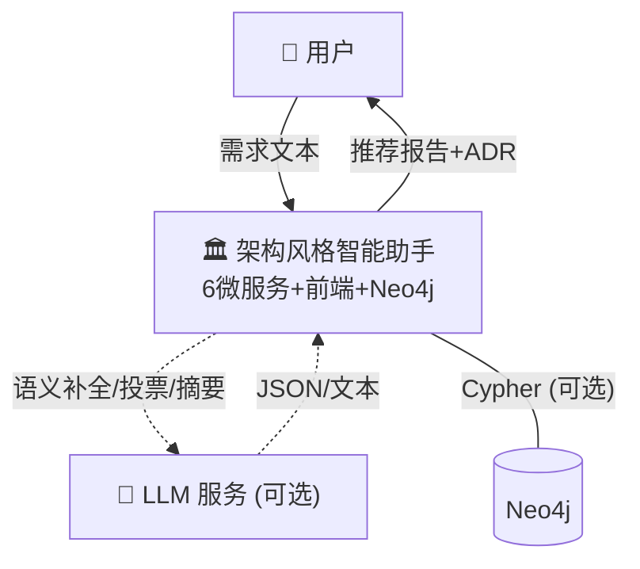

# 答辩 PPT 大纲

> 版本: 1.0
> 日期: 2026-05-13
> 用途: 15 分钟架构设计专题讲解的 PPT 制作指南
> 总页数: 15 页 | 总时长: ~15 分钟

---

## 页面结构总览

| 页码 | 标题 | 时长 | 类型 | 核心图 |
|------|------|------|------|--------|
| 1 | 标题页 | 0:30 | 封面 | — |
| 2 | 项目背景与目标 | 1:00 | 问题 | — |
| 3 | 为什么不是普通 LLM 问答 | 1:00 | 概念 | 对比表 |
| 4 | 总体架构 — C4 Context | 1:30 | 架构 | 图1: C4 Context |
| 5 | 微服务划分 — C4 Container | 2:00 | 架构 | 图2: C4 Container |
| 6 | LangGraph Multi-Agent 协作 | 2:00 | 协作 | 图3: UML时序图 |
| 7 | LLM + Neo4j + 规则引擎混合推理 | 2:00 | 核心 | 图5: 混合推理 |
| 8 | Neo4j 知识图谱设计 | 1:00 | 数据 | PPT内建简图（节点-关系示意图） |
| 9 | ADR、组合推荐与重构建议 | 1:00 | 创新 | 组合表 |
| 10 | LLM 缓存与降级机制 | 1:00 | 工程 | 图6: 降级机制 |
| 11 | 系统演示流程 | 0:30 | 过渡 | 演示路线图 |
| 12 | 测试与验收结果 | 1:00 | 验证 | 数据表 |
| 13 | 技术选型决策总结 | 1:00 | 决策 | 选型表 |
| 14 | 不足与后续改进 | 0:30 | 反思 | 改进表 |
| 15 | 谢谢 & 问答 | — | 结束 | — |

---

## 第 1 页: 标题页

### 页面内容

```
━━━━━━━━━━━━━━━━━━━━━━━━━━━━━━━━
                                  
     基于大模型的软件架构风格智能助手     
          Architecture Assistant       
                                  
    软件体系结构课程大作业答辩            
                                  
    姓名: [你的名字]                   
    日期: 2026-05-13                  
                                  
━━━━━━━━━━━━━━━━━━━━━━━━━━━━━━━━
```

### 推荐图表

无。纯文字排版，保持简洁。

### 讲解重点

报出项目全称和一句话定位。

### 预计用时

30 秒。

### 对应讲稿

`docs/defense/02-15分钟架构设计专题讲稿.md` 开场部分。

### 备注

- 标题页不要放太多信息——不放目录、不放技术栈标签
- 标题用"基于大模型的软件架构风格智能助手"，副标题可选"Architecture Assistant"
- 如果 PPT 模板有位置，加一个"软件体系结构课程大作业答辩"的标注

### 核心结论

> 一个从自然语言需求到架构推荐报告的 Compound AI System。

---

## 第 2 页: 项目背景与目标

### 页面内容

```
┌─────────────────────────────────────────┐
│  传统架构选型的三大痛点                    │
│                                         │
│  ✗ 特征识别效率低                        │
│     依赖个人经验，缺乏系统化方法           │
│                                         │
│  ✗ 候选方案不稳定                        │
│     不同评审者可能得出不同结论             │
│                                         │
│  ✗ 决策理由不完整                        │
│     缺少量化评分依据，无法追溯             │
│                                         │
├─────────────────────────────────────────┤
│  系统设计目标                            │
│                                         │
│  G1 自然语言理解 → 10维特征结构化提取     │
│  G2 多源推理融合 → 规则+图谱+LLM三层协同  │
│  G3 可解释决策   → 四层证据链完整追溯     │
│  G4 高可用降级   → 三级独立降级不中断     │
│  G5 知识可进化   → 反馈驱动的权重学习     │
└─────────────────────────────────────────┘
```

### 推荐图表

无需引用外部图。PPT 内建对比排版即可。

### 讲解重点

1. 三个痛点各用一句话举例说明
2. 五个目标快速过，G2（多源推理融合）是核心

### 预计用时

1 分钟。

### 对应讲稿

`02-15分钟架构设计专题讲稿.md` — 0:00-1:30 部分。

### 备注

- 痛点不要说太久——评委知道课程背景
- 目标页的核心信息是：这不是一个调 API 的项目，而是设计了完整的推理架构
- 从这页开始建立"规则+图谱+LLM 三层"的叙事主线

### 核心结论

> 用三层协同的 Compound AI System，替代个人经验判断。

---

## 第 3 页: 为什么不是普通 LLM 问答

### 页面内容

```
┌───────────────────────────────────────────┐
│  两种路线的本质区别                          │
│                                           │
│    普通 LLM ChatBot      vs    Compound AI  │
│  ┌─────────────────┐    ┌───────────────┐  │
│  │ LLM 全包         │    │ 规则 → 确定性  │  │
│  │ 黑盒输出          │    │ 图谱 → 关系    │  │
│  │ 可能幻觉          │    │ LLM → 语义    │  │
│  │ 不可降级          │    │ 每层可降级    │  │
│  │ 不可复现          │    │ 完全可复现    │  │
│  └─────────────────┘    └───────────────┘  │
│                                           │
│  核心设计原则:                              │
│  规则保证下限，图谱增强关系，LLM 提升上限       │
└───────────────────────────────────────────┘
```

### 推荐图表

PPT 内建左右对比布局。不强依赖外部图。

### 讲解重点

1. 左边一句话带过：LLM 直接推荐会有幻觉（编造不存在的风格名）和不可复现问题
2. 右边重点讲：每层有独立职责、独立降级
3. 最后一句话是整场答辩的核心金句，要重读

### 预计用时

1 分钟。

### 对应讲稿

`02-15分钟架构设计专题讲稿.md` — 0:00-1:30 中"为什么不是普通 LLM 聊天机器人"部分。

### 备注

- 不要贬低 ChatGPT——说"场景不同"。ChatGPT 适合开放式对话，架构选型需要确定性和可追溯
- "规则保证下限，图谱增强关系，LLM 提升上限"这句话至少要在答辩中出现 3 次——这页是第一次

### 核心结论

> Compound AI = 多个专用组件协同，而非单一模型全包。

---

## 第 4 页: 总体架构 — C4 Context

### 页面内容

```
┌───────────────────────────────────────────┐
│  C4 Context — 系统上下文                    │
│                                           │
│  系统: 6 微服务 + 前端 + Neo4j              │
│                                           │
│  外部交互:                                 │
│  • 用户 ←→ 系统 : 自然语言需求 → 推荐报告   │
│  • 系统 ←→ LLM : 语义补全/投票/摘要 (可选)  │
│  • 系统 ←→ Neo4j : 图查询 (可选后端)       │
│                                           │
│  关键设计: 两个虚线框都不绑定系统生存        │
└───────────────────────────────────────────┘
```

### 推荐图表

**使用 `docs/defense/05-C4模型与UML图.md` 的图 1: C4 Context 图。**



> 注意：PPT 中应使用完整版 Mermaid 图（见 05-C4模型与UML图.md 图1），此处为简化示意。

### 讲解重点

1. 先说"这是 C4 模型的 Context 层——展示系统与外部世界的边界"
2. 虚线框 LLM："可选，不可用时自动降级纯规则模式"
3. 虚线框 Neo4j："可选后端，不可用时自动回退 JSON"

### 预计用时

1 分 30 秒。

### 对应讲稿

`02-15分钟架构设计专题讲稿.md` — 1:30-3:30 部分。

### 备注

- 这是第一张架构图，花 20 秒让评委看清楚图的结构，然后再讲
- LLM 画在"系统边界外"是有意的设计——这句话一定要说
- 如果 Mermaid 渲染有问题，用 PPT 内建的形状手动绘制也完全可以

### 核心结论

> LLM 和 Neo4j 都是可选增强——去掉它们，核心推荐链路仍然完整。

---

## 第 5 页: 微服务划分 — C4 Container

### 页面内容

```
┌───────────────────────────────────────────┐
│  C4 Container — 8 个容器 / 4 层架构        │
│                                           │
│  前端层: frontend (Nginx :3000)            │
│  网关层: api-gateway (:8000) 编排+缓存     │
│  Agent层: 4 个业务微服务                   │
│    req(8001) / match(8002) /              │
│    eval(8003) / ref(8005)                 │
│  数据层: knowledge-base (8004) + Neo4j    │
│        双后端 (JSON + Neo4j)              │
│                                           │
│  单文件最大 393 行，平均约 200 行            │
└───────────────────────────────────────────┘
```

### 推荐图表

**使用 `docs/defense/05-C4模型与UML图.md` 的图 2: C4 Container 图。**

### 讲解重点

1. 先展示四层结构（前端/网关/Agent/数据），让评委建立分层认知
2. Agent 层是核心：每个 Agent 各司其职，不超过 393 行
3. 为什么微服务不是单体？5 个理由挑 2 个最重要的说——**故障隔离**和**异构集成**
4. 数据层双后端：JSON 始终可用，Neo4j 可选增强

### 预计用时

2 分钟。

### 对应讲稿

`02-15分钟架构设计专题讲稿.md` — 3:30-5:30 部分。

### 备注

- 这张图内容最多，控制讲解节奏——花 20 秒让评委看分层，再用 1 分半逐层讲
- 不要逐个服务念名字——按"层"来讲，每层一句话概括职责
- 提到代码行数是加分项——说明你对代码规模有控制意识

### 核心结论

> 8 个容器按职责分为 4 层，每层有独立的故障域和扩容能力。

---

## 第 6 页: LangGraph Multi-Agent 协作

### 页面内容

```
┌───────────────────────────────────────────┐
│  Agent 协作机制                            │
│                                           │
│  编排模式: Pipeline-Agent (顺序执行)        │
│                                           │
│  START → extract → match → evaluate → END │
│           ↑ 并行: 投票(20s) + 摘要(25s)    │
│                                           │
│  双引擎设计:                               │
│  • LangGraph StateGraph (优先)             │
│  • 手动编排 httpx (自动 fallback)          │
│                                           │
│  关键约束:                                 │
│  • Agent 间不直接通信，统一通过 Gateway      │
│  • LLM 投票是闭集选择，候选由规则确定        │
└───────────────────────────────────────────┘
```

### 推荐图表

**使用 `docs/defense/05-C4模型与UML图.md` 的图 3: UML 时序图 + 图 4: Agent 协作图。**

PPT 建议放两张图左右并列：左边放简化的时序图，右边放 Agent 协作图。如果空间不够，只放时序图。

### 讲解重点

1. 先讲编排模式——Pipeline-Agent，不是自主 Agent
2. 时序图纵向追踪一次完整请求的 4 个阶段
3. 双引擎设计：LangGraph 优先，不可用就手动，功能完全等价
4. LLM 调用是并行的（`asyncio.gather`）——投票和摘要同时发出

### 预计用时

2 分钟。

### 对应讲稿

`02-15分钟架构设计专题讲稿.md` — 5:30-7:30 部分。

### 备注

- 时序图比较大，建议 PPT 中放大到半页以上，不要缩成小图
- 讲双引擎时用手势示意"两条路径"——LangGraph 和手动编排并列
- 强调"为什么不是自主 Agent"——因为架构推荐流程是固定的 Pipeline

### 核心结论

> Workflow-based Multi-Agent：流程确定，LLM 只参与评估，不参与编排。

---

## 第 7 页: LLM + Neo4j + 规则引擎混合推理

### 页面内容

```
┌───────────────────────────────────────────┐
│  混合推理三层架构 (系统最核心的设计)          │
│                                           │
│  Layer 3: LLM 语义理解      [可选]          │
│  ├ 投票(t=0.0) + 摘要(t=0.3)              │
│  └ 不可用 → 规则模板降级                    │
│            ⇅                              │
│  Layer 2: Neo4j 知识图谱      [可选]        │
│  ├ HAS_QUALITY 关系 +2/项 (上限50%)        │
│  └ 不可用 → 图谱加分 = 0                   │
│            ⇅                              │
│  Layer 1: 规则引擎评分       [始终运行]      │
│  ├ 标签匹配+2 + 学习权重+1 + 特定规则+1     │
│  └ 3 种主流架构始终出现在 Top3              │
│                                           │
│  防幻觉四道防线:                            │
│  不参与候选生成 → 闭集投票 → 低温度 → Few-shot│
└───────────────────────────────────────────┘
```

### 推荐图表

**使用 `docs/defense/05-C4模型与UML图.md` 的图 5: 混合推理流程图。**

这张图是本场答辩最核心的图，建议 PPT 中放大到至少半页。

### 讲解重点

1. "这是本系统最有架构深度的地方"
2. 从下往上讲 Layer 1 → Layer 2 → Layer 3，每层一句话
3. `blend_scores()` 的融合公式：规则分 + min(图谱分, 规则分//2)
4. 四道防幻觉防线——快讲但每道一句话

### 预计用时

2 分钟。

### 对应讲稿

`02-15分钟架构设计专题讲稿.md` — 7:30-9:30 部分。

### 备注

- 这张图信息量最大，预留足够时间，不要赶
- "规则保证下限，图谱增强关系，LLM 提升上限"——第二次出现，重读
- 防幻觉防线中"闭集投票 + 强制校验"是最重要的一条——如果不展开其他三道，这一道一定要讲透

### 核心结论

> 三层独立运行、松耦合——任一层不可用，系统自动退化为下层能力。

---

## 第 8 页: Neo4j 知识图谱设计

### 页面内容

```
┌───────────────────────────────────────────┐
│  Neo4j 知识图谱 (可选后端)                  │
│                                           │
│  节点 (4类)         关系 (4类)             │
│  • ArchitectureStyle  HAS_QUALITY         │
│    (10种风格)         SUITABLE_FOR         │
│  • QualityAttribute   HAS_RISK            │
│    (10维质量属性)      COMPLEMENTS          │
│  • Scenario (场景)                        │
│  • Risk (风险)        + ADR 扩展:          │
│                       RECOMMENDS          │
│                       BASED_ON            │
│                                           │
│  双后端调度: json / neo4j / auto           │
│  auto 模式下 Neo4j 不可用 → 自动回退 JSON  │
└───────────────────────────────────────────┘
```

### 推荐图表

PPT 中使用简化的节点-关系示意图（4 个节点圆角框 + 4 条关系连线）。

不强依赖 `05-C4模型与UML图.md` 中的完整 Mermaid 图——PPT 内建形状即可。

### 讲解重点

1. 节点和关系——快速过，不逐条念
2. 重点讲"为什么用图"——架构知识天然是图结构的，COMPLEMENTS 关系在 JSON 里是隐式的
3. 双后端调度——json/neo4j/auto，auto 模式自动探测
4. 图谱加分 50% 上限：图谱是增强，不是替代

### 预计用时

1 分钟。

### 对应讲稿

`02-15分钟架构设计专题讲稿.md` — 11:00-12:30 中 Neo4j 部分。

### 备注

- 如果时间紧张，这页可以加速——关系类型不逐条念，只讲 COMPLEMENTS
- 50% 上限的价值一定要说——这体现了架构设计的判断力

### 核心结论

> 图数据库让隐含的架构关联显式化，但 JSON fallback 保证零外部依赖也能用。

---

## 第 9 页: ADR、组合推荐与重构建议

### 页面内容

```
┌───────────────────────────────────────────┐
│  三个创新模块                              │
│                                           │
│  ADR 架构决策记录                          │
│  • 每次推荐自动生成，ID: ADR-YYYYMMDD-NNN  │
│  • JSON + Neo4j 双端存储，API 可查询       │
│  • 写入失败不影响主流程 (非阻塞)            │
│                                           │
│  组合架构推荐 (5 种预定义组合)              │
│  Microservices+Event-Driven / Layered+CQRS│
│  Pipeline-Filter+Event-Driven / ...       │
│  评分: 组件分+互补+图谱-复杂度惩罚          │
│                                           │
│  重构建议 (5坏味→5模式)                    │
│  规则主导, LLM 仅可选润色                   │
│  绞杀者/防腐层/模块化单体/CQRS/事件驱动迁移  │
└───────────────────────────────────────────┘
```

### 推荐图表

PPT 内建三列卡片布局——ADR / 组合 / 重构各占一列。

不强依赖外部 Mermaid 图。可以用简化的流程图展示三个模块的关系。

### 讲解重点

1. ADR：强调自动生成 + 可查询 + 非阻塞
2. 组合推荐：强调预定义（不是自由组合）+ 复杂度惩罚
3. 重构建议：强调规则主导（不是 LLM 自由发挥）+ 渐进式方案

### 预计用时

1 分钟。

### 对应讲稿

`02-15分钟架构设计专题讲稿.md` — 11:00-12:30 部分。

### 备注

- 这一页是"快速过"模式——三个模块各两句话，不展开
- 如果评委对某个模块特别感兴趣，在 Q&A 环节详细回答
- 组合推荐和重构建议各有独立文档（ADR 有 ADR机制说明.md），可备查

### 核心结论

> 推荐不是终点——ADR 追溯、组合增强、重构建议构成完整闭环。

---

## 第 10 页: LLM 缓存与降级机制

### 页面内容

```
┌───────────────────────────────────────────┐
│  工程可靠性设计                             │
│                                           │
│  LLM 请求缓存                              │
│  • 键: SHA256(需求+模型+知识库MD5)          │
│  • 双后端: memory(TTL) / sqlite(持久化)    │
│  • 知识库更新 → 缓存自动失效               │
│  • /cache/stats 命中率统计                 │
│                                           │
│  多级降级矩阵                              │
│  Level 1: LangGraph → 手动编排             │
│  Level 2: LLM不可用 → 规则模板              │
│  Level 3: Neo4j不可用 → JSON fallback      │
│  Level 4: ref/ADR失败 → 非阻塞跳过          │
│  最终: 纯规则模式 回归测试 20/20 通过       │
└───────────────────────────────────────────┘
```

### 推荐图表

**使用 `docs/defense/05-C4模型与UML图.md` 的图 6: 降级机制图（简化版）。**

PPT 中建议使用更简洁的递进式降级图示，而非完整 Mermaid。例如左列是四个降级层级，右列是对应行为，底层是纯规则模式。

### 讲解重点

1. 缓存：强调知识库版本感知——更新知识库后缓存自动失效（不是简单的 TTL）
2. 降级：从 Level 0 到 Level Max，每一级的退化都是"有序减法"
3. 最底层结论：纯规则模式 20/20 回归测试通过

### 预计用时

1 分钟。

### 对应讲稿

`02-15分钟架构设计专题讲稿.md` — 9:30-11:00 中缓存部分 + 12:30-14:00 中降级部分。

### 备注

- 缓存和降级可以合成一页，因为它们都是"工程可靠性"的子主题
- 如果时间不够，优先讲降级——降级是架构设计的核心亮点，缓存相对常见
- 缓存是轻量实现（内存/SQLite 非 Redis），如果被追问坦诚说明

### 核心结论

> 每层降级都是"减法"而非"断裂"——纯规则模式下核心推荐链路仍然完整。

---

## 第 11 页: 系统演示流程

### 页面内容

```
┌───────────────────────────────────────────┐
│  系统演示路线图                            │
│                                           │
│  主演示: 即时通讯系统                       │
│  "开发跨平台IM，万人在线，实时可靠..."       │
│                                           │
│  演示路径:                                 │
│  ┌──────┐  ┌──────┐  ┌──────┐  ┌──────┐ │
│  │ 输入  │→│ 特征  │→│ Top3  │→│ 报告  │ │
│  │ 需求  │  │ 提取  │  │ 候选  │  │ 展示  │ │
│  └──────┘  └──────┘  └──────┘  └──────┘ │
│                                           │
│  重点展示:                                 │
│  ① 10维特征标签 + 命中关键词证据           │
│  ② 对比矩阵 (6列×3行) + 拓扑图            │
│  ③ 组合推荐 + ADR记录 + 缓存状态           │
│                                           │
│  备选演示:                                 │
│  • 银行系统 (强一致性场景)                  │
│  • 旧单体系统 (重构建议场景)                │
└───────────────────────────────────────────┘
```

### 推荐图表

PPT 内建流程箭头图。不强依赖外部 Mermaid。

### 讲解重点

1. 主演示输入和 3 个关键展示点
2. 备选演示一句话带过——"如果需要可以展示强一致性或重构场景"
3. 这页是过渡——从架构讲解过渡到实际演示（或回顾刚完成的演示）

### 预计用时

30 秒。

### 对应讲稿

`docs/defense/01-5分钟系统演示讲稿.md` 第 3-4 节。

### 备注

- 这页根据答辩流程有两种用法：
  - 如果先演示后讲架构（推荐），这页作为回顾——"刚刚大家看到的推荐结果，背后是这样的架构设计"
  - 如果先讲架构后演示，这页作为预告——"接下来我展示这个架构的实际运行效果"
- 无论哪种，这页停留时间短，快速过渡

### 核心结论

> 刚才的演示背后是三层推理架构——从特征提取到最终推荐，每一步有据可查。

---

## 第 12 页: 测试与验收结果

### 页面内容

```
┌───────────────────────────────────────────┐
│  测试体系 — 四层验证, 全部 100%             │
│                                           │
│  自动验收: 43项/15大类 ............ 100%   │
│  技术建议符合度: 9/9 ............ 100%     │
│                                           │
│  回归测试 (20条, 10+行业)                  │
│  Top3完整率         ████████████ 100%     │
│  主流架构覆盖率      ████████████ 100%     │
│  最终推荐产出率      ████████████ 100%     │
│  决策可解释率        ████████████ 100%     │
│  对比矩阵产出率      ████████████ 100%     │
│                                           │
│  单元测试: 79条 (76 passed, 3 skipped)    │
│  冒烟测试: 20条 全链路连通验证             │
└───────────────────────────────────────────┘
```

### 推荐图表

PPT 内建数据卡片 + 进度条。推荐用 5 个 100% 指标做横向排列，视觉冲击力强。

### 讲解重点

1. 先报总数据：79 单元 + 40 端到端 + 43 验收，全部 100%
2. 重点说回归测试 5 项指标全是 100%——"没有任何一个用例失败"
3. 3 条 skipped 是 Neo4j 集成测试，需要 Neo4j 运行环境才执行

### 预计用时

1 分钟。

### 对应讲稿

`02-15分钟架构设计专题讲稿.md` — 12:30-14:00 部分。

### 备注

- 5 个 100% 是强有力的视觉证据——建议 PPT 用进度条或仪表盘展示
- 如果时间紧张，单元测试细节可以跳过，只说总数
- 3 条 skipped 要诚实说明原因——"这是 pytest 标记机制的正常行为，不是测试失败"

### 核心结论

> 79 单元 + 40 端到端 + 43 验收，三层测试全部 100% 通过。

---

## 第 13 页: 技术选型决策总结

### 页面内容

```
┌───────────────────────────────────────────┐
│  关键技术选型与决策理由                      │
│                                           │
│  选型          选择         取舍           │
│  ───────────────────────────────────────  │
│  通信协议      HTTP+JSON    可调试 > 性能  │
│  图数据库      Neo4j(可选)   能力 > 依赖   │
│  编排引擎      LangGraph     标准化 > 零依赖│
│  缓存          memory/SQLite 简单 > 分布式 │
│  前端          原生HTML      零构建 > 组件化│
│  知识库        Neo4j+JSON    双后端互为备份 │
│  LLM 协议      OpenAI兼容    可替换 > 专属  │
│  部署          Docker单机    简单 > 弹性   │
│                                           │
│  每个取舍都基于课程项目场景的工程判断        │
└───────────────────────────────────────────┘
```

### 推荐图表

PPT 内建表格。每行左侧是技术选型，中间是选择方案，右侧是取舍理由（用 `> ` 格式）。

### 讲解重点

1. 不要逐行念——挑 3 个最能体现判断力的选型讲
2. 推荐挑这 3 个：HTTP（可调试性优先）、Neo4j 可选（降低环境依赖）、原生 HTML（零构建风险）
3. 总结：每个选择背后都有明确的取舍逻辑，不是技术堆砌

### 预计用时

1 分钟。

### 对应讲稿

`02-15分钟架构设计专题讲稿.md` 附录 A 技术选型表。

### 备注

- 这张表是"防守型"内容——在评委质疑"为什么不用 gRPC/Redis/React"之前，你已经主动说明了取舍
- 如果时间紧张，这页可以加速——说"详细选型见附录 A，这里重点讲 3 个……"

### 核心结论

> 每个技术选择背后都有明确的取舍理由，追求一致的设计逻辑而非技术堆砌。

---

## 第 14 页: 不足与后续改进

### 页面内容

```
┌───────────────────────────────────────────┐
│  已知局限与改进方向                         │
│                                           │
│  局限                  改进方向            │
│  ───────────────────────────────────────  │
│  规则权重硬编码         数据驱动调优        │
│  风险建议覆盖不全       扩充针对性条目      │
│  缓存粒度请求级         细化到LLM调用级     │
│  无用户认证             OAuth2/JWT        │
│  同步HTTP通信           引入消息队列        │
│  单机部署               K8s 水平扩展       │
│  学习权重简单累加       衰减+归一化         │
│                                           │
│  这些局限是课程项目规模的工程权衡，          │
│  每个都有明确的改进路径                     │
└───────────────────────────────────────────┘
```

### 推荐图表

PPT 内建两列表格。

### 讲解重点

1. 主动说出不足——这比"完美无缺"更有说服力
2. 强调"这是工程权衡"而非"能力不足"
3. 每个不足都跟一个改进方向——展示你知道怎么改

### 预计用时

30 秒。

### 对应讲稿

`docs/defense/03-5分钟问答准备.md` 第 10 节"主动承认不足"。

### 备注

- 这页虽然是"自曝其短"，但处理好了是加分页——展示你的工程判断力
- 不要念太多条——说"七个已知局限，重点提三个"，然后跳到下一页
- 语气要自信——"我们在设计文档中明确记录了这些局限和对应的改进方案"

### 核心结论

> 每个局限都是有意识的工程权衡，不是能力不足，都有明确的改进路径。

---

## 第 15 页: 谢谢 & 问答

### 页面内容

```
━━━━━━━━━━━━━━━━━━━━━━━━━━━━━━━━
                                  
          谢谢各位老师              
                                  
    基于大模型的软件架构风格智能助手    
        Architecture Assistant       
                                  
    核心设计理念:                   
    规则保证下限                     
    图谱增强关系                     
    LLM 提升上限                    
                                  
    欢迎提问                       
                                  
━━━━━━━━━━━━━━━━━━━━━━━━━━━━━━━━
```

### 推荐图表

无。纯文字排版。

### 讲解重点

朗读核心设计理念三句话。然后说"欢迎各位老师提问"。

### 预计用时

过渡到 Q&A，不计入 15 分钟。

### 对应讲稿

`docs/defense/03-5分钟问答准备.md` 第 11 节"1 分钟最终总结话术"。

### 备注

- 这页停留在屏幕上直到 Q&A 结束
- 如果评委在 Q&A 中问到具体技术细节，可以翻回对应的 PPT 页展示图表
- 三句话是整场答辩的"锚点"——最后一页重复，强化记忆

### 核心结论

> 规则保证下限，图谱增强关系，LLM 提升上限。

---

## 附录 A: PPT 制作建议

| # | 建议 | 说明 |
|---|------|------|
| 1 | 统一配色 | 建议深蓝主色（#1565c0）+ 暖橙强调（#e65100），与前端暖色调风格一致 |
| 2 | Mermaid 渲染 | VS Code 装 Mermaid 插件可预览；PPT 中建议截图嵌入（保证渲染一致性） |
| 3 | 字号控制 | 标题 ≥28pt，正文 ≥18pt，代码/表格 ≥14pt |
| 4 | 每页字数 | 正文不超过 50 字（中文），超过的放备注或口头补充 |
| 5 | 核心结论 | 每页底部有加粗的一句话结论，作为"take-away message" |
| 6 | 动画 | 少用，最多用"逐条出现"控制节奏；不要用翻页动画 |
| 7 | 代码展示 | 不放完整代码块，只放关键函数名和行数引用 |
| 8 | 备份页 | 准备 3-5 页备份 PPT（详细选型表、完整测试数据、ADR 样例），Q&A 按需翻出 |

---

## 附录 B: 每页核心结论汇总（可打印为手卡）

| 页 | 核心结论 |
|----|---------|
| 1 | 一个从自然语言需求到架构推荐报告的 Compound AI System |
| 2 | 用三层协同的 Compound AI System，替代个人经验判断 |
| 3 | Compound AI = 多个专用组件协同，而非单一模型全包 |
| 4 | LLM 和 Neo4j 都是可选增强——去掉它们，核心推荐链路仍然完整 |
| 5 | 8 个容器按职责分为 4 层，每层有独立的故障域和扩容能力 |
| 6 | Workflow-based Multi-Agent：流程确定，LLM 只参与评估，不参与编排 |
| 7 | 三层独立运行、松耦合——任一层不可用，系统自动退化为下层能力 |
| 8 | 图数据库让隐含的架构关联显式化，但 JSON fallback 保证零外部依赖也能用 |
| 9 | 推荐不是终点——ADR 追溯、组合增强、重构建议构成完整闭环 |
| 10 | 每层降级都是"减法"而非"断裂"——纯规则模式下核心推荐链路仍然完整 |
| 11 | 演示背后是三层推理架构——从特征提取到最终推荐，每一步有据可查 |
| 12 | 79 单元 + 40 端到端 + 43 验收，三层测试全部 100% 通过 |
| 13 | 每个技术选择背后都有明确的取舍理由，追求一致的设计逻辑而非技术堆砌 |
| 14 | 每个局限都是有意识的工程权衡，不是能力不足，都有明确的改进路径 |
| 15 | 规则保证下限，图谱增强关系，LLM 提升上限 |

---

*本文档中所有图表引用均指向 `docs/defense/05-C4模型与UML图.md` 中的对应图。所有数据均基于 2026-05-13 实际测试结果。*
