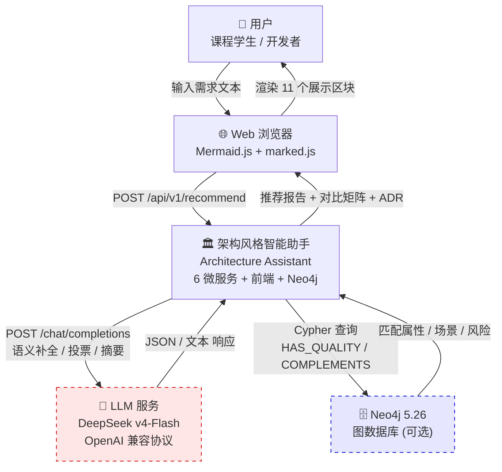
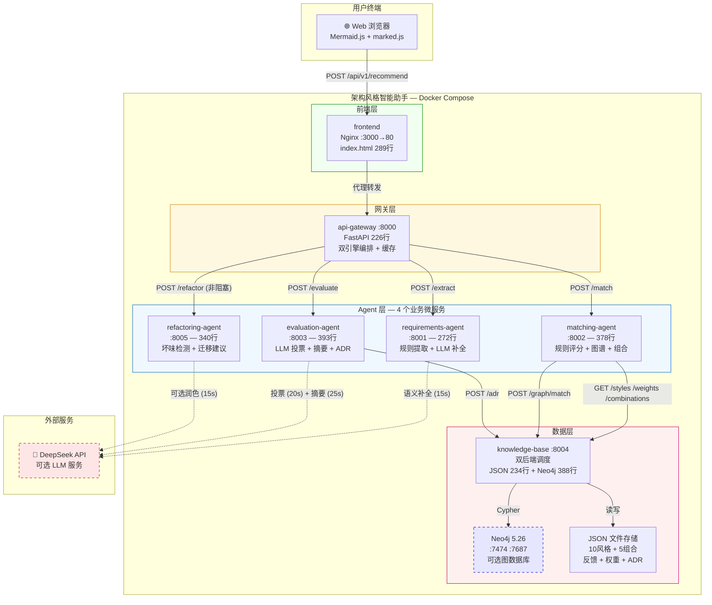
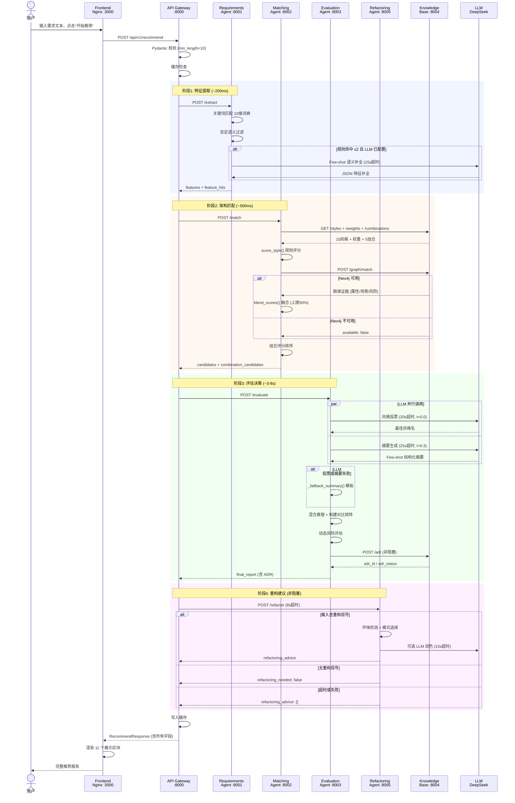
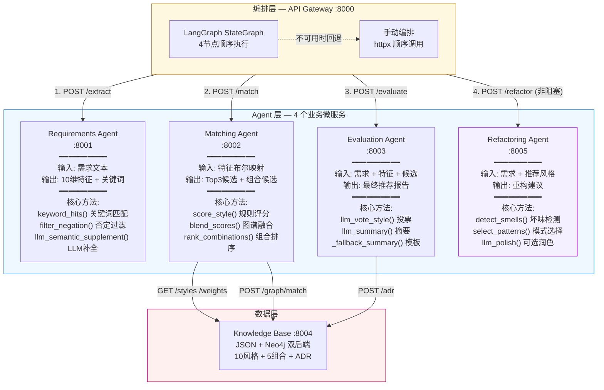
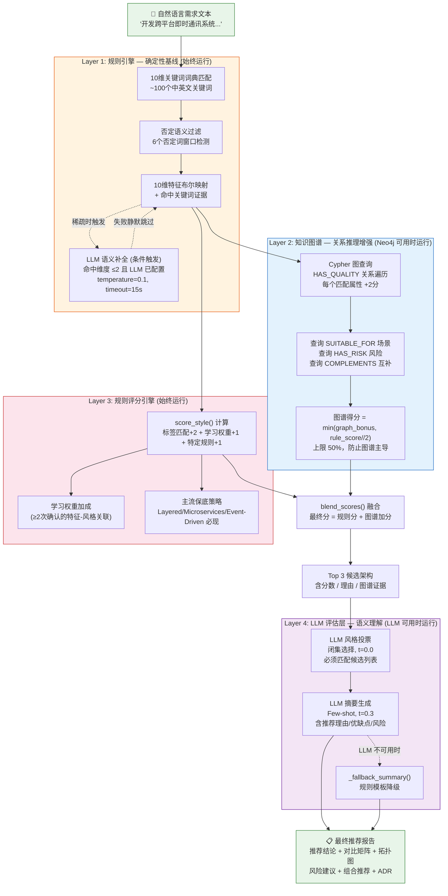
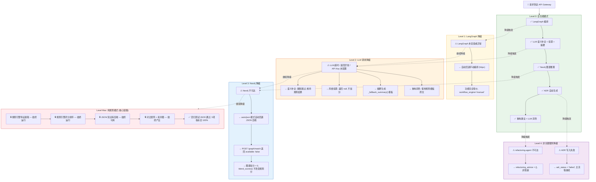
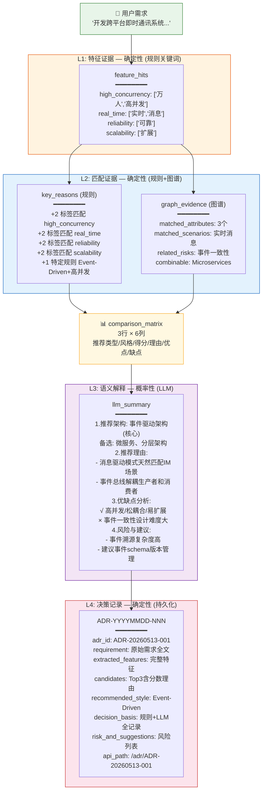

# C4 模型与 UML 图集

> 版本: 1.0
> 日期: 2026-05-13
> 用途: 15 分钟架构设计专题讲解的图示材料
> 原则: 所有图基于实际实现，不包含不存在的服务或组件

---

## 图 1: C4 Context 图（系统上下文）

### Mermaid 代码

> 图例: 红色虚线 = 外部 LLM 服务（系统边界外，可选）；蓝色虚线 = Neo4j 图数据库（可选后端）

### 在答辩中什么时候讲

**时间段**: 1:30-3:30（C4 Context 部分，约在第 3 页 PPT）

在讲完"项目背景与问题定义"之后，引出第一张架构图。用这张图建立观众对系统整体边界的认知。

### 讲图的 1 分钟话术

> 我们用 C4 模型来表达架构。首先是 **C4-Context，系统上下文图**——它回答"我们的系统在世界上和谁交互"。
>
> 中间是我们的系统——架构风格智能助手，由 6 个后端微服务、1 个前端和 1 个 Neo4j 图数据库组成。
>
> 系统有三个外部交互对象——
>
> 左边是**用户**，通过浏览器输入自然语言需求，看到推荐报告。
>
> 右下是**外部 LLM 服务**。注意它用红色虚线标注——它**在系统边界之外**。这意味着 LLM 不是一个必需组件。它不可用时系统自动降级为纯规则模式，核心推荐链路不受影响。
>
> 右边是 **Neo4j 图数据库**，用蓝色虚线标注——它也是**可选后端**。系统同时内置了 JSON 文件后端，Neo4j 不可用时自动切换。
>
> 这张图的核心信息是：**两个虚线框都不是系统生存的必需品。** 去掉 LLM 和 Neo4j，系统仍然可以完整运行。

### 老师可能追问

**Q: 为什么把 LLM 画在系统边界外？**

> 这是有意为之的设计表达。LLM 在系统边界外意味着三件事：一是它的可用性波动不影响核心链路；二是改环境变量就能换模型——DeepSeek、通义千问、GPT-4 任意切换；三是系统启动时检测 LLM 是否配置，未配置就跳过所有 LLM 调用。回归测试验证了纯规则模式 20/20 全通过。

**Q: Neo4j 也是虚线，它和 JSON 后端是什么关系？**

> 双后端架构——地位平等，不是"主从"。`KNOWLEDGE_BACKEND` 环境变量控制：json 模式零外部依赖，neo4j 模式使用图数据库，auto 模式自动探测——Neo4j 可用就用，不可用就回退 JSON。虚线不是"不重要"，是"可选"。

---

## 图 2: C4 Container 图（容器级）

### Mermaid 代码

> 图例: 红色虚线 = 外部可选 LLM；蓝色虚线 = 内部可选 Neo4j。四层背景色分别标注前端层/网关层/Agent层/数据层。

### 在答辩中什么时候讲

**时间段**: 3:30-5:30（C4 Container 部分，约在第 4-5 页 PPT）

紧跟 C4 Context 之后，把系统内部展开为容器级视图。先花 30 秒让观众看清四层结构，再逐层讲解。

### 讲图的 1 分钟话术

> 接下来把系统拆开，看 **C4-Container 图**。这里的"容器"是指可独立部署的运行单元。
>
> 系统分为四层——
>
> 最上层**前端层**：nginx 托管一个 289 行的 HTML 页面，不依赖任何前端框架，通过 CDN 加载 Mermaid.js 和 marked.js。
>
> 往下**网关层**：api-gateway，系统的唯一对外入口。负责 Pydantic 校验、缓存检查、双引擎编排。如果 LangGraph 没安装，自动回退手动编排。
>
> 中间是 **Agent 层**——4 个业务微服务。requirements-agent 做特征提取，规则引擎主导；matching-agent 做架构匹配，规则评分 + 图谱融合 + 组合推荐；evaluation-agent 做最终评估，LLM 投票 + 摘要 + ADR 生成；refactoring-agent 做重构建议，非阻塞异步调用。
>
> 最下层**数据层**——knowledge-base 通过统一的调度函数在 JSON 和 Neo4j 之间切换，调用方不感知。
>
> 注意三个虚线箭头指向 LLM——表示三处 LLM 调用都是可选的、可超时的、可降级的。

### 老师可能追问

**Q: 为什么 evaluation-agent 是最大的（393 行）？它是不是承担了太多职责？**

> evaluation-agent 确实是最复杂的 Agent——它并行调用 LLM 做投票和摘要、构建 6 列对比矩阵、生成动态风险评估、写入 ADR、嵌入组合推荐。但它的所有职责都围绕一个目标——"把候选列表变成最终推荐报告"。如果进一步拆分，可以把 ADR 生成独立出来，当前是考虑到拆分的边际收益不如先把代码写清楚。393 行在单个 FastAPI 文件中还在可管理的范围内。

---

## 图 3: UML 时序图（完整推荐流程）

### Mermaid 代码

### 在答辩中什么时候讲

**时间段**: 5:30-7:30（Agent 协作机制部分，约在第 6 页 PPT）

用这张图展示一次完整请求经过的所有阶段，让观众理解 4 个 Agent 如何协作、LLM 在哪里参与、降级在哪里发生。建议边讲边用手指追踪时序线。

### 讲图的 1 分钟话术

> 这张 UML 时序图展示了一次完整推荐请求的全过程。从上到下，时间是竖轴。
>
> 用户在前端输入文本，请求到达 API Gateway。Gateway 先做校验和缓存检查。
>
> **蓝色区域——阶段 1：特征提取。** Gateway 调用 requirements-agent。Agent 跑关键词匹配和否定过滤，如果关键词命中太少且 LLM 已配置，触发 LLM 语义补全——这个调用有 15 秒超时，失败则静默跳过。
>
> **橙色区域——阶段 2：架构匹配。** matching-agent 从 knowledge-base 拉取 10 种风格和权重数据，跑规则评分。然后尝试获取 Neo4j 图谱证据——可用就通过 blend_scores 融合，不可用就跳过。
>
> **绿色区域——阶段 3：评估决策。** 这是最关键的阶段。evaluation-agent 并行调用 LLM 做两件事——投票选最佳风格、生成中文摘要。两个调用同时发出，减少串行等待。LLM 失败则用规则模板。
>
> **紫色区域——阶段 4：重构建议。** Gateway 异步调用 refactoring-agent，8 秒超时，失败了不阻塞主流程。
>
> 整个过程四个阶段顺序执行，但阶段 3 内部的 LLM 调用是并行的。最后 Gateway 写缓存，前端渲染 11 个展示区块。

### 老师可能追问

**Q: 为什么阶段 3 的 LLM 调用用并行而不用串行？**

> 投票和摘要这两个 LLM 调用互不依赖——投票只需要候选列表，摘要只需要候选列表加需求文本。并行执行通过 `asyncio.gather` 实现，在 Python FastAPI 的 async 环境下，网络 I/O 不会被阻塞。两个调用串行需要约 8-12 秒，并行可以降到约 4-6 秒。但如果 LLM API 有并发限制（比如同一 API Key 不能同时发两个请求），这个设计需要调整——这是一个已知的适配考虑。

**Q: ADR 写入失败了怎么办？**

> ADR 写入是 `try/except` 包装的非阻塞调用。写入失败会在 `final_report.adr` 中设置 `adr_status: "failed"`，但推荐主流程继续返回。前端 ADR 区块会显示"未生成 ADR"。ADR 是重要的溯源手段，但不应该是推荐链路的阻塞点。

---

## 图 4: Agent 协作图

### Mermaid 代码

> 说明: Refactoring Agent 用紫色标注——它是非阻塞异步调用，失败不影响主推荐流程。

### 在答辩中什么时候讲

**时间段**: 5:30-7:30（Agent 协作机制部分，约在第 7 页 PPT）

在 UML 时序图之后，用这张图总结 4 个 Agent 各自的输入输出和核心方法。帮助观众从"流程视角"切换到"组件视角"。

### 讲图的 1 分钟话术

> 这张图从组件视角看 4 个 Agent 的职责边界——
>
> **Requirements Agent**：输入是自然语言文本，输出是 10 维特征布尔映射和命中关键词列表。核心方法是关键词匹配、否定过滤、LLM 语义补全。LLM 补全只在特征稀疏时触发。
>
> **Matching Agent**：输入是特征映射，输出是 Top 3 候选和组合候选。核心方法是规则评分、图谱融合、组合排序。它从 knowledge-base 拉取风格数据和权重，并行获取图谱证据。
>
> **Evaluation Agent**：输入是需求文本、特征和候选列表，输出是最终推荐报告。核心方法是 LLM 投票、LLM 摘要和规则 fallback。它是唯一直接调用 LLM 做决策评估的 Agent。
>
> **Refactoring Agent**：输入是需求文本和推荐风格，输出是重构建议。紫色标注表示它是非阻塞调用——Gateway 调用它时不等待，失败了上面三个 Agent 的结果不受影响。
>
> 四个 Agent 之间不直接通信——都通过 Gateway 编排和 knowledge-base 数据层交互。这是 Pipeline-Agent 模式的典型特征。

### 老师可能追问

**Q: 为什么 Agent 之间不直接通信？**

> 这是有意的设计选择。Agent 之间直接通信会增加耦合——比如 matching-agent 直接调 evaluation-agent，那一旦 evaluation-agent 的接口变化，matching-agent 也要改。通过 Gateway 集中编排，Agent 只需要知道自己的输入输出格式，不需要知道其他 Agent 的存在。这个模式叫"编排式协作"（Orchestration），而不是"舞蹈式协作"（Choreography）。

---

## 图 5: 混合推理流程图

### Mermaid 代码

> 图例: 橙色=Layer1规则引擎 / 蓝色=Layer2知识图谱(P2可选) / 红色=Layer3规则评分(始终运行) / 紫色=Layer4 LLM评估(L4可选)

### 在答辩中什么时候讲

**时间段**: 7:30-9:30（混合推理部分，约在第 8-9 页 PPT）

这是整个架构讲解中最核心的一张图——它把"规则保证下限，图谱增强关系，LLM 提升上限"这句话可视化了出来。

### 讲图的 1 分钟话术

> 这张图是系统最核心的**混合推理流程**——从自然语言需求到最终推荐报告的完整路径。
>
> 需求文本进来，先走 **Layer 1 规则引擎**——10 维关键词词典匹配（橙色区域），否定语义过滤，产出特征映射。如果关键词命中太少，触发 LLM 语义补全——但补全失败就跳过，不影响流程。
>
> 特征向量分流到两条路径——
>
> 左边 **Layer 2 知识图谱**（蓝色区域），通过 Neo4j Cypher 查询 HAS_QUALITY 关系，每个匹配属性 +2 分，但总分上限是规则得分的 50%。Neo4j 不可用时这条路径的贡献为 0。
>
> 右边 **Layer 3 规则评分**（红色区域），标签匹配 +2、学习权重 +1、特定规则 +1，始终运行。
>
> 两条路径通过 `blend_scores()` 融合，产出 Top 3 候选。
>
> 最后 **Layer 4 LLM 评估**（紫色区域）——LLM 从候选列表中投票选最佳，生成中文摘要。LLM 不可用时用规则模板降级。
>
> 注意四条横向色带的含义——层号越大，越"上层"（可选性越强）。Layer 1 和 Layer 3 是必须运行的，Layer 2 和 Layer 4 是可选增强。

### 老师可能追问

**Q: 为什么 Layer 2 图谱加分上限是 50%？**

> 防止图谱颠覆规则引擎的排序。举个极端例子——如果图谱给某个冷门风格加了 10 分，规则引擎只算了 2 分，最终 12 分排第一。但评委一看——"这个风格的 tags 和需求特征几乎不匹配，为什么排第一？"这就失去了可解释性。50% 上限确保：**图谱是辅助证据，不是替代判断。**

**Q: 如果 Layer 2 和 Layer 4 都不可用，Layer 1+3 能独自完成推荐吗？**

> 能。Layer 1 的特征提取 + Layer 3 的规则评分是完整链路。纯规则模式下的回归测试 20 条用例 100% 通过——Top3 完整率、主流覆盖率、推荐产出率、可解释率、矩阵完整率全部 100%。

---

## 图 6: 降级机制图

### Mermaid 代码

### 在答辩中什么时候讲

**时间段**: 可以在两个地方使用——

1. **9:30-11:00**（LLM 集成方案部分，讲 LLM 降级时展示）
2. **12:30-14:00**（测试验证部分，讲降级可靠性时展示）

建议在 LLM 集成方案部分用这张图的前半部分（Level 0 → Level 2），在测试验证部分展示完整的降级矩阵。

### 讲图的 1 分钟话术

> 这张图展示了系统最重要的非功能特性——**多级降级**。
>
> 从上往下看，系统可以在 4 个层级独立降级——
>
> **Level 0 全功能模式**：LangGraph 编排 + LLM 全功能 + Neo4j 图谱 + ADR + 重构建议。输出最丰富的推荐报告。
>
> **Level 1 LangGraph 降级**：langgraph 未安装或运行异常时，自动回退手动编排。功能完全等价，只是 `workflow_engine` 从 "langgraph" 变成 "manual"。用户无感知。
>
> **Level 2 LLM 降级**：LLM 未配置或超时时，语义补全静默跳过，投票返回 null，摘要用规则模板。对比度最大——推荐报告从自然语言变成模板化文本，但核心推荐结论不变。
>
> **Level 3 Neo4j 降级**：Neo4j 不可用时自动回退 JSON 后端。图谱加分归零，`blend_scores()` 不改变规则分。候选排序完全由规则引擎决定。
>
> **最底层纯规则模式（红色）**：所有增强组件全部失效时，规则引擎 + JSON 知识库仍能独立输出包含推荐结论、对比矩阵、风险建议、拓扑图的完整报告。回归测试 20/20 验证了这一点。
>
> 设计原则是：**每一层降级都是在上一层基础上"减法"，而不是"断裂"**。用户在任何降级层级都能获得有意义的推荐结果。

### 老师可能追问

**Q: 如何保证某个降级层级不会悄悄生效而用户不知情？**

> 每个降级都有明确的前端反馈——
> - LangGraph 降级 → 状态栏显示 `workflow_engine: "manual"`
> - LLM 降级 → 摘要文本风格从自然语言变为模板化格式（用户可感知差异）
> - Neo4j 降级 → 图谱证据区块显示"无图谱证据"
> - 缓存降级（缓存后端出错）→ 正常执行完整流程，`cache_hit: false`
>
> 后端日志中也记录了每次降级事件：`logger.warning("langgraph not installed...")`、`logger.warning("LLM not configured...")` 等。

---

## 图 7: 可解释证据链图

### Mermaid 代码

> 图例: 橙色=L1确定性证据 / 蓝色=L2确定性证据 / 紫色=L3概率性解释 / 红色=L4确定性持久化

### 在答辩中什么时候讲

**时间段**: 可在两个地方使用——

1. **7:30-9:30**（混合推理部分，讲完三条推理路径后展示证据链的层次结构）
2. **14:00-15:00**（总结部分，作为"可解释"亮点的可视化支撑）

建议在混合推理部分展示——它和"三层推理"的架构一脉相承，自然承接。

### 讲图的 1 分钟话术

> 这张图展示了系统最核心的非功能目标——**可解释性**。
>
> 一次推荐的四层证据链从下往上看——
>
> **L1 特征证据**（橙色）：确定性产出。`feature_hits` 记录每个被激活维度的命中关键词。评委可以质疑"高并发？凭什么？"——答案在 `feature_hits` 里："万人在线"命中了高并发词典。
>
> **L2 匹配证据**（蓝色）：确定性产出。`key_reasons` 逐条列出每个 +2/+1 的来源，`graph_evidence` 显示 Neo4j 图谱匹配到的属性和场景。评委可以质疑"Event-Driven 为什么 9 分？"——答案在 `key_reasons` 里：4 个标签 × 2 + 1 条特定规则 = 9。
>
> **L3 语义解释**（紫色）：概率性产出。LLM 生成的推荐理由、优缺点分析、风险建议。这一层最"像人写"，但确定性最低。所以 LLM 不可用时用模板替换，不影响 L1/L2 的确定性证据。
>
> **L4 决策记录**（红色）：确定性持久化产出。ADR 把整个决策链编码为一条可查询的记录，永久保存。评委可以通过 API 随时抽查历史上任何一次推荐。
>
> 四层证据链回答了评审中最核心的问题：**"你为什么推荐这个？"** 答案不在演示者的记忆里，在系统的输出字段里。

### 老师可能追问

**Q: L3 是概率性的，如果 LLM 摘要写错了怎么办？**

> L3 的定位是"语义解释"，不是"决策依据"。决策依据在 L1 和 L2 的确定性证据中。LLM 摘要写错了——比如把 Event-Driven 的优点说成了缺点——确实会影响阅读体验。我们通过 Few-shot Prompt（3 个示例）约束输出结构，但无法完全杜绝错误。这正是一开始把 LLM 放在系统边界外的原因——它对核心推荐的影响被限制在"摘要质量"层面，不会污染候选排序和评分。

**Q: ADR 数据量大了怎么办？**

> 当前的 ADR 存储是追加写入 JSON 文件——适合课程项目量级（几十到几百条）。生产环境需要换用真正的数据库并加分页索引。但 ADR 的 ID 格式（`ADR-YYYYMMDD-NNN`）已经内嵌了日期分区，便于按天归档。

---

## 附录: 图的绘制原则自查

| # | 原则 | 落实情况 |
|---|------|---------|
| 1 | 不画不存在的服务 | ✅ 所有 8 个容器均来自 `docker-compose.yml` |
| 2 | 虚线框标注可选组件 | ✅ LLM 和 Neo4j 均标为虚线 + 红色/蓝色标注 |
| 3 | 标注代码行数 | ✅ C4 Container 图每服务标注行数 |
| 4 | 标注超时时间 | ✅ UML 时序图每处 LLM 调用标注超时 |
| 5 | 标注端口号 | ✅ 所有微服务标注端口 |
| 6 | 区分"始终运行"和"可选" | ✅ 混合推理图用实线/虚线区分；降级图用颜色区分 |
| 7 | 非阻塞调用特殊标注 | ✅ Refactoring Agent 标注"非阻塞"，ADR 标注"非阻塞" |
| 8 | 降级路径清晰可追踪 | ✅ 降级图展示 Level 0→1→2→3→Max 的完整退化链路 |
| 9 | 证据链层次分明 | ✅ L1→L2→L3→L4 从确定性到概率性再到持久化 |

---

*本文档 7 张图均使用 Mermaid 语法，可在支持 Mermaid 的 Markdown 渲染器中直接渲染。所有组件名称、端口、行数均来自实际代码。*
