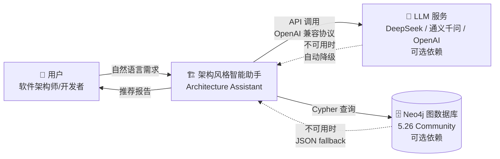
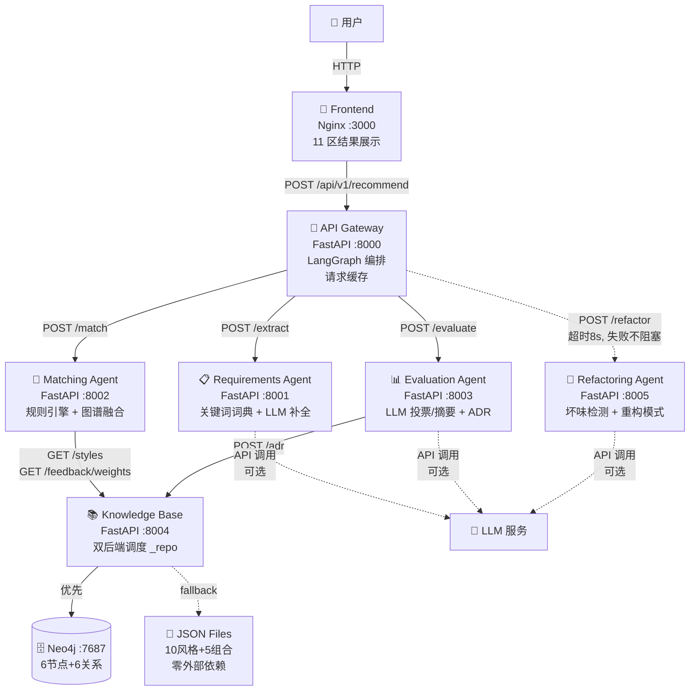
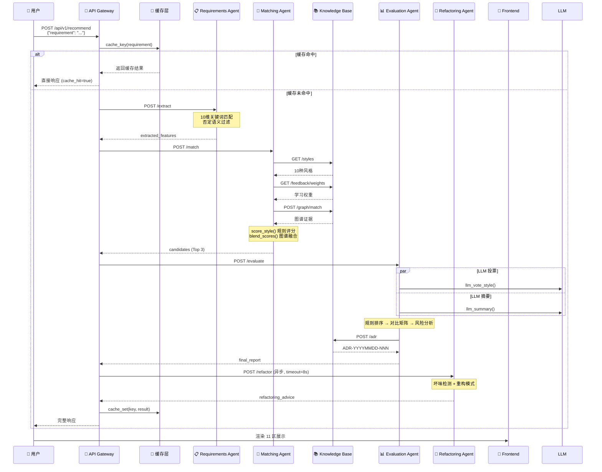
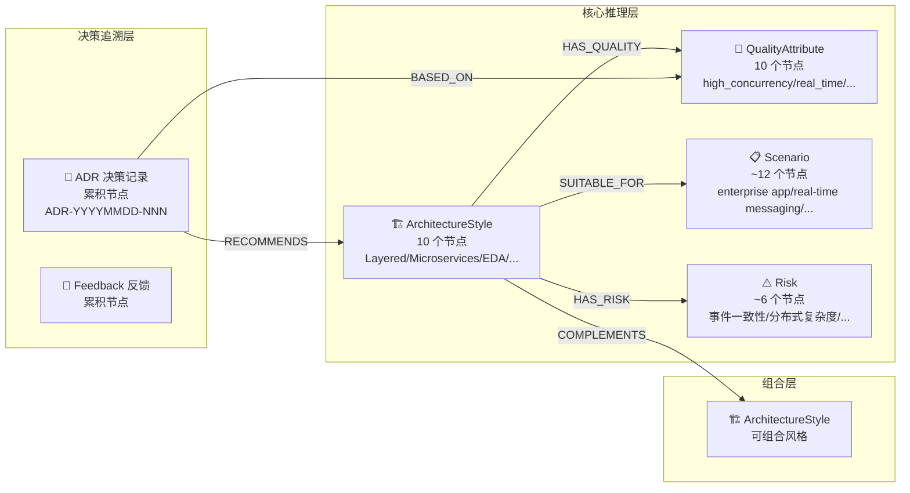
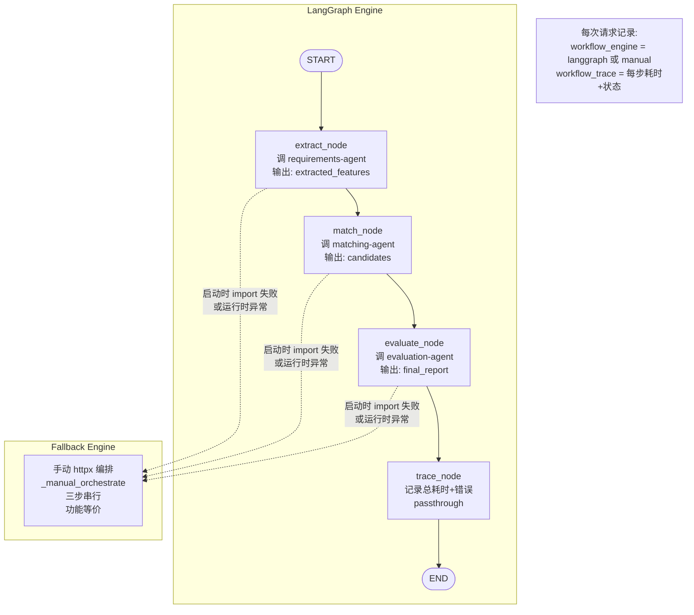
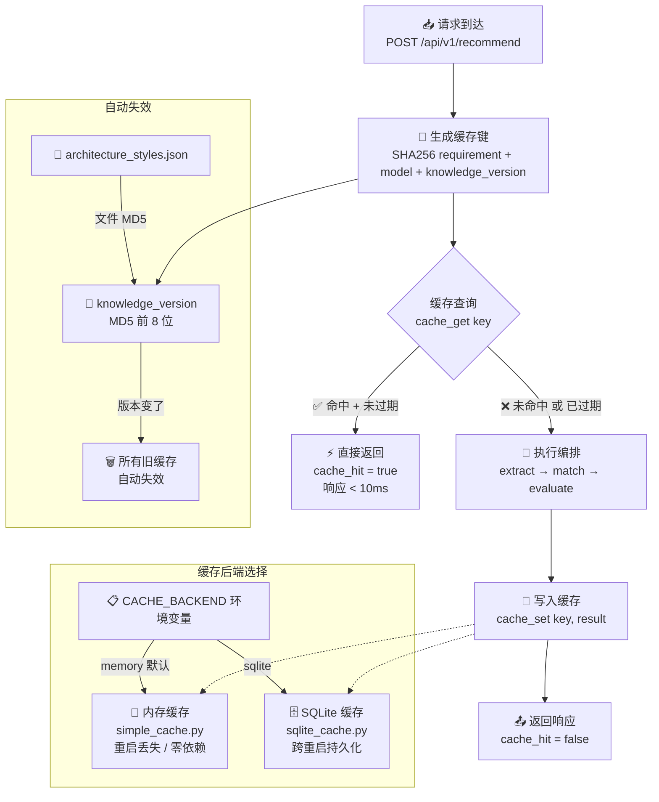

# 03 · 架构图学习文档

> 8 张图讲清楚系统架构。每张图都可以在答辩白板上手绘，也可以在 Markdown 中直接渲染。

---

## 目录

1. [C4 Context 图](#1-c4-context-图) — 系统边界与外部交互
2. [C4 Container 图](#2-c4-container-图) — 7 个容器的职责与通信
3. [Agent 协作时序图](#3-agent-协作时序图) — 一次请求的完整调用链
4. [Neo4j 知识图谱模型图](#4-neo4j-知识图谱模型图) — 节点与关系的拓扑
5. [LangGraph Workflow 图](#5-langgraph-workflow-图) — 编排引擎的状态图
6. [推荐链路图](#6-推荐链路图) — 从需求到报告的完整管线
7. [缓存链路图](#7-缓存链路图) — 请求级缓存的读写路径
8. [降级链路图](#8-降级链路图) — 8 个 fallback 点的容错设计

---

## 1. C4 Context 图

### Mermaid 图



### 答辩讲解词

> "这是 C4 模型的 Level 1——系统上下文图。我们来看系统边界。
>
> 中心是架构风格智能助手。它有两个外部依赖——LLM 服务和 Neo4j 图数据库。注意这两条虚线——**它们是可选的**。LLM 不可用时系统自动降级为纯规则模式，Neo4j 不可用时自动切换 JSON 文件存储。
>
> 用户输入自然语言需求，系统返回可解释的推荐报告。整个系统对外部就是一个'需求进去、报告出来'的黑盒。
>
> 这张图的关键信息：**系统边界清晰，外部依赖两个，且都可降级。**"

---

## 2. C4 Container 图

### Mermaid 图



### 答辩讲解词

> "这是 C4 模型的 Level 2——容器级架构。
>
> 从左边用户开始，请求经过前端到达 API Gateway。Gateway 是编排中枢——它把请求分发到三个核心 Agent：requirements-agent 做特征提取，matching-agent 做风格匹配，evaluation-agent 做评估决策。还有第四个 Agent——refactoring-agent——它是虚线连接，表示非主链路。超时 8 秒，失败不阻塞推荐。
>
> matching-agent 和 evaluation-agent 都依赖 knowledge-base。knowledge-base 下面是双后端——优先 Neo4j 图数据库，不可用时 fallback 到 JSON 文件。三个 Agent 右边都连接到 LLM 服务——虚线表示可选依赖。
>
> 这张图的核心信息：**7 个容器、职责分明、依赖可选、故障隔离。**"

---

## 3. Agent 协作时序图

### Mermaid 图



### 答辩讲解词

> "这张时序图展示了一次完整请求的调用链。按时间轴从上往下走。
>
> **第一步**，Gateway 先查缓存——如果命中，直接返回，全程不调任何 Agent。这就是为什么缓存命中时响应在 10 毫秒以内。
>
> **第二步**，缓存未命中则进入编排流程——先调 requirements-agent 做特征提取，然后把特征传给 matching-agent 做风格匹配。matching-agent 内部调了 knowledge-base 三次——获取风格列表、学习权重和图谱证据——最终用规则引擎和图谱融合给出 Top 3 候选。
>
> **第三步**，evaluation-agent 接收特征和候选，并行调用 LLM 投票和 LLM 摘要——注意中间这个 `par` 标记，表示两个 LLM 调用是同时进行的，不互相等待。
>
> **第四步**，主链路返回后，Gateway 异步调 refactoring-agent——虚线框表示超时 8 秒、失败不阻塞。
>
> **最后**，结果写入缓存，返回给用户。
>
> 这张图的关键信息：**缓存前置、三步串行编排、LLM 并行调用、重构异步非阻塞。**"

---

## 4. Neo4j 知识图谱模型图

### Mermaid 图



### 答辩讲解词

> "这是 Neo4j 知识图谱的模型图。我把它分成三个逻辑层。
>
> **核心推理层**是最重要的——ArchitectureStyle 节点通过三种关系关联到 QualityAttribute、Scenario 和 Risk。当用户需求提取出 `high_concurrency` 特征后，`graph_match()` 函数沿着 HAS_QUALITY 关系的反向，找到所有具备这个质量属性的架构风格。这就是图谱推理的核心机制。
>
> **组合层**中的 COMPLEMENTS 关系表示两个风格可以组合使用——比如 Microservices 和 Event-Driven Architecture 经常联手。
>
> **决策追溯层**中，每次推荐都会创建 ADR 节点，通过 RECOMMENDS 关联到推荐风格，通过 BASED_ON 关联到依据的质量属性。这样一段时间后，你可以查询"Event-Driven 风格在哪些场景下被推荐过"。
>
> 当前图规模：约 38 个节点、80-100 条关系。**设计原则是"麻雀虽小五脏俱全"——6 种节点类型和 6 种关系类型覆盖了完整的架构知识表达。**"

---

## 5. LangGraph Workflow 图

### Mermaid 图



### 答辩讲解词

> "这张图展示的是 API Gateway 的双引擎编排设计。
>
> 上方是 LangGraph 引擎——一个 4 节点的 StateGraph。START → extract → match → evaluate → trace → END。每个节点内部通过 httpx 调用对应的 Agent 服务，完成后更新 TypedDict 状态。
>
> 下方是手动编排引擎——`_manual_orchestrate()` 函数，三步串行 httpx 调用。**两个引擎输出完全一致**——用户拿到的报告不分哪个引擎生成的。
>
> 切换逻辑有两层：第一层在启动时——如果 `import langgraph` 失败，系统自动使用手动引擎。第二层在运行时——如果 LangGraph 执行中抛异常，catch 后切到手动引擎。这两条虚线箭头表示"降级路径"。
>
> 注意底部的备注：每次请求都会在响应中标注 `workflow_engine` 和 `workflow_trace`。答辩时你可以展示 trace 数据——每个节点的耗时精确到毫秒。
>
> 这张图的关键信息：**双引擎、功能等价、两次 fallback、全程可观测。**"

---

## 6. 推荐链路图

### Mermaid 图

```mermaid
graph TB
    subgraph 输入层
        A[👤 用户需求<br/>"开发跨平台IM系统<br/>支持万人同时在线<br/>消息实时可靠"]
    end

    subgraph 特征提取层
        B[📋 关键词词典匹配<br/>10维 × 90词]
        C[🔍 否定语义过滤<br/>6种否定模式]
        D{规则命中 ≤ 2?}
        E[🤖 Few-shot LLM 语义补全<br/>6个示例]
    end

    subgraph 风格匹配层
        F[🎯 规则引擎评分<br/>score_style<br/>标签+2 / 规则+1 / 学习+1]
        G[🔗 Neo4j 图谱推理<br/>graph_match<br/>HAS_QUALITY 遍历]
        H[🧩 组合推荐评分<br/>score_combination<br/>4因素公式]
    end

    subgraph 评估决策层
        I[📊 规则排序]
        J[🤖 LLM 投票<br/>temp=0.0, +1分]
        K[🤖 LLM 摘要<br/>temp=0.3, Few-shot]
        L[⚠️ 风险分析<br/>3风格专属模板]
    end

    subgraph 输出层
        M[📝 ADR 自动生成<br/>ADR-YYYYMMDD-NNN]
        N[🧩 对比矩阵<br/>3×6 维度]
        O[📄 推荐报告<br/>推荐+备选+风险+组合]
    end

    A --> B
    B --> C
    C --> D
    D -->|Yes| E
    D -->|No| F
    E --> F
    F --> G
    G --> H
    H --> I
    I --> J
    I --> K
    J --> L
    K --> L
    L --> M
    L --> N
    M --> O
    N --> O
```

### 答辩讲解词

> "这张图展示了从用户需求到最终报告的完整推荐链路。
>
> **特征提取层**：用户需求进来，先过关键词词典（10 维 × 90 词），然后过否定语义过滤。如果规则命中太少（≤2 维），说明需求表述模糊——触发 Few-shot LLM 语义补全。
>
> **风格匹配层**：特征信号传给 matching-agent。规则引擎 `score_style()` 做基础评分——标签匹配 +2、7 条规则 +1、学习权重 +1。然后 Neo4j 图谱推理 `graph_match()` 做增强——沿 HAS_QUALITY 关系找隐式关联。最后组合推荐评分——4 因素公式。
>
> **评估决策层**：规则排序定基调，LLM 投票做 tie-break（只 +1 分），LLM 摘要生成自然语言报告。风险分析用 3 种核心风格的专属模板加上通用模板。
>
> **输出层**：对比矩阵展示 3 个候选的横向比较，ADR 自动写入决策记录，最终组装为完整报告。
>
> 这张图的核心信息：**四层管线、层层递进、每层都可独立验证输出。**"

---

## 7. 缓存链路图

### Mermaid 图



### 答辩讲解词

> "这张图展示请求级缓存的完整链路。
>
> **缓存键生成**：用 SHA256 对 requirement + model + knowledge_version 做哈希，取前 16 位。三个维度分别保证：相同需求共享缓存、换了模型不共享缓存、知识库更新旧缓存自动作废。
>
> **缓存查询**：命中且未过期的直接返回——响应时间在 10 毫秒以内，全程不调任何 Agent。
>
> **缓存未命中**：正常走编排流程，结果写回缓存。
>
> **双后端设计**：通过 `CACHE_BACKEND` 环境变量切换——memory 是默认方案（零依赖、零配置），sqlite 提供跨重启持久化。两个后端接口完全一致（get/set/clear/stats），上层代码不感知。
>
> **自动失效机制**：右下角这个链路——`knowledge_version` 默认是 `architecture_styles.json` 文件的 MD5 前 8 位。一旦你修改了知识库（新增/修改/删除风格），版本号改变，所有旧缓存自动失效。**不需要手动清缓存——知识更新自动触发缓存更新。**
>
> 这张图的关键信息：**三维缓存键、双后端切换、知识更新自动失效。**"

---

## 8. 降级链路图

### Mermaid 图

```mermaid
graph TB
    subgraph 正常模式
        N1[📋 Requirements Agent<br/>LLM 语义补全]
        N2[📊 Evaluation Agent<br/>LLM 投票]
        N3[📊 Evaluation Agent<br/>LLM 摘要]
        N4[🔧 Refactoring Agent<br/>LLM 润色]
        N5[🔀 API Gateway<br/>LangGraph 编排]
        N6[📋 Few-shot Prompt<br/>6+3 示例]
        N7[📝 ADR 写入<br/>Neo4j 同步]
        N8[🔧 重构建议<br/>HTTP 调用]
    end

    subgraph 降级模式
        D1[✅ 返回纯规则特征<br/>可能漏判但不误判]
        D2[✅ 返回 None<br/>规则排序不变]
        D3[✅ _fallback_summary<br/>规则模板生成中文报告]
        D4[✅ 使用规则模板<br/>结构完整]
        D5[✅ _manual_orchestrate<br/>手写 httpx 编排<br/>功能等价]
        D6[✅ 零样本 Prompt<br/>质量略降功能不变]
        D7[✅ adr_status = failed<br/>不阻塞推荐]
        D8[✅ refactoring_advice = {}<br/>超时8s, try/except]
    end

    N1 -->|LLM 未配置或超时| D1
    N2 -->|LLM 未配置或超时| D2
    N3 -->|LLM 未配置或超时| D3
    N4 -->|LLM 未配置或超时| D4
    N5 -->|ImportError 或运行时异常| D5
    N6 -->|ImportError| D6
    N7 -->|写入失败| D7
    N8 -->|超时或异常| D8

    style D1 fill:#2d5,stroke:#1a3,color:#fff
    style D2 fill:#2d5,stroke:#1a3,color:#fff
    style D3 fill:#2d5,stroke:#1a3,color:#fff
    style D4 fill:#2d5,stroke:#1a3,color:#fff
    style D5 fill:#2d5,stroke:#1a3,color:#fff
    style D6 fill:#2d5,stroke:#1a3,color:#fff
    style D7 fill:#2d5,stroke:#1a3,color:#fff
    style D8 fill:#2d5,stroke:#1a3,color:#fff
```

### 答辩讲解词

> "这是整个系统最重要的设计之一——**全链路降级图**。左边是正常模式下 8 个 LLM 或外部依赖的调用点，右边是每个点对应的降级方案。
>
> 从上往下：
>
> - requirements-agent 的语义补全挂了 → 返回纯规则特征：**可能漏判某些维度，但不会误判**。
> - evaluation-agent 的 LLM 投票挂了 → 返回 None：规则排序不变，只是没有 tie-break。
> - evaluation-agent 的 LLM 摘要挂了 → 走 `_fallback_summary()`：用规则引擎的命中理由拼一份结构完整的中文报告。
> - refactoring-agent 的 LLM 润色挂了 → 直接使用规则模板：迁移步骤和风险描述由 `build_rule_template()` 生成。
> - LangGraph 挂了 → 走 `_manual_orchestrate()`：**50 行 httpx 代码，功能完全等价**。
> - Few-shot 模块文件没了 → 降级为零样本 Prompt：输出质量可能略降，功能不变。
> - ADR 写入失败 → 标记 `adr_status: failed`：**不阻塞推荐返回**。
> - 重构建议超时 → 返回空字典：超时 8 秒 + try/except。
>
> 右边这些绿色框说明：**每个降级路径都保证功能可用**。验证方式：把 `.env` 里的 LLM 配置全部注释掉，跑 20 条回归用例——全部通过 5 维验证，核心推荐结果不受影响。
>
> 这张图的核心信息：**8 个调用点、8 个降级方案、没有一个单点故障能阻断核心链路。**"

---

## 附录：答辩白板速画指南

如果答辩时需要手绘架构图，按以下顺序画最简洁的 C4-Container 图：

```
Step 1: 画一个大框，写 "Architecture Assistant"
Step 2: 框内画 7 个小框，标注端口和职责：
        ┌─────────┐
        │ Gateway │  :8000  "编排+缓存"
        └────┬────┘
        ┌────┼────┬─────────────┐
        │    │    │             │
    ┌───┴─┐┌──┴──┐┌───┴───┐┌───┴──────┐
    │ Req ││Match││ Eval  ││Refactor  │
    │:8001││:8002││:8003 ││:8005     │
    └─────┘└──┬──┘└───┬───┘└──────────┘
             │       │
          ┌──┴───────┴──┐
          │ Knowledge   │
          │   Base:8004 │
          └─────┬───────┘
         ┌──────┴──────┐
      ┌──┴──┐      ┌──┴──┐
      │Neo4j│      │JSON │
      │:7687│      │Files│
      └─────┘      └─────┘
Step 3: 标注关键设计决策（虚线 = 可选依赖、数字 = 降级点数量）
```

**讲解节奏**：先画外层系统边界（10 秒）→ 画 7 个容器（30 秒）→ 标注端口和职责（30 秒）→ 画依赖关系（20 秒）→ 标注关键决策（10 秒）。总计约 2 分钟。

---

## 本节小结

| 图 | 核心信息 | 答辩用时 |
|----|---------|---------|
| C4 Context | 系统边界、两个可选依赖、都可降级 | 30s |
| C4 Container | 7 个容器、职责分明、故障隔离 | 60s |
| Agent 时序 | 缓存前置、三步串行、LLM 并行、重构异步 | 60s |
| Neo4j 图模型 | 6 节点 + 6 关系、三层逻辑结构 | 45s |
| LangGraph Workflow | 双引擎、功能等价、两次 fallback | 45s |
| 推荐链路 | 四层管线、层层递进、每层可验证 | 60s |
| 缓存链路 | 三维缓存键、双后端、自动失效 | 45s |
| 降级链路 | 8 个 fallback、无单点故障可阻断核心 | 60s |
